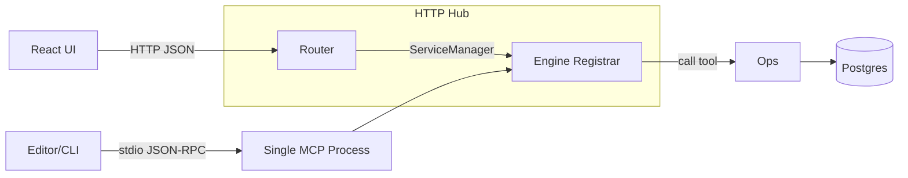

# Savant

Savant is a lightweight Ruby framework for building and running local MCP services. The core now includes a multiplexer that boots every engine inside dedicated child processes, merges their tool registries, and exposes a single unified MCP surface. Engines remain discoverable by the Hub and rendered in a compact React UI.

## Multiplexer Overview

- `bin/mcp_server` defaults to the multiplexer. It spawns one stdio MCP process per engine (`context`, `think`, `personas`, `rules`, `jira` by default), namespaces their tools (`context.fts/search`, `jira.issue.get`, etc.), and serves them to connected editors.
- Each engine failure is isolated—if a child dies the multiplexer removes its tools, logs the event, and restarts it in the background.
- Metrics and status are written to `logs/multiplexer.log` and surfaced via the Hub (`curl /` now includes a `multiplexer` object) and CLI helpers (`savant engines`, `savant tools`).

```
# Inspect engines + status
SAVANT_PATH=$(pwd) bundle exec ruby ./bin/savant engines

# List namespaced tools
SAVANT_PATH=$(pwd) bundle exec ruby ./bin/savant tools
```

This README is intentionally concise. Full, detailed docs (with diagrams) live in the Memory Bank:

| Doc | Summary |
| --- | --- |
| [Framework](memory_bank/framework.md) | Core concepts, lifecycle, and configuration surface. |
| [Architecture](memory_bank/architecture.md) | System topology, data model, and component responsibilities. |
| [Boot Runtime](memory_bank/engine_boot.md) | Boot initialization, RuntimeContext, AMR system, and CLI commands. |
| [Context Engine](memory_bank/engine_context.md) | FTS search flow, cache/indexer coordination, and tool APIs. |
| [Think Engine](memory_bank/engine_think.md) | Plan/next workflow orchestration and prompt drivers. |
| [Jira Engine](memory_bank/engine_jira.md) | Jira integration details, auth requirements, and tool contracts. |
| [Personas Engine](memory_bank/engine_personas.md) | Persona catalog shape, YAML schema, and exposed tools. |
| [Engine Rules](memory_bank/engine_rules.md) | Shared guardrails, telemetry hooks, and best-practice playbooks. |

## Getting Started

Prereqs: Docker, Ruby + Bundler (for stdio runs).

### Boot Runtime (Quick Start)

The Boot Runtime is the foundation for the Savant Engine. Run it first to initialize all core components:

```bash
./bin/savant run
```

This boots the engine and displays runtime status including session ID, persona, driver prompt, AMR rules, and repo context. Files created:
- `.savant/runtime.json` - Persistent runtime state
- `logs/engine_boot.log` - Structured boot logs

**Options:**
```bash
./bin/savant run --persona=savant-architect  # Use different persona
./bin/savant run --skip-git                  # Skip git detection
./bin/savant review                          # Boot for MR review
./bin/savant workflow <name>                 # Boot for workflow execution
```

See [Boot Runtime docs](memory_bank/engine_boot.md) for complete reference.

### Full Stack Setup

1) Quick stack (Postgres + Hub, no indexing):
```
make quickstart
```

2) Migrate + FTS (Context search):
```
make migrate && make fts
```

3) Index repos (see config/settings.json):
```
make repo-index-all
```

4) UI
- Static: `make ui-build` then open http://localhost:9999/ui
- Dev: `make dev-ui` then open http://localhost:5173 (Hub at http://localhost:9999)

5) MCP Multiplexer (stdio)
```
# Unified multiplexer (default)
SAVANT_PATH=$(pwd) bundle exec ruby ./bin/mcp_server

# Run a single engine (optional override)
MCP_SERVICE=context  SAVANT_PATH=$(pwd) bundle exec ruby ./bin/mcp_server
MCP_SERVICE=jira     SAVANT_PATH=$(pwd) bundle exec ruby ./bin/mcp_server
```

## Architecture

Savant is organized into four main backend modules plus a separate frontend:

```
lib/savant/
├── hub/              # MODULE 1: Hub API (HTTP routing, SSE, service management)
├── logging/          # MODULE 2: Logging & Observability (structured logging, metrics, audit)
├── framework/        # MODULE 3: Framework (MCP core, middleware, transports, config)
└── engines/          # MODULE 4: Engines (context, think, jira, personas, rules, etc.)
```

### Module 1: Hub API (`lib/savant/hub/`)

**Purpose**: HTTP API serving tool calls, diagnostics, and engine management

**Key Files**:
- `builder.rb` - Hub construction from config
- `router.rb` - HTTP request routing
- `sse.rb` - Server-Sent Events for live streaming
- `service_manager.rb` - Engine loader and dispatcher
- `connections.rb` - Connection registry
- `static_ui.rb` - Static asset serving

**Key Endpoints**: `/`, `/routes`, `/diagnostics`, `/hub/status`, `/logs`, `/:engine/tools/:name/call`

### Module 2: Logging & Observability (`lib/savant/logging/`)

**Purpose**: Centralized logging, metrics, audit trails, and telemetry

**Key Files**:
- `logger.rb` - Structured logger with levels and timing
- `event_recorder.rb` - In-memory + file event store
- `metrics.rb` - Counters and distributions
- `replay_buffer.rb` - Request replay buffer
- `exporter.rb` - Metrics export (Prometheus format)
- `audit/policy.rb` - Audit configuration
- `audit/store.rb` - Audit log persistence

**Key APIs**: `Logger.new(service:, tool:)`, `EventRecorder.record(event)`, `Metrics.increment(metric, labels)`

### Module 3: Framework (`lib/savant/framework/`)

**Purpose**: MCP framework core, middleware, transports, and shared utilities

**Key Files**:
- `mcp/core/` - Tool specification, Registrar, DSL, middleware, validation
- `mcp/server.rb` - MCP server implementation
- `mcp/dispatcher.rb` - JSON-RPC dispatcher
- `engine/base.rb` - Engine base class
- `engine/context.rb` - Runtime context
- `middleware/` - trace.rb, logging.rb, metrics.rb, user_header.rb
- `transports/http/rack_app.rb` - Minimal Rack app
- `transports/mcp/stdio.rb` - Stdio transport
- `transports/mcp/websocket.rb` - WebSocket transport
- `config.rb` - Configuration loader
- `db.rb` - Database abstraction
- `secret_store.rb` - Secrets management
- `boot.rb` - Bootstrap
- `generator.rb` - Code generation

**Key APIs**: `Framework::MCP::Core::DSL.build { ... }`, `Registrar.call(name, args, ctx:)`, `Engine#before_call`

### Module 4: Engines (`lib/savant/engines/`)

**Purpose**: All MCP engine implementations

**Engines** (under `lib/savant/engines/`):
- **Context** (`context/`): DB-backed FTS over repo chunks; memory bank helpers. See [memory_bank/engine_context.md](memory_bank/engine_context.md)
- **Think** (`think/`): Workflow orchestration (`plan/next`) with driver prompts. See [memory_bank/engine_think.md](memory_bank/engine_think.md)
- **Jira** (`jira/`): Jira REST v3 integration. See [memory_bank/engine_jira.md](memory_bank/engine_jira.md)
- **Personas** (`personas/`): YAML personas catalog. See [memory_bank/engine_personas.md](memory_bank/engine_personas.md)
- **Rules** (`rules/`): Shared guardrails and best practices. See [memory_bank/engine_rules.md](memory_bank/engine_rules.md)
- **Indexer** (`indexer/`): Repository indexing and chunking
- **AI** (`ai/`): Agent orchestration
- **AMR** (`amr/`): Asset management rules

> ℹ️  The Boot Runtime (`lib/savant/framework/boot.rb`) lives in the Framework module because it wires config, personas, prompts, AMR rules, and runtime state before engines run. See [memory_bank/engine_boot.md](memory_bank/engine_boot.md) for full details.

**Engine Pattern**: Each engine has `engine.rb` (extends `Framework::Engine::Base`), `tools.rb` (uses `Framework::MCP::Core::DSL`), and `ops.rb` (business logic).

## Generators

Scaffold a new engine in seconds:
```
ruby ./bin/savant generate engine <name> [--with-db] [--force]
```
Creates `lib/savant/engines/<name>/{engine.rb,tools.rb}` and a baseline spec. Then run with `MCP_SERVICE=<name> ruby ./bin/mcp_server`.

## Transport Layer



- **HTTP**: `lib/savant/framework/transports/http/rack_app.rb` - Rack app for Hub + UI
- **MCP**: `lib/savant/framework/transports/mcp/{stdio,websocket}.rb` - Stdio/WebSocket for editors
- **ServiceManager**: `lib/savant/hub/service_manager.rb` - Transport-agnostic engine loading
- Exactly one engine per MCP process; Hub multiplexes multiple engines via HTTP

## UI

- React UI under `/ui` (or dev at 5173) with three main sections:
  - **Dashboard**: Overview of all engines and system status
  - **Engines**: Per-engine tabs for tool execution and testing
  - **Diagnostics**: Four tabs for system monitoring
    - Overview: System configuration, DB connectivity, repos, personas, rules
    - Requests: HTTP request logs and traffic statistics
    - Logs: Live event streaming with log-level filtering (All/Debug/Info/Warn/Error)
    - Routes: API route browser with filtering by module, method, and path
- Footer shows Dev-Mode/Build-Mode indicator

## Diagnostics & Logs

- Aggregated logs (JSON events): `GET /logs?n=100[&mcp=context][&type=http_request]`
- Live event stream (SSE): `GET /logs/stream[?mcp=context][&type=tool_call_started]`
- Per-engine logs (file tail): `GET /:engine/logs?n=100` or stream with `?stream=1`
- Hub request stats: `GET /hub/stats`
- Connections list: `GET /diagnostics/connections`
- Per-engine diagnostics: `GET /diagnostics/mcp/:name`

## Memory Bank (Detailed Docs)

All detailed docs (with Mermaid diagrams) live under `memory_bank/`. Use the table above (and the direct links below) to jump into the source of truth:

- Framework + architecture: [`framework.md`](memory_bank/framework.md), [`architecture.md`](memory_bank/architecture.md)
- Boot Runtime: [`engine_boot.md`](memory_bank/engine_boot.md) - RuntimeContext, boot sequence, AMR system, CLI reference
- Engines: [`engine_context.md`](memory_bank/engine_context.md), [`engine_think.md`](memory_bank/engine_think.md), [`engine_jira.md`](memory_bank/engine_jira.md), [`engine_personas.md`](memory_bank/engine_personas.md)
- Guardrails + patterns: [`engine_rules.md`](memory_bank/engine_rules.md)

These are the canonical references; the README stays short and points you there.
