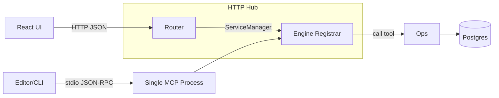

# Savant

Savant is a lightweight Ruby framework for building and running local MCP services. The core boots a single MCP server, loads one engine, and handles transport, logging, config, and dependency wiring. Engines are discoverable by the Hub and rendered in a compact React UI.

This README is intentionally concise. Full, detailed docs (with diagrams) live in the Memory Bank:

| Doc | Summary |
| --- | --- |
| [Framework](memory_bank/framework.md) | Core concepts, lifecycle, and configuration surface. |
| [Architecture](memory_bank/architecture.md) | System topology, data model, and component responsibilities. |
| [Context Engine](memory_bank/engine_context.md) | FTS search flow, cache/indexer coordination, and tool APIs. |
| [Think Engine](memory_bank/engine_think.md) | Plan/next workflow orchestration and prompt drivers. |
| [Jira Engine](memory_bank/engine_jira.md) | Jira integration details, auth requirements, and tool contracts. |
| [Personas Engine](memory_bank/engine_personas.md) | Persona catalog shape, YAML schema, and exposed tools. |
| [Engine Rules](memory_bank/engine_rules.md) | Shared guardrails, telemetry hooks, and best-practice playbooks. |

## Getting Started

Prereqs: Docker, Ruby + Bundler (for stdio runs).

1) Quick stack (Postgres + Hub, no indexing):
```
make quickstart
```

2) Migrate + FTS (Context search):
```
make migrate && make fts
```

3) Index repos (see config/settings.json):
```
make repo-index-all
```

4) UI
- Static: `make ui-build` then open http://localhost:9999/ui
- Dev: `make dev-ui` then open http://localhost:5173 (Hub at http://localhost:9999)

5) Engines (stdio)
```
# Context
MCP_SERVICE=context SAVANT_PATH=$(pwd) bundle exec ruby ./bin/mcp_server
# Jira
MCP_SERVICE=jira    SAVANT_PATH=$(pwd) bundle exec ruby ./bin/mcp_server
# Think
MCP_SERVICE=think   SAVANT_PATH=$(pwd) bundle exec ruby ./bin/mcp_server
# Personas
MCP_SERVICE=personas SAVANT_PATH=$(pwd) bundle exec ruby ./bin/mcp_server
```

## Framework (Overview)



- Transports: stdio (editors) and HTTP (Hub + UI). Exactly one engine per MCP process.
- Registrar DSL + middleware: tools are declared with JSON schemas and wrapped with logging/validation.
- Logging: structured logs per engine under `/tmp/savant/<engine>.log` (Hub) or `logs/<engine>.log` (stdio).

## Engines (Overview)

- Context: DB-backed FTS over repo chunks; memory bank helpers; repo admin tools. See memory_bank/engine_context.md
- Think: deterministic workflow orchestration (`plan/next`) with driver prompts. See memory_bank/engine_think.md
- Jira: Jira REST v3 (search + guarded write actions). See memory_bank/engine_jira.md
- Personas: local YAML personas catalog with list/get tools. See memory_bank/engine_personas.md

## Generators

Scaffold a new engine in seconds:
```
ruby ./bin/savant generate engine <name> [--with-db] [--force]
```
Creates `lib/savant/<name>/{engine.rb,tools.rb}` and a baseline spec. Then run with `MCP_SERVICE=<name> ruby ./bin/mcp_server`.

## UI (Old + New)

- Old: static console under `/console` (request logs + helpers).
- New: React UI under `/ui` (or dev at 5173) with three-tier tabs — Dashboard, Engines (per-engine tabs), Diagnostics (Overview/Requests/Logs). Footer shows Dev-Mode/Build-Mode.
- Diagnostics → Logs includes a log-level dropdown (All/Debug/Info/Warn/Error) that streams only the selected levels directly from the hub for accurate filtering and copy/export.

## Diagnostics & Logs

- Aggregated logs (JSON events): `GET /logs?n=100[&mcp=context][&type=http_request]`
- Live event stream (SSE): `GET /logs/stream[?mcp=context][&type=tool_call_started]`
- Per-engine logs (file tail): `GET /:engine/logs?n=100` or stream with `?stream=1`
- Hub request stats: `GET /hub/stats`
- Connections list: `GET /diagnostics/connections`
- Per-engine diagnostics: `GET /diagnostics/mcp/:name`

## Memory Bank (Detailed Docs)

All detailed docs (with Mermaid diagrams) live under `memory_bank/`. Use the table above (and the direct links below) to jump into the source of truth:

- Framework + architecture: [`framework.md`](memory_bank/framework.md), [`architecture.md`](memory_bank/architecture.md)
- Engines: [`engine_context.md`](memory_bank/engine_context.md), [`engine_think.md`](memory_bank/engine_think.md), [`engine_jira.md`](memory_bank/engine_jira.md), [`engine_personas.md`](memory_bank/engine_personas.md)
- Guardrails + patterns: [`engine_rules.md`](memory_bank/engine_rules.md)

These are the canonical references; the README stays short and points you there.
