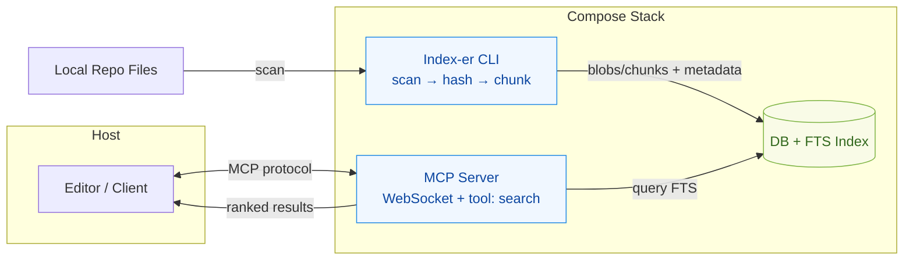
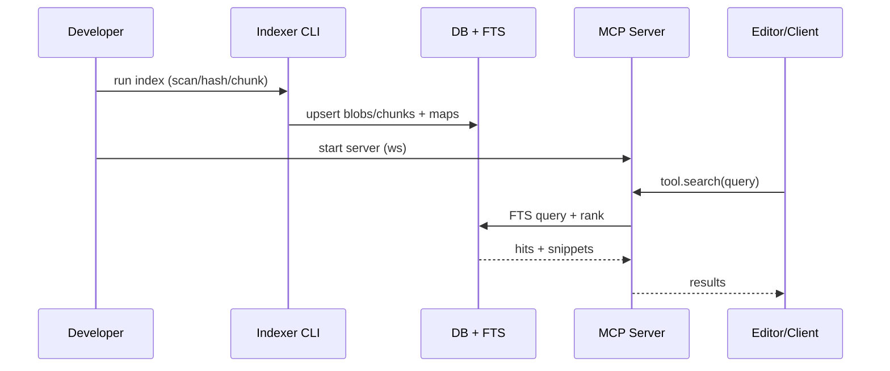

# Savant

Version 1 — Local repo indexer + MCP search layer (Ruby + Docker, Postgres FTS). This README provides a high-level overview, an architecture diagram, the end-to-end flow, and pointers for development.

## Overview
- **Purpose:** Index local repositories, chunk content, store in FTS-backed DB, and expose fast search via an MCP WebSocket tool.
- **Core Pieces:** Indexer CLI, Postgres 16 + FTS (tsvector + GIN), MCP server exposing `search`, containerized via Docker Compose.
- **Docs:** See `docs/README.md` for epics, stories, and PRD.

## Problem
- Codebases are large and change frequently; AI tools need fast, accurate, and privacy‑preserving access to local code.
- Remote embeddings or cloud search increase latency, cost, and risk exposure of proprietary code.
- Developers need a simple, repeatable way to index repos and query them through standard MCP clients.

## Solution
- A local, containerized pipeline that scans repos, chunks content with language‑aware heuristics, and stores data in a single FTS index.
- A minimal MCP server that exposes a `search` tool over WebSocket, returning ranked hits and optional snippets.
- A single `settings.json` drives configuration across services for predictable, reproducible results.

## How It Works
- Scan: indexer reads repo paths from config, applies ignore rules, and detects changes via size/mtime.
- Normalize: compute hashes, deduplicate blobs, and create chunks with overlap to preserve context boundaries.
- Store: upsert blobs/chunks/mappings and populate FTS tables for fast ranking.
- Serve: MCP server connects to the DB, executes FTS queries, and returns results to the client.

## Architecture


## Flow Diagram


## Configuration Examples
- Primary configuration lives in `config/settings.json` (see example below). The stack reads it via `SETTINGS_PATH`.

Minimal `config/settings.json` example:

```json
{
  "indexer": {
    "maxFileSizeKB": 512,
    "languages": ["rb", "ts", "tsx", "js", "md", "yml", "yaml", "json"],
    "chunk": { "mdMaxChars": 1200, "codeMaxLines": 200, "overlapLines": 3 }
  },
  "repos": [
    { "name": "example", "path": "/host/example-repo", "ignore": ["node_modules/**", "tmp/**", ".git/**"] }
  ],
  "mcp": { "listenHost": "0.0.0.0", "listenPort": 8765, "allowOrigins": ["*"] },
  "database": { "host": "postgres", "port": 5432, "db": "contextdb", "user": "context", "password": "contextpw" }
}
```

Notes:
- Full schema: `config/schema.json`; reference example: `config/settings.example.json`.
- Mount your host repo into the compose stack so the indexer can read it (see `docker-compose.yml`).

## Project Layout
- **Docs:** `docs/` — epics, PRD, and ops notes.
- **Config:** `config/` — settings and loaders (see `settings.example.json`).
- **Scripts:** `bin/` — Ruby CLIs for index and DB ops.
- **Compose:** `docker-compose.yml` — services, networks, and volumes.

## Development
- **Dev:** `make dev` (compose up)
- **Logs:** `make logs`
- **Down:** `make down`
- **PS:** `make ps`

Common ops:
- Tail logs: `docker compose logs -f indexer-ruby mcp-ruby`
- Readiness grep: `docker compose logs mcp-ruby | rg '^READY'`

## Configuration
- Provide `config/settings.json` (see `config/settings.example.json`).
- The compose stack mounts `settings.json` and services read via `SETTINGS_PATH`.

## Usage Summary
- Start services: `docker compose up -d`
- Run indexer: `bin/index` (or via compose service command)
- Query via MCP: connect your MCP‑aware client to `ws://localhost:8765` and call `search`.

Database
- Version 1 uses Postgres 16 with built-in FTS (tsvector + GIN). No embeddings or vector search are used.

## Roadmap & References
- **Epics & Stories:** `docs/README.md`
- **PRD:** `docs/prds/prd.md`
- **Health & Logs:** `docs/epics/01-setup/s-3-logs-health.md`
