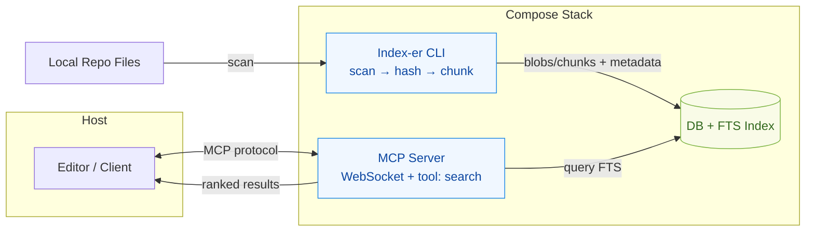
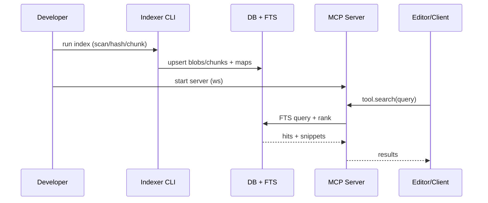

# Savant

Local repo indexer + MCP search layer (Ruby + Docker, FTS-only). This README provides a high-level overview, an architecture diagram, the end-to-end flow, and pointers for development.

## Overview
- **Purpose:** Index local repositories, chunk content, store in FTS-backed DB, and expose fast search via an MCP WebSocket tool.
- **Core Pieces:** Indexer CLI, SQLite/Postgres + FTS, MCP server exposing `search`, containerized via Docker Compose.
- **Docs:** See `docs/README.md` for epics, stories, and PRD.

## Architecture

## Flow Diagram

## Project Layout
- **Docs:** `docs/` — epics, PRD, and ops notes.
- **Config:** `config/` — settings and loaders (see `settings.example.json`).
- **Scripts:** `bin/` — Ruby CLIs for index and DB ops.
- **Compose:** `docker-compose.yml` — services, networks, and volumes.

## Development
- **Setup:** `make setup`
- **Lint:** `make lint`
- **Test:** `make test`
- **Dev:** `make dev` (compose up + watch, if configured)

Common ops:
- Tail logs: `docker compose logs -f indexer-ruby mcp-ruby`
- Readiness grep: `docker compose logs mcp-ruby | rg '^READY'`

## Configuration
- Provide `config/settings.json` (see `config/settings.example.json`).
- The compose stack mounts `settings.json` and services read via `SETTINGS_PATH`.

## Roadmap & References
- **Epics & Stories:** `docs/README.md`
- **PRD:** `docs/prds/prd.md`
- **Health & Logs:** `docs/epics/01-setup/s-3-logs-health.md`

