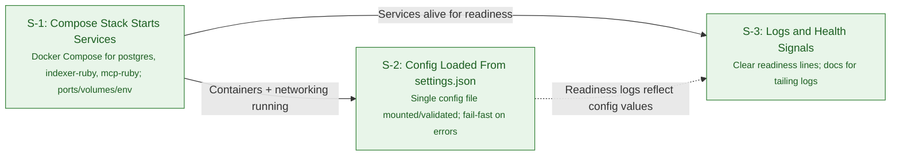

# Epics & Stories Index

This repository implements the "AI Context System — Local Repo Indexer + MCP Search Layer (Ruby + Docker, FTS-Only)" MVP.

- PRD: [docs/prds/prd.md](prds/prd.md)

## Epics
- Containerized MVP Setup — Compose services and base config
  - ✅ [S-1: Compose Stack Starts Services](epics/01-setup/s-1-compose.md)
  - ✅ [S-2: Config Loaded From settings.json](epics/01-setup/s-2-config.md)
  - ✅ [S-3: Logs and Health Signals](epics/01-setup/s-3-logs-health.md)
- Indexer CLI — Scan, hash, chunk, and map files
  - [S-1: Command Scaffolding](epics/02-indexer/s-1-command.md)
  - [S-2: Repo Scanning with Ignore Rules](epics/02-indexer/s-2-scan-ignore.md)
  - [S-3: Change Detection via mtime+size](epics/02-indexer/s-3-change-detection.md)
  - [S-4: Hash + Blob Deduplication](epics/02-indexer/s-4-dedupe-hash.md)
  - [S-5: Chunking](epics/02-indexer/s-5-chunking.md)
  - [S-6: Mapping and Garbage Collection](epics/02-indexer/s-6-mapping-gc.md)
- Database & FTS — Schema and full-text search index
  - [S-1: Connection and Migrations](epics/03-database/s-1-migrations.md)
  - [S-2: Tables](epics/03-database/s-2-tables.md)
  - [S-3: FTS Index](epics/03-database/s-3-fts-index.md)
  - [S-4: Minimal Seed/Smoke Check](epics/03-database/s-4-smoke-seed.md)
- MCP Server (`search`) — WebSocket tool exposing FTS results
  - [S-1: WebSocket Server Scaffolding](epics/04-mcp-api/s-1-server-scaffold.md)
  - [S-2: Tool Contract `search`](epics/04-mcp-api/s-2-tool-contract.md)
  - [S-3: FTS Query and Ranking](epics/04-mcp-api/s-3-fts-ranking.md)
  - [S-4: Container Integration](epics/04-mcp-api/s-4-container-integr.md)
- Configuration (`settings.json`) — Single source of truth for runtime
  - [S-1: Schema Definition](epics/05-configuration/s-1-schema.md)
  - [S-2: Loader and Validation](epics/05-configuration/s-2-loader-validate.md)
  - [S-3: Example and Docs](epics/05-configuration/s-3-example-docs.md)
- Usage & Integration — End-to-end steps and troubleshooting
  - [S-1: Usage Flow](epics/06-usage/s-1-usage-flow.md)
  - [S-2: Quick Troubleshooting](epics/06-usage/s-2-troubleshoot.md)

## Conventions
- Keep epics small and shippable; stories include tasks + acceptance.
- Link code and docs changes in PRs to the relevant epic.

## Setup Dependencies (Mermaid)
The following graph shows dependencies among the setup stories (hard vs. soft):



## Parallel Work Streams (2)
- **Stream A — Platform & Config (S-1, S-2):**
  - Deliver `docker-compose.yml`, shared network, volumes, healthchecks, and Makefile targets (`dev`, `logs`, `down`).
  - Define `config/settings.example.json` and validation rules; mount `settings.json` into services and wire `SETTINGS_PATH`.
  - Assigned stories: [S-1](epics/01-setup/s-1-compose.md), [S-2](epics/01-setup/s-2-config.md).
- **Stream B — Readiness & Ops (S-3):**
  - Implement clear single-line READY logs for `indexer-ruby` and `mcp-ruby`; ensure MCP listens on `0.0.0.0:8765`.
  - Update README with tailing commands and expected readiness output; optional lightweight healthchecks.
  - Assigned story: [S-3](epics/01-setup/s-3-logs-health.md).

Notes:
- Streams A and B can proceed in parallel once the minimal compose scaffold exists; Stream B can stub service commands if app code is pending.

## Ops: Tailing & Readiness (S-3)
- Tail logs for both services:
  - `docker compose logs -f indexer-ruby mcp-ruby`
- Filter just the readiness lines:
  - `docker compose logs mcp-ruby | rg '^READY'`
  - `docker compose logs indexer-ruby | rg '^READY'`
- Expected readiness output examples:
  - MCP: `READY mcp listening host=0.0.0.0 port=8765 tools=[search]`
  - Indexer: `READY indexer started batch_size=500 db_host=postgres`

Optional Compose healthchecks (add to your `docker-compose.yml`):

```yaml
services:
  mcp-ruby:
    healthcheck:
      test: ["CMD-SHELL", "nc -z localhost 8765 || exit 1"]
      interval: 5s
      timeout: 2s
      retries: 12
  indexer-ruby:
    healthcheck:
      test: ["CMD-SHELL", "grep -q '^READY indexer' /proc/1/fd/1 || exit 1"]
      interval: 10s
      timeout: 2s
      retries: 6
```
