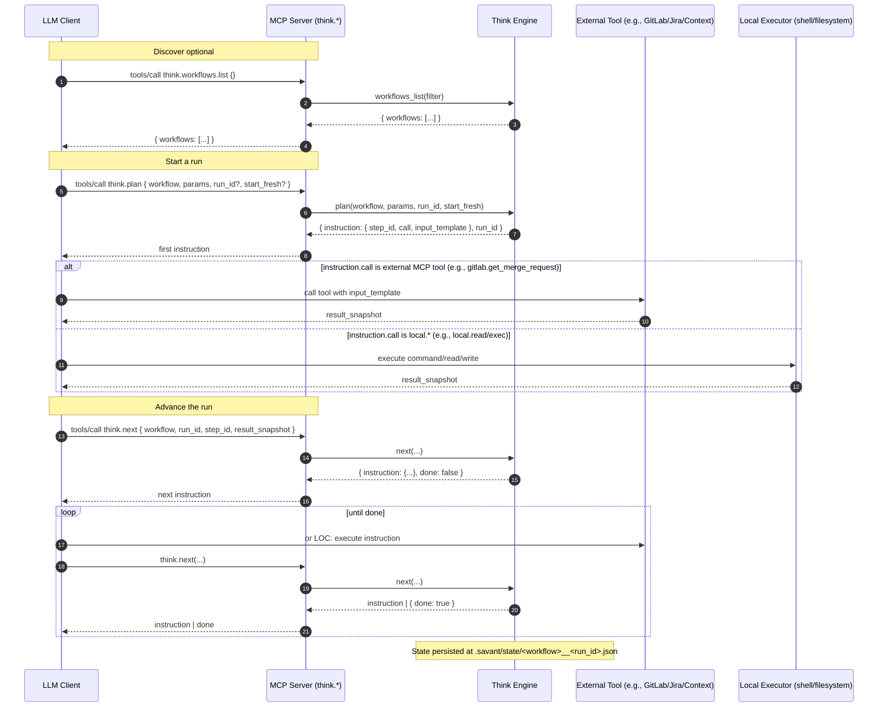

# Think Engine

Deterministic orchestration for LLM‑driven workflows: plan → execute tool → next, repeat until done.

## What Is Think
Think is a lightweight workflow engine exposed over MCP (stdio/HTTP). It loads YAML workflows, enforces a directed acyclic graph (DAG) of steps, and coordinates tool calls by returning precise instructions to the client. It also provides a versioned driver prompt to keep agent behavior predictable across runs.

## Why It’s Needed
- Consistency: Reproducible, step‑by‑step execution for complex tasks (e.g., code review).
- Safety: Enforces payload discipline and schema checks (no invented tools; size limits).
- Portability: No database; workflows, prompts, and state live in the repo.
- Extensibility: Add or change workflows without code changes; Think validates and runs them.

## Tools (API Surface)
The Think service exposes these tools. All calls are JSON‑RPC via MCP; examples below use the bundled CLI.

### `think.driver_prompt`
- Why: fetch the versioned driver prompt to prime the LLM with execution rules for Think.
- Params:
  - `version` (string, optional): key from `lib/savant/think/prompts.yml` (e.g., `stable-2025-11` via `stable` key, or `code_review`). Defaults to the latest entry.
- Returns: `{ version: string, hash: "sha256:...", prompt_md: string }`
- Example:
  ```bash
  ruby ./bin/savant call 'think.driver_prompt' --service=think \
    --input='{"version":"code_review"}'
  ```

### `think.plan`
- Why: start a workflow run and receive the first instruction to execute.
- Params:
  - `workflow` (string, required): workflow ID (e.g., `code_review_initial`).
  - `params` (object, optional): workflow parameters (e.g., `{ "mr_iid": "!12345" }`).
  - `run_id` (string, optional): provide your own run identifier; autogenerated if omitted.
  - `start_fresh` (boolean, optional, default true): clear any prior state for this run before starting.
- Returns: `{ instruction: { step_id, call, input_template, capture_as? }, state, run_id, done: false }`
- Example:
  ```bash
  ruby ./bin/savant call 'think.plan' --service=think \
    --input='{"workflow":"code_review_initial","params":{"mr_iid":"!12345"},"run_id":"cr-init-001","start_fresh":true}'
  ```

### `think.next`
- Why: advance the run by submitting the last tool's result; receive the next instruction or completion.
- Params:
  - `workflow` (string, required): workflow ID.
  - `run_id` (string, required): run identifier returned by `think.plan` (or supplied by you).
  - `step_id` (string, required): the `instruction.step_id` you just executed.
  - `result_snapshot` (object, optional): the tool's output payload; Think trims/summarizes if oversized.
- Returns: either `{ instruction: {...}, done: false }` or `{ done: true, summary: string }`
- Example:
  ```bash
  ruby ./bin/savant call 'think.next' --service=think \
    --input='{"workflow":"code_review_initial","run_id":"cr-init-001","step_id":"load_config","result_snapshot":{"files":[".cline/config.yml"],"content":"..."}}'
  ```

### `think.workflows.list`
- Why: discover available workflows.
- Params:
  - `filter` (string, optional): substring match to limit the list.
- Returns: `{ workflows: [ { id: string, version: string, desc: string } ] }`
- Example:
  ```bash
  ruby ./bin/savant call 'think.workflows.list' --service=think --input='{"filter":"code_review"}'
  ```

### `think.workflows.read`
- Why: inspect the raw YAML for a workflow (useful for tooling and debugging).
- Params:
  - `workflow` (string, required): workflow ID.
- Returns: `{ workflow_yaml: string }`
- Example:
  ```bash
  ruby ./bin/savant call 'think.workflows.read' --service=think \
    --input='{"workflow":"code_review_initial"}'
  ```

### `prompt.say`
- Why: display/record a message in the run; utility step used by workflows to announce progress.
- Params:
  - `text` (string, required): message to surface.
- Returns: `{ message: string, display: true, timestamp: ISO8601 }`
- Example:
  ```bash
  ruby ./bin/savant call 'prompt.say' --service=think \
    --input='{"text":"Hello from Think"}'
  ```

## What You Can Do With It
- Run the provided workflows:
  - `code_review_initial` (Phase 1) and `code_review_final` (Phase 2)
  -  `develop_ticket_v1`, `ticket_grooming_v1`
- Create your own workflows under `lib/savant/think/workflows/` and iterate quickly.
- See per‑workflow descriptions and diagrams here: [docs/engines/workflows](./workflows/)

## How It Works
1) Client calls `think.plan(workflow, params)` → Think loads YAML, validates schema, builds a DAG, injects the driver prompt if needed, and returns the first instruction `{ step_id, call, input_template }`.
2) Client executes exactly that tool (e.g., `local.read`, `gitlab.get_merge_request`, `fts/search`).
3) Client sends the tool’s snapshot to `think.next(workflow, run_id, step_id, result_snapshot)`.
4) Think persists state (`.savant/state/<workflow>__<run_id>.json`), marks the step complete, and returns the next instruction. Repeat until finished.

Details
- Workflows: `.yml|.yaml` accepted; each step defines `id`, `call`, `deps`, and an `input_template`; optional `capture_as` stores the tool snapshot in state.
- Driver prompt: Versioned via `lib/savant/think/prompts.yml` and returned by `think.driver_prompt`.
- Limits: Payload size caps with truncation/summarization to keep snapshots manageable.

## Run
- Stdio: `MCP_SERVICE=think SAVANT_PATH=$(pwd) ruby ./bin/mcp_server`
- HTTP (testing): `MCP_SERVICE=think ruby ./bin/mcp_server --http`

## Sample Flow
Example (CLI) showing the first loop of a workflow:

```bash
# 1) Start the engine (stdio)
MCP_SERVICE=think SAVANT_PATH=$(pwd) ruby ./bin/mcp_server

# 2) Client asks for available workflows
ruby ./bin/savant call 'think.workflows.list' --service=think --input='{}'

# 3) Plan the run (e.g., code_review_initial)
ruby ./bin/savant call 'think.plan' \
  --service=think \
  --input='{"workflow":"code_review_initial","params":{"mr_iid":"!12345"},"run_id":"cr-init-001","start_fresh":true}'

# -> returns: { instruction: { step_id, call, input_template }, state, run_id }

# 4) Execute the instructed tool (example: local.read of .cline/config.yml)
ruby ./bin/savant call 'local.read' --service=think \
  --input='{"files":[".cline/config.yml"]}'

# 5) Advance the workflow with that snapshot
ruby ./bin/savant call 'think.next' --service=think \
  --input='{"workflow":"code_review_initial","run_id":"cr-init-001","step_id":"load_config","result_snapshot":{"files":[".cline/config.yml"],"content":"..."}}'

# -> returns next instruction; repeat until done
```

## Sequence Diagram
High-level interaction between an LLM client and the Think engine using `plan` and `next`:


