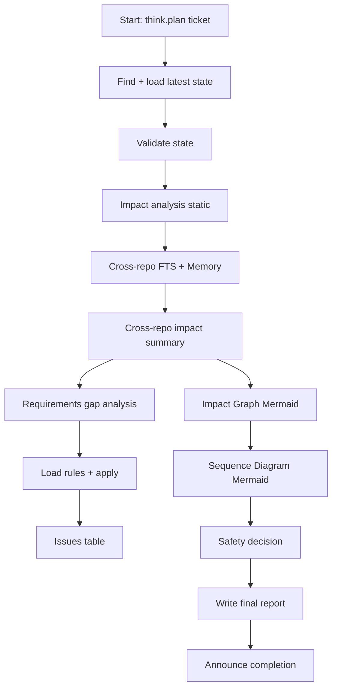

# Workflow: code_review_final

Purpose: Phase 2 of code review — load state from Phase 1, perform impact and cross‑repo analysis, generate diagrams, apply rules, decide safety, and write the final report.

Prerequisite
- Run `code_review_initial` first. Use `ticket={TICKET}` to load the latest state.

Key outputs
- `code-reviews/{TICKET}-{TIMESTAMP}.md` (embedded Mermaid Impact Graph and Sequence Diagram)

Mermaid (high‑level flow)

