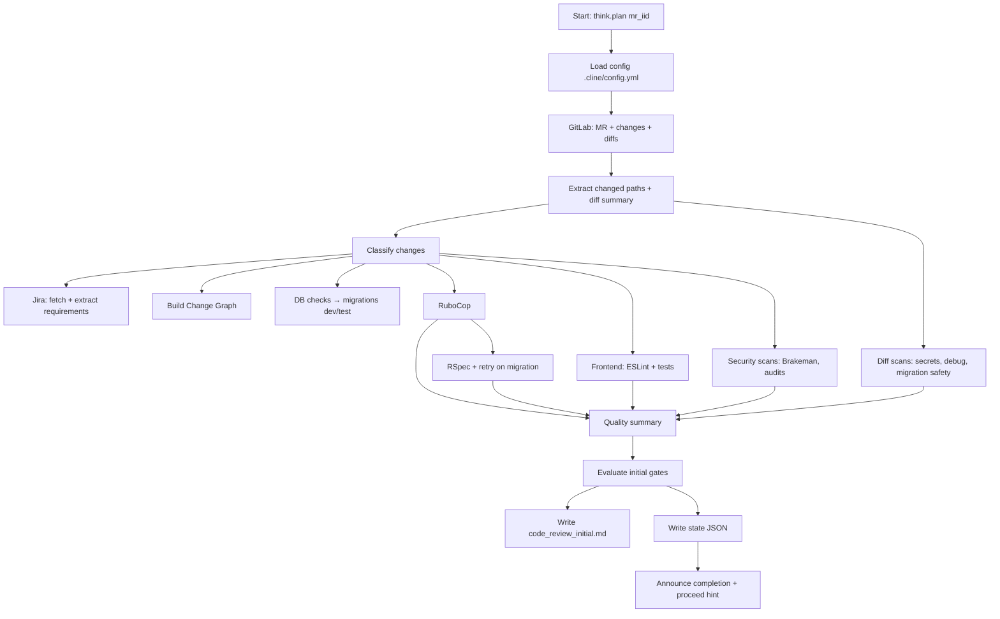

# Workflow: code_review_initial

Purpose: Phase 1 of code review — collect MR data, classify changes, run quality gates and security scans, produce an initial report and state. If gates pass, announce it’s safe to proceed to Phase 2.

Key outputs
- `code-reviews/{TICKET}/{TIMESTAMP}/code_review_initial.md` (embedded Mermaid Change Graph)
- `.savant/code-review/{TICKET}-{TIMESTAMP}-state.json`

Mermaid (high‑level flow)

