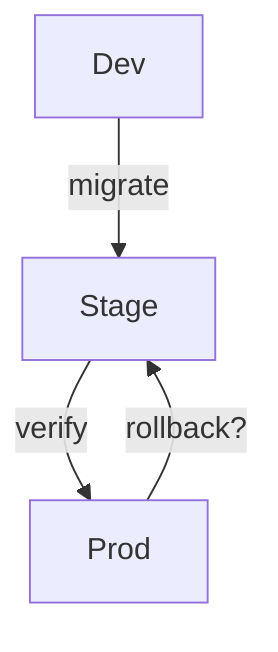

# Workflow: cr_delivery — Delivery & Ops Readiness

Purpose: Ensure migration safety, CI gates, configs/flags, observability, docs, and merge readiness. Independent report written to `code-reviews/<ticket_id>/<YYYY-MM-DD>/cr_delivery.md` with Mermaid visuals embedded.

Required params (think.plan → params)
- `ticket_id`, `repo_path`, `branch`, `base_branch`, `pr_number`, `date` (YYYY‑MM‑DD), `reviewer`.

Key steps & gates
- Gate: migrations → if yes, run migrations checks; gate destructive backup/restore.
- Gate: CI → if yes, fetch CI status (GitHub MCP: `github.ci.status`).
- Gate: config/env/flags → if yes, review changes and defaults.
- Gate: observability → if yes, ensure logs/metrics/traces/alerts.
- Gate: docs/release notes → if yes, verify updates.
- Gate: cross‑repo release coordination → if yes, use Context `fts/search`.

Visuals (Mermaid)

Output
- Header block, summary, visuals, findings, actions, merge readiness verdict.

