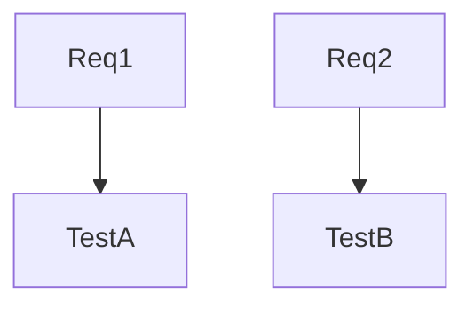

# Workflow: cr_quality_security — Quality & Security

Purpose: Validate requirements coverage, implementation quality, security posture, and performance risk. Independent report written to `code-reviews/<ticket_id>/<YYYY-MM-DD>/cr_quality_security.md` with Mermaid visuals embedded.

Required params (think.plan → params)
- `ticket_id`, `repo_path`, `branch`, `base_branch`, `pr_number`, `date` (YYYY‑MM‑DD), `reviewer`.

Key steps & gates
- Requirements understanding (PRD/Jira + PR context).
- Gate: business-flow change → if yes, compare implementation; pros/cons and rating.
- Gate: tests change → if yes, run tests and compute coverage delta.
- Gate: lint/static → if yes, run linter.
- Gate: performance → if yes, assess complexity shifts/hotspots.
- Lightweight secret scan always; gate deep secret scan.
- Gate: auth/authz; gate: dependency CVEs.

Visuals (Mermaid)

Output
- Header block, summary, visuals, findings, actions, quality and security scores, overall risk.

