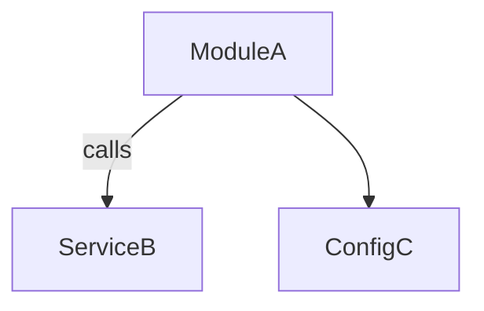

# Workflow: cr_scope — Scope & Impact

Purpose: Define PR scope, impacted areas, dependencies, and backward‑compatibility risk. Independent report written to `code-reviews/<ticket_id>/<YYYY-MM-DD>/cr_scope.md` with Mermaid visuals embedded.

Required params (think.plan → params)
- `ticket_id`, `repo_path`, `branch`, `base_branch`, `pr_number`, `date` (YYYY‑MM‑DD), `reviewer`.

Key steps & gates
- PR snapshot (GitHub MCP: `github.pr.snapshot`).
- Size/churn and impact map summary.
- Gate: public API/BC → if yes, run API/BC analysis.
- Gate: dependencies → if yes, summarize dep changes.
- Gate: config/env → if yes, review env/config changes.
- Gate: cross‑repo impact → if yes, use Context `fts/search`.

Visuals (Mermaid)

Output
- Header block, summary, visuals, findings, actions, risk score.

