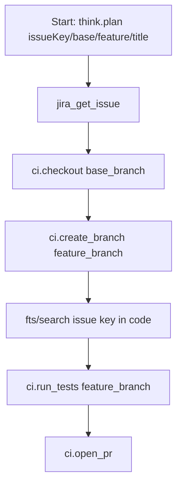

# Workflow: develop_ticket_v1

Purpose: Develop a ticket from Jira — fetch ticket, branch from base, search context, run tests, and open a PR.

Parameters
- `issueKey`, `base_branch`, `feature_branch`, `title`

Mermaid (flow)

