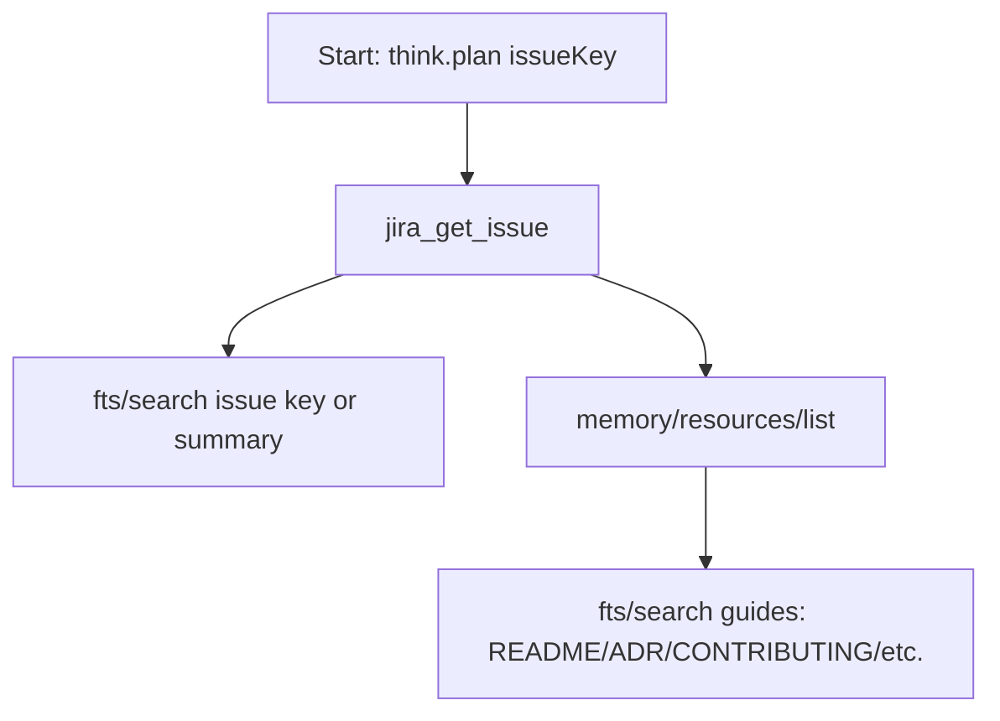

# Workflow: ticket_grooming_v1

Purpose: Groom and plan implementation for a ticket — pull the issue, scan the repo for related context, list memory resources, and surface planning guides.

Parameters
- `issueKey`

Mermaid (flow)

