# Savant Architecture Document (Full Version)

## 1. Overview
Savant is a local-first Agent Operating System that orchestrates autonomous code-editing agents, multi-agent workflows, safe tool execution via MCP, parallel repo indexing, and rich observability. It is implemented as:

## 🔥 FINAL SAVANT SUBSYSTEM NAMES
### 1. Savant Engine → “Savant Core”
Purpose: Execution, Orchestration, Runtime
Savant Core is the heart of the entire platform.
It performs all execution, routing, reasoning orchestration, sandbox control, MCP integration, and logging.

### 2. Python Backends → “Savant Mind”
Purpose: AI cognition (LangChain + LangGraph)
The cognitive layer of the system: all agent reasoning, workflow reasoning, planning, tool-use decisions, transitions, and Intent generation.

### 3. React Hub → “Savant Hub
Purpose: UI for agents, workflows, repos, MCP, logs
The interface where developers configure, run, observe, and manage everything.

### 4. MCP Tool Layer → “Savant Tools
Purpose: File edits, git ops, exec, sandbox action
The execution layer that performs real-world actions safely.

### 5. Sandbox → “Savant Sandbox
Purpose: isolated environment for all code operations
Provides a secure workspace for edits, tests, git operations, builds, etc.

### 6. Repo Indexer → “Savant Scout”
Purpose: scan repos, index context, embed files

A parallel service that continuously analyzes and prepares code context.

### 7. PostgreSQL Definitions Store → “Savant pg
Purpose: store definitions (agents, workflows, repos)

Central configuration database for the platform.

### 8. MongoDB Log Store → “Savant mongo
Purpose: event logs, execution timelines, debugging
A full historical trace of every action and decision.

---

- **Savant Engine (Ruby Fiber Runtime)**
- **MCP Tools + Sandbox**
- **Python Reasoning Backends (LangChain + LangGraph)**
- **React Hub (UI)**
- **PostgreSQL (definitions)**
- **MongoDB (logs)**

## 2. High-Level Architecture Diagram

```mermaid
flowchart TD
    subgraph Hub["React Hub (UI)"]
        A1[Edit Agents]
        A2[Edit Personas]
        A3[Edit Workflows]
        A4[Edit Workflow Graphs]
        A5[Edit MCP Servers]
        A6[Add/Disable Repos]
        A7[Search Context]
        A8[View Logs]
    end

    subgraph Engine["Savant Core (Ruby Fiber Runtime)"]
        E1[Agent Runtime\nFiber]
        E2[Workflow Runtime\nFiber]
        E3[MCP Multiplexer]
        E4[Sandbox Manager]
        E5[Repo Indexer Fiber]
        E6[DB Layer Postgres]
        E7[Logging Layer Mongo]
        E8[API Layer]
    end

    subgraph Python["Savant Mind"]
        P1[LangChain → Agent Intent]
        P2[LangGraph → Workflow Intent]
    end

    subgraph MCP["Savant Tools"]
        M1[FS MCP]
        M2[Git MCP]
        M3[Exec MCP]
    end

    subgraph Sandbox["Savant Sandbox"]
        S1[Isolated FS/Jail/Docker]
    end

    Hub -->|HTTP/WS| Engine
    Engine -->|Intent| Python
    Python -->|Agent/Workflow Intent| Engine
    Engine -->|Tool Calls| MCP
    MCP --> Sandbox
    Engine -->|Read/Write| Postgres
    Engine -->|Logs| Mongo
```



## 3. Module-Level Architecture

### 3.1 Savant Engine
**Language:** Ruby  
**Concurrency:** Fibers  
**Responsibilities:**
- Loads all definitions from Postgres
- Runs agents (LangChain) 
- Runs workflows (LangGraph)
- Executes all tool calls through MCP Multiplexer
- Controls sandbox environment
- Runs Repo Indexer in parallel
- Emits runtime logs to Mongo
- Exposes HTTP API for Hub

### 3.2 MCP Multiplexer
- Routes tool calls to proper MCP process
- Enforces sandbox constraints
- Manages MCP lifecycle: start/stop/reload
- Validates schemas

### 3.3 MCP Tools
**FS MCP**
- read_file  
- write_file  
- search  

**Git MCP**
- diff  
- apply_patch  
- commit  

**Exec MCP**
- run tests  
- run linters  
- run commands  

All MCPs operate **only inside sandbox**.

### 3.4 Sandbox Manager
- Creates isolated workspace (dir jail or Docker)
- Prevents access outside allowed path
- Ensures reproducible execution

### 3.5 Repo Indexer
Runs in independent fiber.
- Scans repos
- Chunks files
- Generates embeddings
- Stores metadata in Postgres
- Logs index events to Mongo

### 3.6 Python Backends
Pure reasoning layer.
- LangChain → Agent Intent
- LangGraph → Workflow Intent

No FS/Git/Exec/DB access.

### 3.7 PostgreSQL Schema (Definitions Only)
- agents  
- personas  
- rules  
- drivers  
- workflows  
- workflow_graphs  
- repos  
- repo_files  
- mcp_servers  
- mcp_tools  
- context_chunks  

### 3.8 MongoDB Schema (Logs Only)
Collections:
- agent_runs  
- workflow_runs  
- tool_calls  
- fs_ops  
- git_ops  
- exec_ops  
- sandbox_events  
- runtime_errors  
- langchain_calls  
- langgraph_transitions  

## 4. Intent Model

### 4.1 Agent Intent
Example:
```json
{
  "type": "tool_call",
  "tool": "git.apply_patch",
  "args": { "diff": "..." }
}
```

Types include:
- tool_call  
- final_output  
- propose_patch  
- propose_file_change  
- run_tests  

### 4.2 Workflow Intent
Example:
```json
{
  "type": "workflow_transition",
  "next_node": "summarizer"
}
```

Types:
- workflow_transition  
- branch  
- loop  
- workflow_complete  

## 5. Implementation Roadmap

### Phase 1 — Engine Core (v0.1)
- Engine boot loader
- Postgres schema + migrations
- Mongo logging driver
- MCP Multiplexer
- FS/Git/Exec MCP servers
- Sandbox manager
- Basic agent execution (LangChain)
- Basic workflow execution (Yaml-based)

### Phase 2 — Repo + Context (v0.2)
- Repo Indexer fiber
- Repo add/remove/disable API
- File scanning + metadata extraction
- Context search API
- Improved workflow graph compiler

### Phase 3 — Hub Integration (v0.3)
- React Hub scaffold
- Agent editor UI
- Workflow builder UI
- Repo management UI
- Tool registry UI
- Log viewer (timeline)

### Phase 4 — Full Multi-Agent Orchestration (v0.4)
- Complete workflow graph execution
- Conditional branches
- Looping / state retention
- Full sandbox test/lint execution
- Realtime Hub updates via WebSockets

### Phase 5 — Optimization + Hardening
- Sandboxed Docker execution
- Advanced patch safety checks
- Agent memory caching
- Repo incremental index updates
- Tool performance profiling

## 6. Summary
This document defines the full production architecture for Savant, including:
- module boundaries
- data flow
- execution flow
- fiber-based runtime
- storage layers
- sandbox safety model
- indexing pipeline
- orchestrator model
- Hub API expectations

It is the single source of truth for the system.
