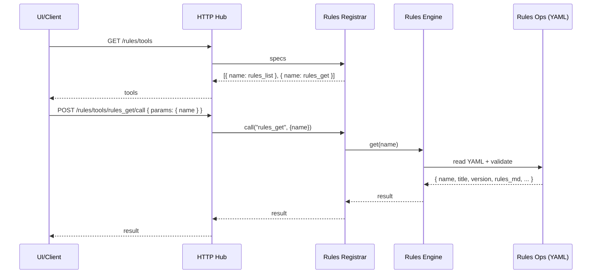

# Savant – Rules MCP (MVP PRD)

> A lightweight MCP engine that exposes curated “Savant Rules” (e.g., Code Review Rules, Backend Rules, Testing Rules, Style Rules, Security Rules) as versioned, structured prompts/policies for LLMs and agent runtimes. Provides discovery and lookup tools, integrates with the Hub for auto‑mounting, and surfaces in the React UI similar to Personas.

## Problem & Outcome
- Problem: Teams repeatedly ask LLMs to follow a set of organization rules (code review, backend, testing, security, style) but lack a consistent, versioned, discoverable source.
- Outcome: A dedicated MCP engine that stores canonical rule sets and exposes simple tools to list/fetch rules by name. Rules are easy to mount, query, and reuse across editors and flows.

## In Scope (MVP)
- Engine: `rules` with stdio/HTTP MCP support via Hub.
- Tools:
  - `rules_list` — returns all rule sets (names, titles, versions, brief summaries/tags).
  - `rules_get` — returns a single ruleset by name with full markdown text and metadata.
- Data: File‑backed catalog in repo (YAML), versioned entries; no DB required.
- Hub: Auto‑mount under `/rules` (default) and appear in Hub engines listing.
- React UI: Show as a mounted engine card (like context/think/jira/personas). MVP requires a Rules tab with list + YAML viewer + markdown dialog (copy button), mirroring Personas UX.
- Docs: Engine README entry (in Memory Bank) with stdio usage AND explicit “Hub mount” instructions. README should link to Memory Bank.

## Out of Scope (MVP)
- Authoring UI (manual edits to YAML only).
- Remote or user‑scoped rules stores (future backends).
- LLM execution or enforcement logic (consumers apply rules themselves).

## Rules Data Model
- Location: `lib/savant/rules/rules.yml`
- Schema (YAML list of objects):
  - `name` (string, required, unique): machine‑friendly key (e.g., `code-review-rules`).
  - `title` (string, required): display name (e.g., `Code Review Rules`).
  - `version` (string, required): semantic or date tag (e.g., `v1.0.0`, `stable-2025-01`).
  - `summary` (string, required): short one‑liner on purpose.
  - `tags` (string[] optional): keywords (e.g., [`review`, `backend`, `security`]).
  - `rules_md` (string, required): full markdown rule set.
  - `notes` (string, optional): guidance for usage or limits.

Example snippet:
```yaml
- name: code-review-rules
  title: Code Review Rules
  version: v1.0.0
  summary: Practical guidelines for consistent code review.
  tags: ["review", "quality", "consistency"]
  rules_md: |
    # Code Review Rules
    - Prefer small, focused changes...

- name: backend-rules
  title: Backend Rules
  version: stable-2025-01
  summary: Backend patterns, boundaries, and safety constraints.
  tags: ["backend", "design", "safety"]
  rules_md: |
    # Backend Rules
    - Separate transport, orchestration, and IO layers...
```

## Engine Structure
- Files (mirror Personas):
  - `lib/savant/rules/engine.rb` — entrypoint; dispatches tool calls.
  - `lib/savant/rules/ops.rb` — loads YAML catalog; implements list/get.
  - `lib/savant/rules/tools.rb` — MCP registrar with input/output schemas.
  - `logs/rules.log` — engine logs (via `Savant::Logger`).
- Service selection: `MCP_SERVICE=rules`.
- Transport: stdio (default) or HTTP (test mode) via `bin/mcp_server` flags.

## MCP Tools (Contracts)
1) `rules_list`
   - Purpose: discover available rule sets.
   - Input: `{ filter?: string }` (substring on `name|title|tags|summary`).
   - Output: `{ rules: [{ name, title, version, summary, tags? }] }`.
   - Errors: `invalid_input`, `load_error`.

2) `rules_get`
   - Purpose: fetch one ruleset by `name`.
   - Input: `{ name: string }`.
   - Output: `{ name, title, version, summary, tags?, rules_md, notes? }`.
   - Errors: `not_found`, `invalid_input`, `load_error`.

## Sequence (HTTP via Hub)


## React UI Integration (MVP)
- Dashboard: engine card titled “Rules” with tool count `2`.
- Rules page: list + filter left; right has YAML viewer; “View Rules” opens markdown dialog; “Copy YAML/Rules” icons.
- Diagnostics: show catalog size and recent `rules_get` counts per name (use Hub recent requests like Personas Diagnostics).

## Hub Mounting
- Default path: `/rules`.
- Auto‑mount behavior: if mounts config is absent, Hub may auto‑discover engines. Otherwise add to `config/mounts.yml`:
  ```yaml
  mounts:
    - engine: "rules"
      path: "/rules"
  ```

## Engine README + Mounting Instructions
- Add `memory_bank/engine_rules.md` covering:
  - What/why, tool docs, examples
  - Stdio usage: `MCP_SERVICE=rules SAVANT_PATH=$(pwd) ruby ./bin/mcp_server`
  - Hub mount usage (explicit): `make hub` then `GET /rules/tools` and `POST /rules/tools/:name/call`.

## Ops & Logging
- Logs to `/tmp/savant/rules.log` (Hub) and `logs/rules.log` (stdio). Include tool calls, durations, and errors.
- Env: `LOG_LEVEL` honored; no secrets required.

## Acceptance Criteria
- MCP engine exposes exactly two tools: `rules_list` and `rules_get`.
- Rules YAML supports at least `code-review-rules` and `backend-rules` with complete markdown.
- Hub lists the engine and mounts it under `/rules`.
- React dashboard shows the Rules engine card.
- Rules page exists with list + YAML viewer + markdown dialog (copy buttons).
- `memory_bank/engine_rules.md` exists and README points to Memory Bank.

## Implementation Plan (Agent‑Friendly)
1) Scaffold engine: `ruby ./bin/savant generate engine rules --force`
2) Add files:
   - `lib/savant/rules/ops.rb` (YAML loader, list/get)
   - `lib/savant/rules/tools.rb` (DSL registrar: rules_list/get)
   - `lib/savant/rules/rules.yml` (seed two rulesets)
3) Wire Hub: add to `config/mounts.yml` if not auto‑discovered
4) UI:
   - Engine card icon/color mapping
   - Add Routes + Page `/engines/rules`
   - List + YAML viewer + markdown dialog; copy icons
   - Diagnostics section: catalog size + recent rules_get per name
5) Docs:
   - `memory_bank/engine_rules.md` (usage + examples + diagrams)
   - README stays short and points to Memory Bank
6) Tests:
   - Ops spec for YAML loader (list/filter/get)
   - Registrar spec for tools
   - Hub specs unchanged; existing patterns cover mounts + logs
7) Lint/Build:
   - `bundle exec rubocop -A`, `bundle exec rspec`, `make ui-build`

