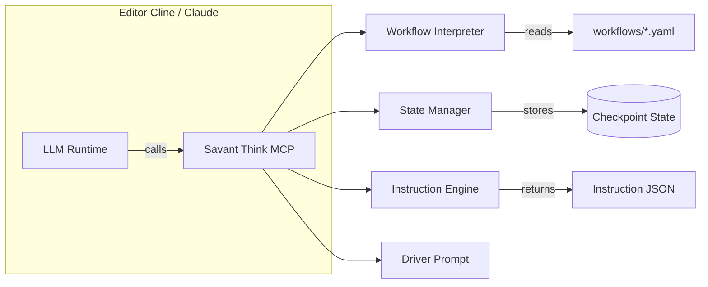
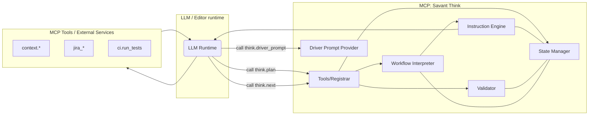
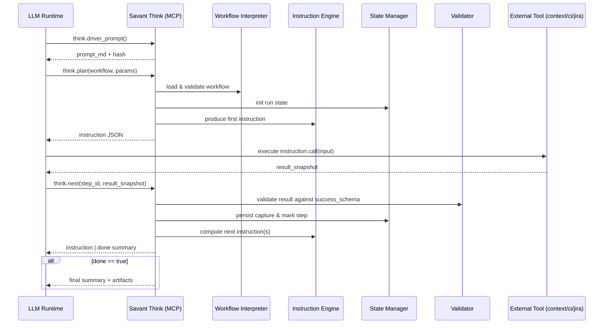

# 🧠 Savant Think  
### Deterministic Orchestration & Reasoning Engine  
> “The layer that decides what happens next.”

## Component Reference — quick guide

Below are concise, implementation-focused explanations of Savant Think's primary components. Each entry shows the contract (inputs/outputs), core responsibilities, common error modes, and implementation notes so engineers can quickly map the PRD to code.

### Workflow Interpreter
- Contract: YAML workflow → normalized AST/DAG (nodes with ids, deps, templates).
- Responsibilities: parse and validate workflow YAML, expand `when`/`foreach`, normalize variable interpolation, and emit a deterministic execution graph.
- Errors: YAML/schema violations, unresolved vars, circular deps.
- Impl notes: validate with JSON Schema, expand foreach into explicit nodes, and produce a DAG for the Instruction Engine.

#### Flow sequence
1. Caller: Developer, CI, or `think.plan` tool
   - Call: internal API or tool call to load/resolve a workflow.
   - Payload example:

```json
{ 
  "workflow": "review_v1",
  "params": {
    "jira": {
      "project_code": "ABC",
      "ticket_id": "ABV-123"
    },
    "gitlab":{
      "project": "something/something",
      "base_branch": "main",
      "feature_branch": "feature/x"
    },
  }
}
```

2. Interpreter actions:
   - Read `workflows/review_v1.yaml` from disk (or repo/config path).
   - Parse YAML into an AST and run JSON Schema validation.
   - Resolve `when` expressions and `foreach` expansions using provided `params`.
   - Normalize templates and compute explicit step dependencies (DAG).
   - Detect cycles, unresolved variables, or invalid constructs and return diagnostics.

3. Response (success):

```json
{
  "workflow": "review_v1",
  "graph": {
    "nodes": [ { "id": "lint", "deps": [] }, { "id": "tests", "deps": ["lint"] } ],
    "entry": "lint"
  },
  "v": "1"
}
```

4. Response (error):

```json
{ "error": "YAML_SCHEMA_VIOLATION", "details": "missing required field: steps[0].call" }
```

##### Implementation Deep Dive: Workflow Interpreter Actions

Below is a breakdown of **how** each Interpreter action is implemented and **what technology stack** is required.

###### Action 1: Read `workflows/review_v1.yaml` from disk

**How:**

- Load file from the filesystem using a fixed, known path within the Savant repo.
- Construct path: `lib/savant/think/workflows/review_v1.yaml` (relative to repo root).
- The Interpreter is always running within the Savant context, so this path is deterministic.

**Technology:**

- Ruby: `File.read()` or `IO.read()` to load file.
- Error handling: rescue `Errno::ENOENT` for missing files, `Errno::EACCES` for permission issues.

**Example (Ruby):**

```ruby
workflow_path = File.join(Savant::Config.repo_root, 'lib/savant/think/workflows', "#{workflow_id}.yaml")
yaml_content = File.read(workflow_path)
```

---

###### Action 2: Parse YAML into an AST and run JSON Schema validation

**How:**

- Use a YAML parser to convert the file into a native Ruby Hash/Array tree.
- Define a JSON Schema that specifies valid workflow structure (required fields, types, allowed values).
- Use a JSON Schema validator to check the parsed Hash against the schema.
- Return the parsed Hash if valid, or collect validation errors.

**Technology:**

- YAML parser: Ruby's built-in `YAML.safe_load()` (ships with Ruby).
- JSON Schema: use `json-schema` gem (already in Gemfile) or equivalents like `jsonschema`.
- Validation library: `json_schemer` gem or manual validation if schema is simple.

**Workflow Schema (minimal example):**

```json
{
  "type": "object",
  "required": ["name", "version", "steps"],
  "properties": {
    "name": { "type": "string" },
    "version": { "type": "string" },
    "steps": {
      "type": "array",
      "minItems": 1,
      "items": {
        "type": "object",
        "required": ["id", "call"],
        "properties": {
          "id": { "type": "string" },
          "call": { "type": "string" },
          "input_template": { "type": "object" },
          "capture_as": { "type": "string" },
          "success_schema": { "type": "string" },
          "when": { "type": "string" },
          "foreach": { "type": "string" }
        }
      }
    }
  }
}
```

**Example (Ruby):**

```ruby
parsed = YAML.safe_load(yaml_content, permitted_classes: [Symbol], aliases: true)
validator = JSON::Validator.new(schema_hash)
errors = validator.validate(parsed)
if errors.any?
  return { error: "YAML_SCHEMA_VIOLATION", details: errors.join("; ") }
end
```

---

###### Action 3: Resolve `when` expressions and `foreach` expansions using provided `params`

**How:**

- Iterate through each step in the workflow.
- For steps with a `when` clause, evaluate the boolean expression in the context of `params` and state variables.
  - If `when` evaluates to false, skip or mark the step as conditional.
  - If true, include the step.
- For steps with a `foreach` clause, iterate over a collection from `params` or state and create a copy of the step for each item.
  - Inject loop variables (e.g., `{{item.id}}`, `{{loop.index}}`) into the step's templates.

**Technology:**

- Expression evaluator: Ruby `eval()` (unsafe) or a templating engine like Tilt/ERB for safe interpolation.
- Template rendering: use string interpolation with context binding or a lightweight template engine.
- Safer alternative: hand-written expression parser for simple conditionals (`a > 5`, `b == "value"`).

**Example (Ruby with safe binding context):**

```ruby
def resolve_step(step, params, state)
  # Resolve 'when' clause
  if step['when']
    context = { params: params, state: state, **params }
    condition = eval_safe(step['when'], context)
    return nil unless condition  # skip if condition is false
  end

  # Resolve 'foreach' clause
  if step['foreach']
    collection = resolve_var(step['foreach'], params, state)
    return collection.map.with_index do |item, idx|
      expanded_step = deep_copy(step)
      expanded_step['id'] = "#{step['id']}_#{idx}"
      expanded_step['_loop_var'] = item
      expanded_step['_loop_index'] = idx
      expanded_step
    end
  end

  [step]  # return single step wrapped in array
end

def resolve_var(var_ref, params, state)
  # e.g., resolve "{{params.pr_ids}}" to actual array
  case var_ref
  when /^params\.(.+)$/
    params[$1] || []
  when /^state\.(.+)$/
    state[$1] || []
  else
    [var_ref]
  end
end
```

---

###### Action 4: Normalize templates and compute explicit step dependencies (DAG)

**How:**

- Walk the final list of (resolved) steps and record dependencies:
  - Explicit deps: if a step has `deps: ["step_a", "step_b"]`, add those edges.
  - Implicit deps: parse the step's `input_template` and capture references (e.g., `{{capture_as_from_step_x}}`); infer edges from those.
  - Build a directed acyclic graph (DAG) with nodes (steps) and edges (deps).
- Normalize each step's `input_template` by marking which variables it needs, allowing validation later.

**Technology:**

- Regex or simple parser to extract template variable references: `{{(\w+(?:\.\w+)*)}}`.
- Graph library: Ruby's `tsort` module (in stdlib) for topological sort, or hand-roll a DFS-based DAG check.
- Data structure: represent DAG as Hash of node_id → { deps: [...], node: step_def }.

**Example (Ruby):**

```ruby
require 'tsort'

def build_dag(steps)
  dag = {}
  steps.each do |step|
    deps = step['deps'] || []
    
    # Infer deps from input_template
    if step['input_template'].is_a?(Hash)
      template_str = step['input_template'].to_json
      template_str.scan(/{{(\w+(?:\.\w+)*)}}/) do |match|
        var_name = match[0].split('.')[0]  # extract base var
        # Try to find step that captures this var
        capture_step = steps.find { |s| s['capture_as'] == var_name }
        deps << capture_step['id'] if capture_step
      end
    end
    
    dag[step['id']] = { step: step, deps: deps.uniq }
  end
  
  # Topological sort to validate DAG (no cycles)
  begin
    sorted = TSort.tsort(dag.method(:each_key), ->(n) { dag[n][:deps].each { |d| yield d } })
  rescue TSort::Cyclic
    return { error: "CYCLIC_DEPENDENCY", cycle: find_cycle(dag) }
  end
  
  { nodes: dag, entry: sorted.first, order: sorted }
end
```

---

###### Action 5: Detect cycles, unresolved variables, or invalid constructs and return diagnostics

**How:**

- Run the topological sort (above) to detect cycles.
- After DAG construction, walk each step and check that all required variables (from template) are either:
  - Provided in `params`, or
  - Captured by a predecessor step (via `capture_as`).
- Validate that each `call` target maps to a known MCP tool name (check against a tool registry).
- Return a list of diagnostics with error codes and actionable messages.

**Technology:**

- Topological sort with cycle detection (as above).
- Variable resolution: cross-reference `capture_as` from all predecessor steps.
- Tool registry: maintain a static list or query MCP tool discovery.

**Example (Ruby):**

```ruby
def validate_workflow(dag, params, tool_registry)
  diagnostics = []
  available_vars = Set.new(params.keys)
  
  dag[:order].each do |step_id|
    step = dag[:nodes][step_id][:step]
    
    # Check: call is a known tool
    unless tool_registry.include?(step['call'])
      diagnostics << { error: "UNKNOWN_TOOL", step: step_id, details: "tool not in registry: #{step['call']}" }
    end
    
    # Check: all template vars are available
    if step['input_template'].is_a?(Hash)
      template_str = step['input_template'].to_json
      template_str.scan(/{{(\w+(?:\.\w+)*)}}/) do |match|
        var_name = match[0]
        unless available_vars.include?(var_name)
          diagnostics << { error: "UNRESOLVED_VAR", step: step_id, var: var_name }
        end
      end
    end
    
    # Add this step's capture to available vars for successors
    available_vars.add(step['capture_as']) if step['capture_as']
  end
  
  diagnostics
end
```

---

###### Summary: Technology Stack for Workflow Interpreter

| Task | Technology | Ruby Gem / Stdlib |
|------|------------|------------------|
| Load YAML | YAML parser | `YAML.safe_load()` (stdlib) |
| Validate schema | JSON Schema validator | `json-schema` (Gemfile) or `json_schemer` |
| Evaluate conditionals | Safe expression evaluator | hand-rolled or `eval_safe` wrapper |
| Template rendering | String interpolation | stdlib or ERB/Tilt |
| Cycle detection | Topological sort | `TSort` (stdlib) |
| Graph representation | Hash of deps | stdlib Hash |
| Variable resolution | Regex parsing | stdlib Regexp |
| Tool registry | Array or MCP discovery | custom or MCP tool discovery |

---

### Instruction Engine

- Contract: (workflow node + state) → Instruction JSON (step_id, call, input_template, capture_as, success_schema, rationale, done).
- Responsibilities: serialize a step into a precise, versioned instruction the LLM/runtime executes.
- Errors: template rendering failures, missing inputs, unsupported call targets.
- Impl notes: define a stable Instruction JSON schema and keep `call` tool-agnostic (string mapping to MCP registry).

#### Flow Sequence for Instruction Engine

1. Caller: `think.plan` or `think.next` within the MCP Engine
   - Call: request an instruction for a resolved node.
   - Payload example:

```json
{ "workflow": "review_v1", "node_id": "lint", "state": { "vars": {} } }
```

2. Instruction Engine actions:
   - Load node definition from the Interpreter's graph.
   - Render `input_template` using state variables and provided params.
  - Attach `success_schema`, `rationale`, `timeout`, and other metadata.
  - Ensure the `call` maps to a valid MCP tool name.

3. Response (instruction):

```json
{
  "step_id": "lint",
  "call": "context.search",
  "input_template": { "q": "rubocop offenses in {{path}}" },
  "capture_as": "lint_result",
  "success_schema": "FTSResultV1",
  "rationale": "Check for style issues before merge",
  "done": false
}
```

4. Error response (example):

```json
{ "error": "TEMPLATE_RENDER_ERROR", "details": "missing variable: path" }
```

### State Manager
- Contract: (workflow id, step results, control commands) → durable state snapshot (e.g. `.savant/state/<workflow>.json`).
- Responsibilities: persist variables, artifacts, step history; support checkpoint/resume/reset; provide atomic updates.
- Errors: corrupted state, concurrent writes, partial checkpoint failures.
- Impl notes: start filesystem-backed JSON with version/hash fields; abstract storage behind an interface for DB later.

#### Flow sequence
1. Caller: `think.next` or `think.plan` or manual inspect/reset commands
  - Call: update or query state.
  - Payload examples:

Update state (after a step):
```json
{ "workflow": "review_v1", "step_id": "lint", "result": { "matches": [] }, "actor": "llm-runner" }
```

Query state:
```json
{ "workflow": "review_v1", "action": "snapshot" }
```

2. State Manager actions:
  - Validate incoming result metadata and optionally run Validator.
  - Persist state atomically (write to temp file, fsync, rename) with version/hash.
  - Emit events/logs for observability and return updated snapshot.

3. Response (success):

```json
{ "ok": true, "state": { "vars": { "lint_result": {} }, "version": "v1" } }
```

4. Error response (example):

```json
{ "error": "STATE_CONFLICT", "details": "expected version v1, found v2" }
```

### Validator
- Contract: (tool response, expected success_schema) → validation result + diagnostics.
- Responsibilities: validate responses, normalize captures, detect skipped deps or invalid transitions.
- Errors: schema mismatch, ambiguous/partial responses.
- Impl notes: use JSON Schema registry for v1; allow pluggable validators for complex types.

#### Flow sequence
1. Caller: `think.next` or the State Manager (validation step)
  - Call: validate a tool response against an expected schema.
  - Payload example:

```json
{ "schema": "FTSResultV1", "response": { "rows": [] } }
```

2. Validator actions:
  - Look up the schema (JSON Schema or typed contract) by name.
  - Run validation, apply normalization rules (e.g., trim fields), and compute pass/fail.
  - Produce structured diagnostics for failures (field, expected, actual).

3. Response (valid):

```json
{ "valid": true, "capture": { "rows": [] } }
```

4. Response (invalid):

```json
{ "valid": false, "errors": [ { "path": "rows[0].id", "message": "expected string" } ] }
```

### Driver Prompt Provider (`think.driver_prompt`)
- Contract: (optional version) → versioned markdown prompt + hash.
- Responsibilities: serve the authoritative LLM system prompt that enforces the plan→execute→next loop and policy hints.
- Errors: missing/incompatible prompt version.
- Impl notes: store prompts under `prompts/*.md` and list versions in `prompts.yml`.

#### Flow sequence
1. Caller: LLM runtime (editor cline, agent bootstrap)
  - Call: tool discovery finds `think.driver_prompt`; runtime calls it (optionally with a version).
  - Payload example:

```json
{ "version": "stable-2025-11" }
```

2. Provider actions:
  - Look up `prompts.yml` for requested version (or return latest).
  - Return prompt markdown and hash; include quick usage and the loop contract.

3. Response (example):

```json
{ "version": "stable-2025-11", "hash": "sha256:abc123", "prompt_md": "# Driver: Savant Think..." }
```

4. Error response (example):

```json
{ "error": "PROMPT_NOT_FOUND", "details": "version: stable-2024-01 not found" }
```

### MCP Tools (think.*)
- `think.plan`: initialize a workflow run and return the first instruction + initial snapshot.
- `think.next`: accept `{step_id, result_snapshot}`, validate result, update state, and return the next instruction or final summary.
- `think.explain`: return human-readable explanation for a step or current state.
- `think.reset`: clear or roll back state to a checkpoint.
- Impl notes: make tools idempotent where possible and return structured error codes/messages for automation.

#### Flow examples

think.plan flow
1. Caller: LLM runtime or user agent
  - Call: `think.plan` with payload:

```json
{ "workflow": "review_v1", "params": { "mr_id": "123" } }
```

2. Engine actions:
  - Load workflow via Interpreter, compute entry node(s), initialize state via State Manager.
  - Use Instruction Engine to produce the first instruction.

3. Response (example):

```json
{ "instruction": { "step_id": "lint", "call": "context.search", "input_template": {"q":"rubocop"} }, "state": {"vars":{}}, "done": false }
```

think.next flow
1. Caller: LLM runtime after executing `instruction.call`
  - Call payload example:

```json
{ "workflow": "review_v1", "step_id": "lint", "result_snapshot": { "matches": [] } }
```

2. Engine actions:
  - Run Validator on `result_snapshot` using node's `success_schema`.
  - Update State Manager with validated capture and mark step completed.
  - Compute next node(s) considering conditionals and `foreach` expansions.
  - Return next instruction or final summary.

3. Response (example - next instruction):

```json
{ "instruction": { "step_id": "tests", "call": "ci.run_tests", "input_template": {"ref":"{{params.branch}}" } }, "done": false }
```

4. Response (example - final):

```json
{ "done": true, "summary": "All checks passed.", "artifacts": [] }
```

### Execution Loop (guarantee)
- Loop: call `think.plan` → execute instruction.call → call `think.next` with result → repeat until `done == true`.
- Guarantee: deterministic outcome given same workflow, params, and validated tool outputs; each instruction includes rationale and success criteria.

#### End-to-end loop (payload examples)
1. LLM runtime discovers `think.driver_prompt` and loads the driver prompt (see `think.driver_prompt` flow).
2. Runtime calls `think.plan`:

```json
{ "workflow": "review_v1", "params": { "mr_id": "123", "branch": "feature/x" } }
```

3. Runtime executes the returned `instruction.call` (e.g., `context.search`) with the rendered input.
4. Runtime calls `think.next` with the `step_id` and the tool `result_snapshot`.
5. Repeat until `think.next` returns `done: true` and a final `summary`/`artifacts`.

---

## 1. Purpose

**Savant Think** is the orchestration and reasoning engine for the Savant ecosystem.  
It doesn’t execute code — it **decides** how things should execute.  
Think acts as a **guide** for LLMs and other MCPs, translating workflows into deterministic, auditable steps.

In short, Context knows *what’s in the repo*, Jira knows *what’s in the backlog*, and **Think** knows *what to do next.*

## 2. Goals

| Goal | Description |
|------|--------------|
| **Deterministic flow** | Same inputs → same steps → same outcome. |
| **LLM-safe orchestration** | The LLM follows Think’s JSON instructions — no guessing. |
| **Tool independence** | Think doesn’t call MCPs; it instructs the LLM which MCP to call. |
| **Self-bootstrapping** | Provides its own driver prompt (`think.driver_prompt`). |
| **Explainable reasoning** | Every step has a schema, a policy, and a rationale. |

## 3. Architecture Overview



---

## Acceptance + TDD TODO (Compact)
- Criteria: deterministic workflow interpretation; instruction JSON schema; state checkpoints; driver prompt; editor MCP exposure.
- TODO:
  - Red: specs for workflow parsing, state transitions, instruction schemas.
  - Green: implement interpreter, state manager, driver prompt resource.
  - Refactor: simplify policies; add examples and docs.
  classDef data fill:#f9fbe7,stroke:#7cb342,stroke-width:1px;
  class MCP,WF,SM,IE,DP comp;
  class YAML,State,JSON data;


## 4. Core Responsibilities

### 4.1 Workflow Interpreter  
Reads and validates declarative YAML workflows.  
Supports conditional logic (`when`, `foreach`), data binding, and variable expansion.

### 4.2 Instruction Engine  
Turns workflow steps into structured JSON instructions for the LLM to execute.  
Each step defines the next action, expected schema, and completion criteria.

Example:
```json
{
  "step_id": "lint",
  "call": "context.search",
  "input_template": { "q": "rubocop offenses" },
  "capture_as": "lint_result",
  "success_schema": "FTSResultV1",
  "done": false
}
```

### 4.3 State Manager  
- Maintains persistent state per workflow (`.savant/state/<workflow>.json`).  
- Stores intermediate results, variables, and artifacts.  
- Supports resume, checkpoint, and reset operations.

### 4.4 Validator  
- Validates tool responses against expected schemas.  
- Detects skipped dependencies or invalid transitions.  
- Marks completion when the workflow graph resolves.

### 4.5 Driver Prompt Provider  
- Exposes `think.driver_prompt`, allowing editors to self-configure.  
- Returns versioned markdown with startup instructions and hash.

## 5. Tools

Below is the canonical list of MCP tools the `think` engine exposes, with brief purpose, input schema (JSON Schema), example outputs, responsibilities, and common error codes. These are the tools an LLM or editor runtime will call to drive workflows.

### think.plan
- Purpose: Initialize a workflow run and return the first instruction + initial state snapshot.
- Input schema:

```json
{ "type": "object", "properties": { "workflow": { "type": "string" }, "params": { "type": "object" }, "run_id": { "type": "string" } }, "required": ["workflow"] }
```

- Example success output:

```json
{ "instruction": { "step_id":"lint","call":"context.search","input_template":{...} }, "state": { "vars": {}, "version":"v1", "run_id":"abcd" }, "done": false }
```

- Responsibilities: load and validate workflow, initialize state (via State Manager), return first instruction (Instruction Engine).
- Errors: UNKNOWN_WORKFLOW, YAML_SCHEMA_VIOLATION, INVALID_PARAMS. Should be idempotent when `run_id` is provided.

### think.next
- Purpose: Advance a workflow by accepting a step result; validate it, persist state, and return next instruction(s) or final summary.
- Input schema:

```json
{ "type":"object", "properties": { "workflow": { "type":"string" }, "run_id": { "type":"string" }, "step_id": { "type":"string" }, "result_snapshot": { "type":"object" } }, "required": ["workflow","step_id","result_snapshot"] }
```

- Example outputs:
  - Next instruction: `{ "instruction": { ... }, "done": false, "state": { ... } }`
  - Final: `{ "done": true, "summary": "All checks passed", "artifacts": [] }`

- Responsibilities: validate `result_snapshot` using Validator, update State Manager, compute next step(s) considering `when`/`foreach`.
- Errors: VALIDATION_FAILED (with diagnostics), STATE_CONFLICT, UNKNOWN_STEP, CYCLIC_DEPENDENCY.

### think.explain
- Purpose: Return human-readable explanation for a specific step or the current run state (rationale, success schema, deps).
- Input schema:

```json
{ "type":"object", "properties": { "workflow": { "type":"string" }, "run_id": { "type":"string" }, "step_id": { "type":"string" } }, "required": ["workflow"] }
```

- Example output:

```json
{ "step_id":"lint", "rationale":"Find style issues before tests", "success_schema":"FTSResultV1", "depends_on": ["checkout"] }
```

- Responsibilities: provide explainability and debugging context. Errors: UNKNOWN_STEP, UNKNOWN_RUN.

### think.reset
- Purpose: Reset or roll back a workflow run state (supports checkpoints).
- Input schema:

```json
{ "type":"object", "properties": { "workflow": { "type":"string" }, "run_id": { "type":"string" }, "checkpoint": { "type":"string" }, "force": { "type":"boolean" } }, "required": ["workflow"] }
```

- Example output: `{ "ok": true, "state": { ... } }`
- Responsibilities: clear or restore state, enforce safety (require `force` for destructive resets).
- Errors: CHECKPOINT_NOT_FOUND, RESET_NOT_ALLOWED.

### think.driver_prompt
- Purpose: Provide the versioned driver prompt markdown and hash used by LLMs at bootstrap.
- Input schema:

```json
{ "type":"object", "properties": { "version": { "type":"string" } } }
```

- Example output:

```json
{ "version":"stable-2025-11", "hash":"sha256:abc123", "prompt_md":"# Driver: Savant Think..." }
```

- Responsibilities: serve prompts from `prompts/*.md` and `prompts.yml`. Errors: PROMPT_NOT_FOUND.

### think.workflows.list
- Purpose: List available workflows and metadata.
- Input schema: `{ "type":"object", "properties": { "filter": { "type":"string" } } }`
- Output example: `{ "workflows": [ { "id":"review_v1", "version":"1.0", "desc":"PR review flow" } ] }`

### think.workflows.read
- Purpose: Return raw workflow YAML (or parsed JSON) for a workflow id.
- Input schema: `{ "type":"object", "properties": { "workflow": { "type":"string" } }, "required": ["workflow"] }`
- Output example: `{ "workflow_yaml": "..." }` or parsed JSON.

### think.state.get (and think.state.list)
- Purpose: Read current state snapshot or list runs for a workflow.
- Input schema: `{ "type":"object", "properties": { "workflow": { "type":"string" }, "run_id": { "type":"string" } }, "required": ["workflow"] }`
- Output example: `{ "state": { "vars": {...}, "history": [...] } }`.

### think.validate
- Purpose: Validate either a workflow file or a tool result against a named schema (useful for editors/tests).
- Input schema (result validation): `{ "type":"object", "properties": { "schema": { "type":"string" }, "response": { "type":"object" } }, "required": ["schema","response"] }`
- Output: `{ "valid": true }` or `{ "valid": false, "errors": [...] }`.

### think.debug (optional)
- Purpose: Replay or step through a run for debugging and produce logs/state diffs.
- Input schema: `{ "type":"object", "properties": { "workflow": { "type":"string" }, "run_id": { "type":"string" }, "action": { "type":"string" }, "from_step": { "type":"string" } }, "required": ["workflow","run_id"] }`
- Output: structured logs, state diffs, replay results.

## Visuals — tool interactions & sequence

Below are two diagrams (Mermaid) that show the high-level relationships between the LLM/runtime, the `think` MCP, internal Think components, and external MCP tools — and the typical sequence for a plan → execute → next loop.

Flow of components (high-level):



Sequence diagram: plan → execute → next loop



These diagrams are intentionally lightweight — they can be exported and embedded in design documents or converted into rendered images for PRDs and presentations.

---


## 6. Execution Flow

```bash
# 1. Plan
plan = call think.plan({workflow:"review_v1", params:{mr_id:"123"}})

# 2. Execute
result = call plan.instruction.call with plan.instruction.input_template

# 3. Advance
next = call think.next({step_id:plan.instruction.step_id, result_snapshot:result})

# 4. Repeat until next.done == true
```

Final output example:
```json
{
  "done": true,
  "summary": "All checks passed. Merge approved.",
  "artifacts": [{"type": "json", "name": "review_summary", "ref": "sha256:deadbeef"}]
}
```

## 7. LLM Bootstrap Logic

1. **Startup:** LLM enumerates MCP tools.  
2. **Detection:** Finds `think.driver_prompt`.  
3. **Load:** Calls it → gets markdown and version hash.  
4. **Inject:** Loads as the session system prompt.  
5. **Loop:** Follows protocol (`plan → execute → next → repeat`).  

Example prompt snippet:
```
# Driver: Savant Think (Guide Mode)

Always follow this loop:
1. Call `think.plan` first.
2. Execute exactly the tool in `instruction.call`.
3. Pass the result to `think.next`.
4. Stop when `done == true`.
5. If any tool is missing → abort and notify.
```

## 8. Directory Layout

```
lib/savant/think/
  engine.rb          # Engine entrypoint
  tools.rb           # MCP tool registry
  workflows/*.yaml   # Workflow definitions
  prompts/*.md       # Bootstrapped driver prompts
  prompts.yml        # Prompt version registry
spec/savant/think/
  engine_spec.rb
```

## 9. Environment Variables

| Env Var | Description | Default |
|----------|--------------|----------|
| `MCP_SERVICE` | must be `think` | — |
| `SAVANT_PATH` | base path for workflows/logs | `./` |
| `LOG_LEVEL` | `debug|info|warn|error` | `info` |
| `SLOW_THRESHOLD_MS` | warn threshold | optional |

## 10. Developer Flow

| Step | Command |
|------|----------|
| Scaffold | `bundle exec ruby ./bin/savant generate engine think` |
| Start MCP | `MCP_SERVICE=think ruby ./bin/mcp_server` |
| Test | `make think-test workflow=review_v1` |
| Inspect State | `cat .savant/state/review_v1.json` |

## 11. Success Metrics

| Metric | Target |
|---------|---------|
| Deterministic replay | 100% |
| Instruction latency | < 50 ms |
| Auto-bootstrap success | ≥ 99% |
| Policy compliance | < 1% violations |
| Setup time | < 10 s |

## 12. Future Enhancements
- Conditional branching & parallel execution.  
- Visual workflow graph inspector.  
- `think.debug` for step replay.  
- Integration with `memory` MCP for adaptive planning.  
- Workflow registry with versioned releases.  

### Summary

**Savant Think** is the reasoning brain of the Savant stack —  
a deterministic guide that plans, sequences, and validates every action the LLM takes.  

> *Not an agent. A guide that thinks before it acts.*
