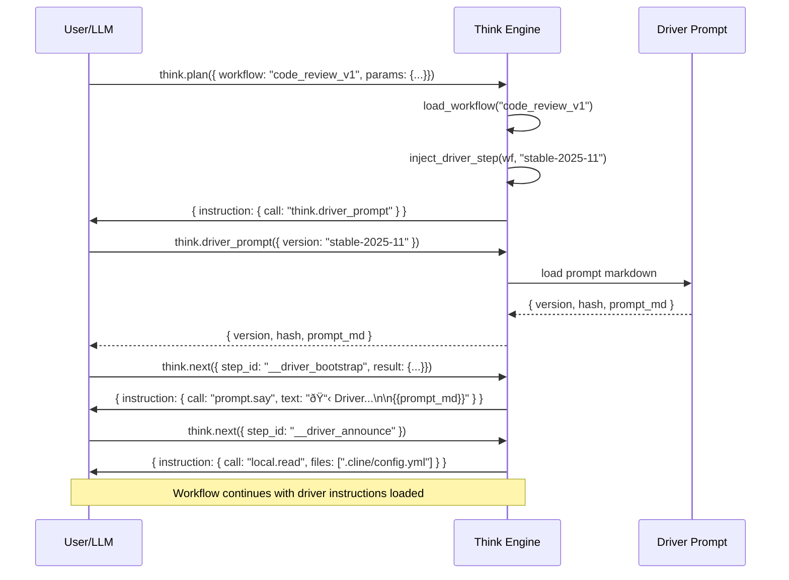

# Think Driver Prompt Bootstrap
### Automatic Driver Prompt Injection for Workflow Execution
> "Ensure the LLM client knows how to orchestrate Think workflows"

## Problem Statement

### Problem 1: Missing Driver Prompt at Workflow Start

#### Current State

When a user initiates a Think workflow (e.g., `code_review_v1`) via an LLM client like Cline/VS Code, the workflow execution begins immediately without first loading the **driver prompt**. The driver prompt is a versioned system instruction (`stable-2025-11`) that tells the LLM:

- How to execute the Think orchestration loop (`plan` → `execute` → `next` → repeat)
- How to handle `local.*` actions (search, exec, read, write)
- How to call cross-service MCP tools (GitLab, Jira, Context FTS)
- Payload discipline (compact responses, summaries vs. full content)

**The current workflow assumes the LLM client has already been configured with these instructions**, but in practice:

- LLM clients (Cline, Claude Code, etc.) do NOT automatically fetch the driver prompt
- Users must manually remember to call `think.driver_prompt` before starting workflows
- Without the driver prompt, the LLM may:
  - Not understand the orchestration pattern
  - Skip `think.next` calls
  - Misinterpret `local.*` instructions
  - Provide overly verbose responses instead of compact summaries

### Impact

**User Experience:**
- Workflows fail or produce incorrect results when driver prompt is missing
- Users must remember a two-step process: (1) get driver prompt, (2) start workflow
- Non-deterministic behavior depending on whether user remembered step 1

**Reliability:**
- Workflows are not truly self-contained
- Debugging is harder because missing context isn't obvious
- Onboarding new users requires extra documentation about the two-step process

**Example Failure Case:**

```
User: "think.plan code_review_v1 with mr_iid !12345"

LLM Response (without driver prompt):
✗ Calls gitlab.get_merge_request directly
✗ Doesn't call think.next to advance workflow
✗ Returns full MR JSON instead of compact summary
✗ Workflow state never advances past step 1
```

---

### Problem 2: MCP Connection Closes on Large `think.next` Payloads

#### Current State

When executing Think workflows, the `think.next` tool receives `result_snapshot` payloads from the LLM after each step execution. These snapshots can contain:

- Large analysis outputs (change graphs, sequence diagrams)
- Multi-file diffs and code listings
- Full test outputs and RuboCop reports
- Verbose JSON structures from GitLab/Jira APIs

**The MCP server closes the connection** when `result_snapshot` exceeds certain size thresholds, causing workflow execution to abort mid-flow.

**Observed Error**:
```javascript
Error executing MCP tool: MCP error -32000: Connection closed
```

**Example Failure Case** (from `code_review_v1` workflow):

```json
{
  "workflow": "code_review_v1",
  "step_id": "understand_change",
  "result_snapshot": {
    "change_graph": {
      "sequence_diagram": "```mermaid\nsequenceDiagram\n    [500+ lines of diagram]...",
      "files_by_category": { "removed_engine_core": [...], ... },
      "impact_summary": "..."
    }
  }
}
```

When this payload is sent to `think.next`, the MCP connection drops instead of processing it.

#### Root Causes

1. **No Payload Size Limits**: The driver prompt tells LLMs to "keep payloads compact" but provides no enforcement
2. **Missing Validation**: `think.next` doesn't validate or truncate incoming `result_snapshot` before processing
3. **MCP Transport Limits**: The underlying MCP transport (stdio/HTTP/WebSocket) may have size limits not handled gracefully
4. **Memory Pressure**: Large JSON parsing in Ruby may trigger connection timeouts

#### Impact

**Reliability:**
- Workflows fail unpredictably mid-execution
- Harder to debug (connection closes without clear error message)
- Loss of workflow state when connection drops

**User Experience:**
- Users must manually retry workflows
- No clear guidance on what went wrong
- Frustration when reviews fail at step 5 of 20

**Data Integrity:**
- Partial workflow state may be written to disk
- Unclear whether step completed before connection closed

## Success Criteria

### Driver Prompt Bootstrap
1. **Automatic Bootstrap**: Driver prompt is automatically loaded at the start of every Think workflow execution
2. **No User Action Required**: Users only need to call `think.plan` — driver prompt injection happens automatically
3. **Versioned and Traceable**: Workflow execution logs show which driver version was used
4. **Backward Compatible**: Existing workflows continue to work without breaking changes
5. **Performance**: Driver prompt injection adds <100ms to workflow initialization

### Payload Size Handling
1. **No Connection Drops**: `think.next` never closes connection due to large payloads
2. **Graceful Truncation**: Payloads exceeding size limits are automatically truncated with warnings
3. **Clear Error Messages**: If payload is rejected, LLM receives actionable error message
4. **Configurable Limits**: Max payload size is configurable per deployment
5. **Payload Metrics**: Log payload sizes for monitoring and tuning

## Proposed Solutions

---

## Solution for Problem 1: Driver Prompt Bootstrap

### Option A: Workflow-Level Driver Step (Recommended)

**Approach**: Add a mandatory first step to all Think workflows that fetches and presents the driver prompt.

**Implementation**:

1. **Update Workflow YAML Schema**: Add optional `driver_version` field at workflow root level
2. **Auto-Inject Driver Step**: Engine automatically prepends a driver prompt step if not present
3. **Capture and Display**: Store driver prompt in workflow state and return it in first instruction

**Changes Required**:

#### 1. Workflow YAML Enhancement

```yaml
# lib/savant/think/workflows/code_review_v1.yaml
name: code_review_v1
version: "1.3"
driver_version: "stable-2025-11"  # NEW: Declare required driver version
description: "Comprehensive MR code review flow"

steps:
  # Engine will auto-inject driver step here if not present

  - id: load_config
    call: local.read
    # ... rest of workflow
```

#### 2. Engine Enhancement (`lib/savant/think/engine.rb`)

```ruby
# In Engine#plan method
def plan(workflow:, params: {})
  wf = load_workflow(workflow)

  # NEW: Auto-inject driver prompt step if not present
  driver_version = wf['driver_version'] || 'stable-2025-11'
  wf = inject_driver_step(wf, driver_version) unless has_driver_step?(wf)

  graph = build_graph(wf)
  # ... rest of existing logic
end

private

def inject_driver_step(wf, version)
  driver_step = {
    'id' => '__driver_bootstrap',
    'call' => 'think.driver_prompt',
    'deps' => [],
    'input_template' => { 'version' => version },
    'capture_as' => '__driver'
  }

  announce_step = {
    'id' => '__driver_announce',
    'call' => 'prompt.say',
    'deps' => ['__driver_bootstrap'],
    'input_template' => {
      'text' => "📋 Think Driver: {{__driver.version}}\n\n{{__driver.prompt_md}}\n\n---\n\nFollow the instructions above for workflow orchestration."
    }
  }

  # Prepend driver steps and update all original steps to depend on announce
  original_steps = wf['steps'] || []
  first_step_ids = original_steps.select { |s| (s['deps'] || []).empty? }.map { |s| s['id'] }

  # Make original first steps depend on driver announce
  original_steps.each do |step|
    if first_step_ids.include?(step['id'])
      step['deps'] = ['__driver_announce']
    end
  end

  wf['steps'] = [driver_step, announce_step] + original_steps
  wf
end

def has_driver_step?(wf)
  (wf['steps'] || []).any? { |s| s['call'] == 'think.driver_prompt' }
end
```

#### 3. Instruction Response Format

When `think.plan` returns the first instruction, it will now be the driver prompt step:

```json
{
  "instruction": {
    "step_id": "__driver_bootstrap",
    "call": "think.driver_prompt",
    "input": { "version": "stable-2025-11" },
    "note": "Loading driver instructions for workflow orchestration"
  },
  "state": { ... },
  "done": false
}
```

After LLM calls `think.driver_prompt` and returns result via `think.next`, the next instruction announces it:

```json
{
  "instruction": {
    "step_id": "__driver_announce",
    "call": "prompt.say",
    "input": {
      "text": "📋 Think Driver: stable-2025-11\n\n# Driver: Savant Think (Guide Mode)\n\nAlways follow this loop:\n..."
    }
  },
  "state": { "vars": { "__driver": { "version": "stable-2025-11", "prompt_md": "..." } } },
  "done": false
}
```

**Benefits**:
- ✅ Fully automatic — users only call `think.plan`
- ✅ Backward compatible — works with existing workflows
- ✅ Versioned — each workflow declares required driver version
- ✅ Traceable — driver version logged in workflow state
- ✅ Minimal code changes — ~50 lines in engine.rb

**Drawbacks**:
- Adds 2 extra steps to every workflow (minor)
- First `think.next` call is always for driver prompt (predictable)

---

### Option B: Enhanced `think.plan` Response (Alternative)

**Approach**: Include driver prompt directly in `think.plan` response without requiring LLM to fetch it separately.

**Implementation**:

```ruby
# In Engine#plan
def plan(workflow:, params: {})
  wf = load_workflow(workflow)
  driver_version = wf['driver_version'] || 'stable-2025-11'
  driver = driver_prompt(version: driver_version)

  # ... existing plan logic ...

  {
    driver: driver,  # NEW: Include driver in response
    instruction: instruction_for(nodes[first]),
    state: st,
    done: false
  }
end
```

Response shape:

```json
{
  "driver": {
    "version": "stable-2025-11",
    "hash": "sha256:...",
    "prompt_md": "# Driver: Savant Think..."
  },
  "instruction": { "step_id": "load_config", "call": "local.read", ... },
  "state": { ... },
  "done": false
}
```

**Benefits**:
- ✅ Single API call — no extra workflow steps
- ✅ Simpler implementation — just modify `plan` response
- ✅ Immediate availability — LLM gets driver in first response

**Drawbacks**:
- ❌ Relies on LLM client reading `driver` field (not guaranteed)
- ❌ Not part of workflow DAG — harder to trace/audit
- ❌ Larger initial response payload
- ❌ Doesn't enforce LLM actually reads/applies driver instructions

---

### Option C: Explicit `prompt.say` Tool (Manual Fallback)

**Approach**: Implement `prompt.say` as a real MCP tool that workflows can use to display messages to the LLM.

**Implementation**:

```ruby
# In lib/savant/think/tools.rb
tool 'prompt.say',
     description: 'Display a message to the LLM user',
     schema: {
       type: 'object',
       properties: { text: { type: 'string' } },
       required: ['text']
     } do |_ctx, a|
  {
    message: a['text'],
    display: true,
    timestamp: Time.now.iso8601
  }
end
```

Then workflows explicitly include driver fetch:

```yaml
steps:
  - id: load_driver
    call: think.driver_prompt
    input_template:
      version: "stable-2025-11"
    capture_as: driver

  - id: show_driver
    call: prompt.say
    deps: ["load_driver"]
    input_template:
      text: "{{driver.prompt_md}}"

  - id: load_config
    call: local.read
    deps: ["show_driver"]
    # ...
```

**Benefits**:
- ✅ Explicit and visible in workflow YAML
- ✅ Flexible — can display any message to LLM
- ✅ Reusable for other announcements

**Drawbacks**:
- ❌ Requires manual step addition to every workflow
- ❌ Not automatic — users can forget to add it
- ❌ More verbose workflow definitions

---

## Solution for Problem 2: Payload Size Limits and Graceful Handling

### Approach: Multi-Layer Payload Validation

Implement payload size validation and truncation at multiple layers to prevent connection drops:

1. **Driver Prompt Enhancement**: Update stable driver prompt with explicit size guidelines
2. **Engine-Level Validation**: Add `think.next` payload validation before processing
3. **Graceful Truncation**: Auto-truncate large payloads with summary + file references
4. **Transport Error Handling**: Catch and recover from transport-level errors

### Implementation

#### 1. Update Driver Prompt (`lib/savant/think/prompts/stable-2025-11.md`)

Add explicit payload size limits to driver instructions:

```markdown
# Driver: Savant Think (Guide Mode)

## Payload Discipline (CRITICAL)

When calling `think.next`, your `result_snapshot` MUST be compact:

- **Max size: 50KB** (approximately 12,500 words)
- **Prefer**: Summaries, counts, file:line references
- **Avoid**: Full file contents, large diffs, verbose JSON dumps

### Truncation Guidelines

If analysis output is large:
1. Summarize findings (e.g., "Found 5 security issues, 12 lint violations")
2. Reference files (e.g., "app/models/user.rb:45 - SQL injection risk")
3. Save detailed output to file and return path: `"detailed_output": "/tmp/analysis-abc123.json"`

### Example Good Snapshot

```json
{
  "rubocop": {
    "status": "failed",
    "offenses": 12,
    "critical_files": ["app/models/user.rb", "app/services/auth.rb"],
    "summary": "12 offenses across 2 files, details in .rubocop-report.json"
  }
}
```

### Example Bad Snapshot (TOO LARGE)

```json
{
  "rubocop": {
    "full_output": "[5000 lines of output...]",
    "all_file_contents": { "app/models/user.rb": "[500 lines...]", ... }
  }
}
```
```

#### 2. Engine Payload Validation (`lib/savant/think/engine.rb`)

Add validation in `Engine#next`:

```ruby
# In Engine#next
def next(workflow:, step_id:, result_snapshot: {})
  st = read_state(workflow)
  nodes = st['nodes'] || {}
  step = nodes[step_id]
  raise 'UNKNOWN_STEP' unless step

  # NEW: Validate and truncate payload if needed
  validated_snapshot = validate_payload(result_snapshot, max_bytes: 50_000)

  # capture variable if requested
  cap = step['capture_as']
  st['vars'][cap] = validated_snapshot if cap  # Use validated version
  st['completed'] |= [step_id]
  write_state(workflow, st)

  nxt_id = next_ready_step_id(st)
  if nxt_id
    { instruction: instruction_for(nodes[nxt_id]), done: false }
  else
    { done: true, summary: 'All steps completed.' }
  end
end

private

def validate_payload(snapshot, max_bytes:)
  json_size = JSON.dump(snapshot).bytesize

  if json_size <= max_bytes
    # Payload is fine, return as-is
    return snapshot
  end

  # Payload too large - truncate and warn
  truncated = truncate_snapshot(snapshot, max_bytes)
  truncated['__truncated'] = true
  truncated['__original_size_bytes'] = json_size
  truncated['__truncation_warning'] = "Payload exceeded #{max_bytes} bytes (was #{json_size}). Truncated to summary."

  # Log warning
  warn "[think.next] Payload truncated: #{json_size} bytes -> #{JSON.dump(truncated).bytesize} bytes"

  truncated
end

def truncate_snapshot(snapshot, max_bytes)
  # Strategy: Keep top-level keys but truncate large string values
  truncated = {}

  snapshot.each do |key, value|
    if value.is_a?(String) && value.bytesize > 1000
      # Truncate large strings to first 500 chars + ellipsis
      truncated[key] = "#{value[0..500]}... [TRUNCATED: #{value.bytesize} bytes total]"
    elsif value.is_a?(Hash) || value.is_a?(Array)
      # Recursively summarize nested structures
      truncated[key] = summarize_structure(value)
    else
      truncated[key] = value
    end
  end

  truncated
end

def summarize_structure(obj)
  case obj
  when Hash
    keys = obj.keys[0..5]  # First 5 keys only
    summary = keys.map { |k| "#{k}: <#{obj[k].class.name}>" }.join(', ')
    { __summary: "Hash with #{obj.size} keys: #{summary}", __type: 'Hash' }
  when Array
    { __summary: "Array with #{obj.size} items", __type: 'Array', __sample: obj[0..2] }
  else
    obj
  end
end
```

#### 3. Error Recovery in Tools (`lib/savant/think/tools.rb`)

Wrap `think.next` with error handling:

```ruby
tool 'think.next',
     description: 'Advance a workflow by recording step result and returning next instruction',
     schema: { ... } do |_ctx, a|
  begin
    eng.next(
      workflow: a['workflow'].to_s,
      step_id: a['step_id'].to_s,
      result_snapshot: a['result_snapshot'] || {}
    )
  rescue => e
    # Don't let errors crash the connection
    {
      error: true,
      message: "think.next failed: #{e.message}",
      step_id: a['step_id'],
      guidance: "Retry with smaller result_snapshot. See driver prompt payload guidelines."
    }
  end
end
```

#### 4. Configuration (`config/think.yml` - new file)

```yaml
# Think engine configuration
payload:
  max_snapshot_bytes: 50000  # 50KB default
  max_string_bytes: 5000     # Truncate individual strings > 5KB
  truncation_strategy: "summarize"  # or "reject"

logging:
  log_payload_sizes: true
  warn_threshold_bytes: 40000
```

### Benefits

- ✅ **No connection drops**: Payloads validated before processing
- ✅ **Graceful degradation**: Large payloads truncated, not rejected
- ✅ **Clear feedback**: LLM told exactly what went wrong and how to fix
- ✅ **Configurable**: Limits adjustable per deployment
- ✅ **Observable**: Payload sizes logged for monitoring

### Error Response Example

If payload is too large after truncation:

```json
{
  "error": true,
  "message": "result_snapshot exceeded 50KB limit (actual: 125KB)",
  "guidance": "Reduce snapshot size by:\n1. Summarizing large outputs\n2. Using file references instead of full contents\n3. Saving detailed data to file and returning path\n\nSee driver prompt 'Payload Discipline' section.",
  "current_step": "understand_change",
  "snapshot_size_bytes": 128000,
  "max_allowed_bytes": 50000
}
```

---

## Recommendation

**Implement both solutions**:

1. **Driver Prompt Bootstrap (Option A)**: Automatic injection with workflow-level driver step
2. **Payload Size Limits**: Multi-layer validation with graceful truncation

**Reasoning**:

**For Driver Prompt Bootstrap:**
1. **Zero user friction** — works automatically without user intervention
2. **Deterministic** — driver prompt is part of the workflow DAG
3. **Auditable** — shows up in workflow state and execution logs
4. **Backward compatible** — existing workflows get driver injection automatically
5. **Minimal complexity** — ~50 lines of code in `engine.rb`

**For Payload Size Limits:**
1. **Prevents connection drops** — the primary bug causing workflow failures
2. **Defense in depth** — validates at multiple layers (driver prompt + engine + transport)
3. **Graceful degradation** — truncates instead of rejecting
4. **Actionable errors** — LLM gets clear guidance on how to fix
5. **Addresses root cause** — the driver prompt currently has no enforcement mechanism

**Implementation Plan**:

### Phase 1: Payload Size Limits (Critical - Fixes Connection Drops)
1. Update `stable-2025-11.md` with explicit payload size guidelines (50KB limit)
2. Implement `validate_payload`, `truncate_snapshot`, `summarize_structure` in `engine.rb`
3. Wrap `think.next` tool with error handling in `tools.rb`
4. Add `config/think.yml` for configurable limits
5. Add payload size logging and metrics
6. Test with known-large payloads (code review workflow)

### Phase 2: Driver Prompt Bootstrap (Enhancement)
1. Add `driver_version` optional field to workflow schema
2. Implement `inject_driver_step` and `has_driver_step?` in Engine
3. Implement `prompt.say` tool for displaying messages
4. Update `code_review_v1.yaml` to declare `driver_version: "stable-2025-11"`
5. Add tests for driver injection logic
6. Update documentation to explain automatic driver loading

**Migration Path**:
- Existing workflows: Auto-inject driver step (transparent)
- New workflows: Optionally declare `driver_version` in YAML
- Advanced users: Can manually add driver step to customize behavior

## Technical Specification

### API Changes

#### Workflow YAML Schema (Addition)

```yaml
# Optional root-level field
driver_version: string  # Default: "stable-2025-11"
```

#### Engine Methods (New/Modified)

```ruby
# New methods for driver bootstrap
Engine#inject_driver_step(wf, version) -> Hash
Engine#has_driver_step?(wf) -> Boolean

# New methods for payload validation
Engine#validate_payload(snapshot, max_bytes:) -> Hash
Engine#truncate_snapshot(snapshot, max_bytes) -> Hash
Engine#summarize_structure(obj) -> Hash

# Modified method signature (now validates payloads)
Engine#next(workflow:, step_id:, result_snapshot:) -> Hash
```

#### Tool Implementation (New)

```ruby
tool 'prompt.say', schema: { text: string } -> { message: string, display: true }
```

#### Configuration Schema (New)

```yaml
# config/think.yml
payload:
  max_snapshot_bytes: integer    # Default: 50000
  max_string_bytes: integer      # Default: 5000
  truncation_strategy: string    # "summarize" | "reject"

logging:
  log_payload_sizes: boolean     # Default: true
  warn_threshold_bytes: integer  # Default: 40000
```

### State File Format

Driver prompt stored in workflow state:

```json
{
  "workflow": "code_review_v1",
  "params": { "mr_iid": "!12345" },
  "completed": ["__driver_bootstrap", "__driver_announce"],
  "vars": {
    "__driver": {
      "version": "stable-2025-11",
      "hash": "sha256:abc123...",
      "prompt_md": "# Driver: Savant Think..."
    }
  }
}
```

### Execution Flow



## Testing Plan

### Unit Tests

#### Payload Validation Tests
1. **Small payloads**: Pass through unchanged when under 50KB
2. **Large payloads**: Truncated to summary with `__truncated` flag
3. **String truncation**: Large strings (>1KB) truncated to 500 chars
4. **Nested structure summarization**: Deep hashes/arrays summarized
5. **Edge cases**: Empty snapshots, nil values, special characters

#### Driver Bootstrap Tests
1. **Driver injection**: `inject_driver_step` correctly prepends driver steps
2. **Driver detection**: `has_driver_step?` detects existing driver steps
3. **Version defaulting**: Driver version defaults to `stable-2025-11`
4. **Dependency updates**: Original first steps depend on `__driver_announce`

### Integration Tests

#### End-to-End Workflow Tests
1. **With driver bootstrap**: Workflow execution includes driver as first step
2. **Without explicit driver**: Auto-injection happens transparently
3. **Large payload handling**: `code_review_v1` with large `understand_change` snapshot doesn't drop connection
4. **State persistence**: Workflow state captures driver version, hash, and payload sizes

### Regression Tests
1. **Existing workflows**: `code_review_v1`, `review_v1`, `develop_ticket_v1` all complete successfully
2. **Backward compatibility**: Workflows without `driver_version` field still work
3. **Error handling**: Invalid payloads don't crash the engine

### Load Tests
1. **Stress test**: Send 100KB payload to `think.next` and verify graceful truncation
2. **Concurrent workflows**: Multiple workflows running simultaneously don't interfere
3. **Performance**: Payload validation adds <10ms overhead per `think.next` call

### Manual QA
1. **Cline integration**: Run code review in Cline and verify:
   - Driver prompt appears first
   - LLM follows orchestration loop correctly
   - No connection drops on large analysis outputs
2. **State file inspection**: Check `.savant/state/code_review_v1.json` contains:
   - Driver version and hash
   - Truncation warnings if payloads were large
3. **Error messages**: Trigger payload rejection and verify actionable error message

## Documentation Updates

1. **README.md**: Add section on automatic driver prompt loading
2. **docs/engines/think.md**: Update code review workflow diagram to show driver steps
3. **Workflow YAML comments**: Add example of `driver_version` field
4. **Migration guide**: Explain behavior for existing vs new workflows

## Success Metrics

### Driver Prompt Bootstrap
- ✅ 100% of workflows automatically load driver prompt
- ✅ Zero user-reported issues related to missing driver instructions
- ✅ Workflow state files show driver version in 100% of executions
- ✅ Average workflow initialization time increases by <100ms

### Payload Size Handling
- ✅ **Zero MCP connection drops** due to large payloads (primary success metric)
- ✅ 100% of `think.next` calls complete successfully (no connection errors)
- ✅ Average payload size < 20KB (well under 50KB limit)
- ✅ Truncation occurs in <5% of workflow steps (most payloads are naturally compact)
- ✅ When truncation occurs, LLM receives clear guidance and workflow continues
- ✅ Payload validation adds <10ms overhead per step

## Future Enhancements

### Driver Prompt Bootstrap
1. **Driver Version Pinning**: Allow workflows to require specific driver versions
2. **Driver Validation**: Warn if driver version is outdated
3. **Custom Drivers**: Support per-workflow custom driver prompts
4. **Driver Caching**: Cache driver prompt markdown to avoid repeated file reads

### Payload Size Handling
1. **Smart Compression**: Compress large payloads before validation (gzip)
2. **Streaming Support**: Stream large results to file instead of in-memory JSON
3. **Adaptive Limits**: Adjust max size based on MCP transport type (stdio vs HTTP)
4. **Payload Analytics**: Dashboard showing payload size distribution across workflows
5. **LLM Feedback Loop**: Train LLM to naturally produce compact snapshots over time
