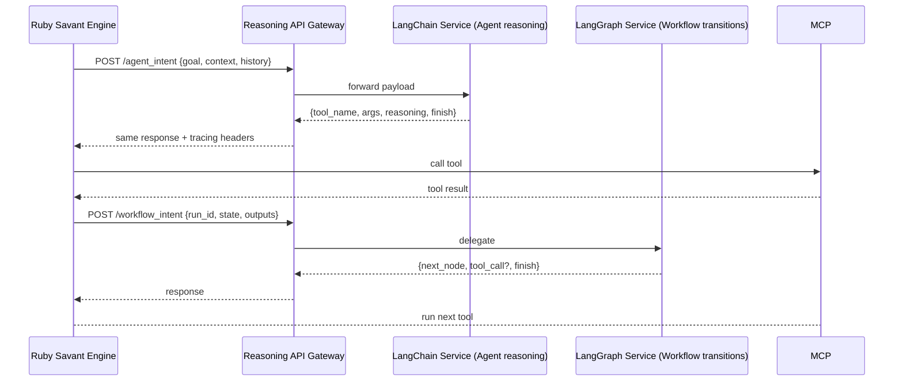

# LangChain + LangGraph Intent API PRD

## Summary
- Provide a hosted LangChain / LangGraph reasoning service that exposes structured intent endpoints.
- Let the Ruby Savant Engine call the API for agent reasoning + workflow transitions, keeping tool execution and sandboxing in Ruby.
- Ensure the API contract is clear, versioned, and observable so the engine can retry, log, and recover deterministically.

## Roles & Responsibilities
- **Hub-provided definitions:** All agents, personas, drivers, AMR rules, and workflow graphs live in the Hub/UI backed by Postgres. Ruby loads these definitions before sending context to the reasoning API so LangChain/LangGraph operate on the same canonical catalog the Hub provides.
- **LangChain (Agent reasoning)** is responsible for agent-style thinking: given goal text, context, repo metadata, and history, it returns tool intent (`tool_name`, `tool_args`, `finish`, `reasoning`). Ruby routes the intent through `POST /agent_intent` and then executes the tool via MCP.
- **LangGraph (Workflow reasoning)** handles workflow transitions: it consumes the workflow state (`run_id`, `current_node`, outputs, params) and emits the next node, optionally with a tool call. Ruby posts to `/workflow_intent` so LangGraph remains the workflow decision engine.
- **Ownership model:** Agents belong to LangChain, workflows belong to LangGraph, and Ruby remains the executor that validates intents, calls MCP tools, enforces AMR, and maintains observability/sandboxing.

## Goals
1. **Decouple reasoning from execution** by running LangChain/LangGraph in a separate process or service that speaks a stable HTTP/JSON-RPC API.
2. **Preserve existing Ruby responsibilities** (MCP tool execution, logging, sandbox enforcement) by feeding the API responses into `Savant::Agent::Runtime` and workflow engine.
3. **Add observability + control**: the API logs reasoning traces, supports timeouts, and exposes metrics so the engine understands failures and slow steps.

## API Architecture

```mermaid
flowchart LR
    subgraph Ruby Engine
        A[Persona + AMR Loader]
        B[Runtime Context]
        C[Agent + Workflow Engine]
        D[MCP Tool Executor]
    end
    subgraph Python Reasoning
        E[LangChain (Agent thinker)]
        F[LangGraph (Workflow orchestrator)]
        G[Intent API Gateway]
    end
    subgraph Observability
        H[Logs + Metrics]
    end
    A --> B
    B --> C
    C --> G
    G -->|agent_intent| E
    G -->|workflow_intent| F
    E --> G
    F --> G
    C --> D
    G --> H
    D --> H
    D -->|tool results| B
```

## API Contract

- `POST /agent_intent`
  - Payload: `{ session_id, persona, driver, repo_context, memory_state, history, goal_text, forced_tool?, max_steps? }`
  - Response: `{ intent_id, tool_name, tool_args, reasoning, finish: bool, next_prompt? }`
- `POST /workflow_intent`
  - Payload: `{ run_id, workflow_name, current_node, outputs, params, memory_state }`
  - Response: `{ intent_id, next_node, action_type, tool_call?, tool_args, finish: bool }`
- Common fields: `status`, `duration_ms`, `trace` (array of {step, detail}). Support `retry_after_ms` & `error_code` on failures.

## Requirements

### Functional
1. **Request context:** Engine must send persona, driver prompt hash, repo metadata, active AMR rules, and history summarizing prior intents.
2. **Response intent:** API must say which MCP tool to call (name + args) or which workflow node to transition to, along with reasoning text.
3. **Finish signal:** Responses can include `finish: true` to end the session with `final_text`.
4. **Fallback:** Include a `fallback_tool` option when unknown tool names appear; engine should log and abort safely.

### Non-functional
1. **Latency guardrails:** API must respond within configurable timeout (default 5s), else Ruby runtime marks intent as failed and retries up to two times.
2. **Instrumentation:** Each call emits structured logs (request_id, intent_id, duration, status) that the engine configures a log sink (file/Mongo).
3. **Versioning:** Support `Accept-Version` header; default `v1`. Ruby runtime includes version in requests and can downgrade if API reports `UnsupportedVersion`.
4. **Security:** Local deployment uses loopback binding; production can use mutual TLS or Unix sockets; tokens stored via `SAVANT_REASONING_TOKEN`.

## Sequence Diagram



## Workflows

1. **Agent session**
   - Ruby engine boots, loads persona + repo, and builds request payload.
   - Calls `POST /agent_intent`; API returns tool intention.
   - Engine executes tool via MCP, logs results, updates history, then loops until `finish`.
2. **Workflow run**
   - When a workflow node needs reasoning, Ruby sends `/workflow_intent`.
   - LangGraph service replies with next node or tool; engine updates workflow state.

## Observability

- Request/response logs include `intent_id`, `trace`, `status`, `duration_ms`, and `tool_name` (if any).
- The engine tracks retries and surfaces `retry_attempt` in logs.
- Failures (timeout, invalid response) emit `reasoning_failure` event (Savant Logger + optional Mongo).

## Next Steps
1. Define the payload schema and publish as `config/reasoning_api_schema.json`.
2. Implement Ruby adapter that wraps API calls (HTTP client with timeout + retries). Inject into `Savant::Agent::Runtime` and workflow engine.
3. Build the Python service (Flask/FastAPI) that spins up LangChain/LangGraph handlers behind this gateway.

## Developer Guidance
- **Understand Hub definitions**: The Hub/UI stores agents, personas, drivers, AMR rules, and workflow graphs in Postgres. Junior devs should trace how `Savant::Hub` exposes these definitions (look at `lib/savant/hub/builder.rb`) and how `Savant::Agent::Runtime` currently loads personas and AMR rules.
- **Reasoning priority**: LangChain returns a tool intent (tool name/args/finish) for agents; LangGraph returns workflow node transitions. Ruby must validate each intent against the MCP tool registry before dispatching the call. Consider writing `intent_validation` helpers that reject missing tools.
- **Logging expectations**: Use `Savant::Logging::Logger` and the existing `with_timing` helpers to emit structured events for each API request, intent, tool call, and failure. Junior devs should add `intent_id`, `request_id`, and `retry_attempt` metadata to those logs.
- **Error handling**: The adapter should distinguish transient errors (timeouts, rate limits) from fatal ones (invalid tool name). Retries should cap at 2 attempts, with backoff. When the API insists on `finish: true`, Ruby should skip further tool runs and return final text.

## Implementation Plan
### Phase 1 — Schema & Contract (2–3 days)
- Define the request/response schema in `config/reasoning_api_schema.json`, covering fields (`session_id`, `goal`, `history`, `tool_name`, `next_node`, `finish`, `reasoning`, `trace`), error codes (`invalid_tool`, `timeout`, `unsupported_version`), and headers (`Accept-Version`, `Authorization`).
- Create sample payloads for agent success/failure and workflow transitions. Publish guidance in `docs/reasoning_api.md` (or extend this PRD).
- Draft a spec for response validation so both Ruby and Python can reference the same contract.

### Phase 2 — Ruby Adapter + Runtime Integration (1 week)
- Add `lib/savant/reasoning/client.rb` that wraps HTTP calls to the API. Use `Net::HTTP` or `Faraday` with configurable timeouts/retries (default 5s timeout, 2 retries). Inject intent metadata (session_id, intent_id) into headers for logging.
- Add intent validation helper to ensure `tool_name` exists in the MCP registry before invoking the tool. Emit `intent_validation_error` when not found.
- Integrate the client with `Savant::Agent::Runtime` (call `/agent_intent` whenever a tool decision is needed) and `Savant::Workflow::Engine` (call `/workflow_intent` for graph decisions). Respect `finish: true` to end loops.
- Add configuration hooks (`REASONING_API_URL`, `REASONING_API_TOKEN`, `REASONING_API_TIMEOUT_MS`, `REASONING_API_RETRIES`). Document in `.env.example` or `config/settings.json`.

### Phase 3 — Python LangChain + LangGraph Service (1–2 weeks)
- Build FastAPI service under `python/reasoning_api/` (or similar) with endpoints `/agent_intent`, `/workflow_intent`, `/healthz`. Use Pydantic models matching the schema.
- LangChain chain: load prompts from Hub definitions (via exported YAML/JSON or API), call LangChain chain/pipeline to produce `tool_name`, `tool_args`, `reasoning`, `finish`. Validate allowed tool names (maybe via sync from Ruby registry?).
- LangGraph: load workflow graph definitions, run LangGraph transition logic, emit next node and optional tool intent.
- Log each request/response with duration, status, trace; emit metrics (counts, durations) via Prometheus or simple log counters.
- Provide CLI (e.g., `python -m reasoning.api --config=python/config.yml`) to run service.

### Phase 4 — Testing & QA (2–3 days)
- Unit tests: adapter retries/timeouts, schema validation, error handling. Use RSpec/Minitest with WebMock for HTTP mocking.
- Integration tests: spin up FastAPI server in CI (use `uvicorn` fixture) and run `Savant::Reasoning::Client` against it to confirm contracts.
- Python tests: use Pytest to validate LangChain/LangGraph logic produces intents aligned with schema. Mock MCP tool list for validation.
- Add smoke test to `make` or CI verifying Ruby -> Python -> MCP flow (dry run without real tools, just stub responses).

### Phase 5 — Documentation & Onboarding (1–2 days)
- Update `README.md`, `docs/getting-started.md`, or create `docs/reasoning_api.md` with install/run steps for the reasoning service, env vars, debugging tips, and error explanations.
- Provide a Hub FAQ entry describing how agents/workflows route to LangChain/LangGraph, how to restart the service, and which logs to monitor.
- If possible, add Hub UI indicator showing reasoning API health/status (optional, but include instructions for manual checking via `/healthz`).

### Phase 6 — Dependency Automation (ongoing)
- Add `requirements.txt` (or `pyproject.toml`) for Python deps and document `python -m pip install -r requirements.txt`.
- Create `scripts/run_reasoning_api.sh` to activate venv and start FastAPI with env variables.
- Update repo Makefile to include `make reasoning-api` workflow that sets up env, runs lint/tests, and launches the service for local dev.

## Schema & Adapter Reference
- **Shared schema (`config/reasoning_api_schema.json`)** defines requests/responses between Ruby and the reasoning service. It should include: 
  - `agent_intent.request` with fields `session_id`, `persona`, `repo_context`, `history`, `goal_text`, `max_steps`.
  - `agent_intent.response` with `intent_id`, `tool_name`, `tool_args`, `finish`, `next_prompt`, `reasoning`, `trace`.
  - `workflow_intent.request` with `run_id`, `workflow_name`, `current_node`, `outputs`, `params`.
  - `workflow_intent.response` with `intent_id`, `next_node`, `action_type`, `tool_call`, `tool_args`, `finish`, `reasoning`, `trace`.
  - Error templates for `invalid_tool`, `timeout`, `unsupported_version` with codes and descriptions.
- **Ruby adapter (`Savant::Reasoning::Client`)** under `lib/savant/reasoning/client.rb`:
  1. Build payloads from Hub definitions (personas, drivers, AMR rules) and pinpoint repo context.
  2. Send HTTP POSTs to `REASONING_API_URL` with `Accept-Version: v1` and optional `Authorization` header.
  3. Retry transient failures (timeouts, 5xx) up to `REASONING_API_RETRIES` (default 2) with exponential backoff.
  4. Validate responses: ensure `tool_name` exists in the MCP registry, `tool_args` parse to a Hash, and `next_node` is present for workflows; raise `intent_validation_error` otherwise.
  5. Return a typed intent struct (`tool_name`, `tool_args`, `finish`, `next_node`, `reasoning`, `trace`) for the runtime loop.
- **Validation helpers** (e.g., `Savant::Reasoning::Validators::Intent`) allow both Ruby specs and Python tests to share schema assertions.

## Task Breakdown for Junior Devs
- [ ] Follow Phase 1 schema definition before writing code so contract is locked.
- [ ] Build and test the Ruby adapter in small increments; mock HTTP responses to ensure retries/logging behave correctly.
- [ ] Collaborate with Python devs (if separate) to ensure LangChain/LangGraph responses match the schema—test with `curl` before wiring to Ruby.
- [ ] Document each launch step (Ruby `bin/savant run`, Python service start, env vars) and include failure modes.

## Dependency Setup & Task Instructions
1. **Install Ruby dependencies**
   - Ensure `ruby` (2.7+) is installed. Use `bundle install` in repo root to install gems.
   - Run `bundle exec rubocop` and `bundle exec rspec` locally to verify Ruby changes.
2. **Set up PostgreSQL** (already required): run `make rails-migrate` then `make rails-fts` as usual.
3. **Install Python environment**
   - Install `python3` and `pip`. Create a venv with `python3 -m venv .venv_reasoning`.
   - Activate it (`source .venv_reasoning/bin/activate`) and install with `pip install fastapi[all] langchain==0.1.* langgraph==0.x.* uvicorn pydantic requests` (pin versions to avoid drift).
   - Add instructions to document how to activate/deactivate the venv and keep dependencies in `pyproject.toml` or `requirements.txt`.
4. **Run reasoning service locally**
   - Start FastAPI app with `uvicorn reasoning.api:app --reload --host 127.0.0.1 --port 9000`.
   - Verify `/healthz` returns 200 and `/agent_intent` accepts sample JSON.
5. **Wire Ruby to API**
   - Use environment variables: `REASONING_API_URL`, `REASONING_API_TOKEN`, `REASONING_API_TIMEOUT_MS`.
   - Document how to run `bin/savant run` with the new adapter enabled.

## Junior Dev Checklist
- [ ] Review `Savant::Boot` to understand how personas/workflows load.
- [ ] Study the MCP multiplexer tooling to ensure new intents map to existing tools.
- [ ] Build `Savant::Reasoning::Client` and add spec coverage for retries and logging.
- [ ] Validate the Python service returns intents that match `config/reasoning_api_schema.json`.
- [ ] Update `README.md` (or new docs) with setup steps for the reasoning service and how to run full agent/workflow flows.

## Troubleshooting Notes
- **Timeouts**: If the reasoning API times out, Ruby should log `reasoning_timeout` and retry automatically. Use the `REASONING_API_TIMEOUT_MS` env var to adjust.
- **Invalid tool names**: The adapter should log `intent_validation_error` and instruct the API team to update the graph/chain definition.
- **API unavailability**: Provide a fallback message that includes instructions to start the FastAPI server via `uvicorn reasoning.api:app`.
