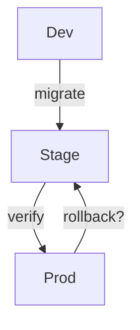
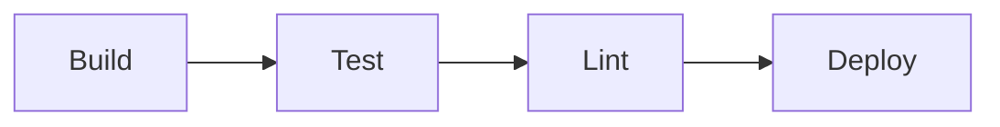
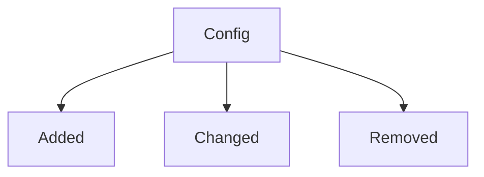

# Summary

<one-paragraph verdict and merge readiness>

# Visuals (Mermaid)

# Evidence

- Migrations: 

- CI: <status>
- Config/flags: <changes>
- Observability: <instruments/alerts>
- Docs: <updates>

# Findings

- Migrations/backfill/rollback: <pass/warn/fail + rationale>
- CI checks: <pass/warn/fail + rationale>
- Config/env/flags: <pass/warn/fail + rationale>
- Observability: <pass/warn/fail + rationale>
- Docs/release notes: <pass/warn/fail + rationale>
- Cross‑repo coordination: <pass/warn/fail + rationale>

# Actions

- [ ] <action item> — owner: <name>, due: <date>
