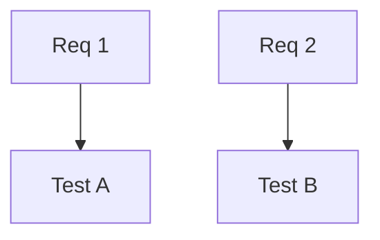
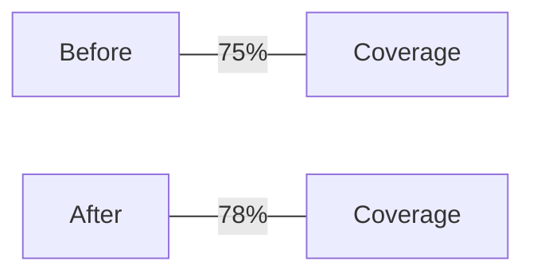
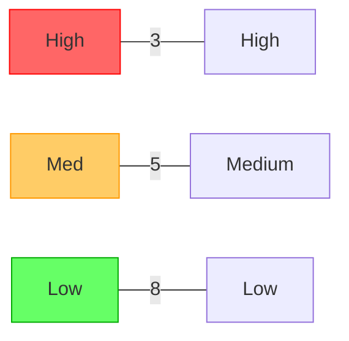
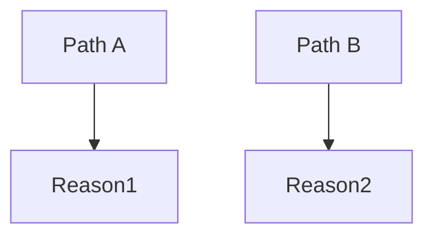

# Summary

<one-paragraph verdict and key scores>

# Visuals (Mermaid)

# Evidence

- Requirements: <source>
- Tests: 

- Lint/static: 

- Security: <secret/CVE summary>
- Performance: <hotspots>

# Findings

- Requirements coverage: <pass/warn/fail + rationale>
- Tests & coverage: <pass/warn/fail + rationale>
- Lint/static: <pass/warn/fail + rationale>
- Security: <pass/warn/fail + rationale>
- Performance: <pass/warn/fail + rationale>

# Actions

- [ ] <action item> — owner: <name>, due: <date>
