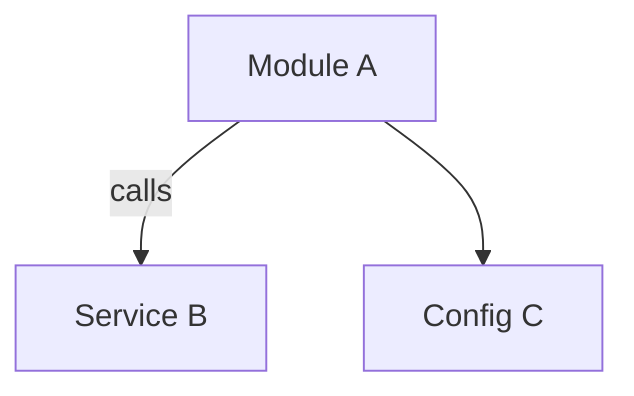
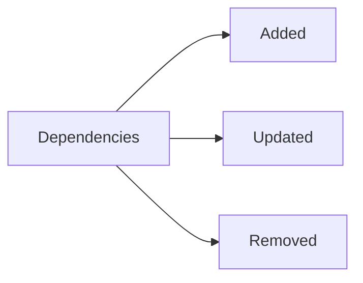
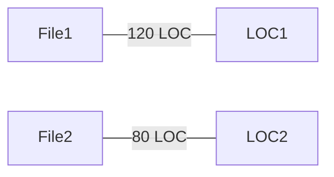

# Summary

<one-paragraph verdict and key scores>

# Visuals (Mermaid)

# Evidence

- PR: <link or number>
- Files changed: <count>, LOC: <count>
- Hotspots: <paths and scores>

# Findings

- Scope: <pass/warn/fail + rationale>
- Backward compatibility: <pass/warn/fail + rationale>
- Dependencies: <pass/warn/fail + rationale>
- Config/env: <pass/warn/fail + rationale>
- Cross-repo impact: <pass/warn/fail + rationale>

# Actions

- [ ] <action item> — owner: <name>, due: <date>
