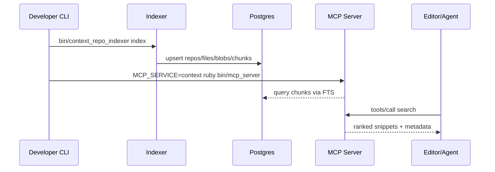

# Savant Architecture Overview

- **Purpose:** Local indexer plus MCP servers enabling private repo search and Jira access through stdio tools that editors can call. Ruby services coordinate storage in Postgres with FTS-enabled chunk search.
- **Indexer Flow:** Configured repos are scanned, hashed, deduped into blobs, chunked, and stored via tables (`repos`, `files`, `blobs`, `file_blob_map`, `chunks`). Chunks receive a GIN index on `to_tsvector('english', chunk_text)` for ranked retrieval.
- **Config Inputs:** `config/settings.json` validated by `Savant::Config.load` drives repo list, file limits, DB connection, and MCP listen options. `.gitignore` plus repo-specific ignores feed the scanner.
- **Runtime Modes:** Scripts run directly with env vars (`DATABASE_URL`, Jira creds) or via Docker/Makefile targets (e.g., `make dev`, `make repo-index-all`, `make mcp-context-run`). MCP service selection depends on `MCP_SERVICE` env.
- **Logging & Timing:** `Savant::Logger` handles stdout logs for CLI tools and `logs/<service>.log` for MCP server, flagging slow operations via `SLOW_THRESHOLD_MS`.

## Sequence Overview

### Key Components

- **Indexer (`lib/savant/indexer/*`):** Runner orchestrates repo scans, merges ignore files, skips hidden/binary/unchanged files (tracked in `.cache/indexer.json`), dedupes blobs via SHA256, chunks code vs. markdown differently, and maintains file↔blob associations plus cleanup for deleted files.
- **Database Layer (`lib/savant/db.rb`):** Wraps `pg` with helpers to migrate schema, ensure FTS, upsert repos/files/blobs, replace chunks, and drop data for deleted repos.
- **Context MCP Engine:** Uses chunk search via `lib/savant/context/fts.rb`, operations defined in `ops.rb`, tools registered in `tools.rb`, and orchestrated by `engine.rb`.
- **Jira MCP Engine:** REST v3 client in `lib/savant/jira/client.rb`, operations + engine orchestrate ticket queries/actions exposed via `jira/tools.rb`.
- **MCP Server (`lib/savant/mcp_server.rb`):** JSON-RPC 2.0 stdio server loading either Context or Jira registrar per `MCP_SERVICE`, exposing `tools/list` and `tools/call`.

### Data Model

- `repos(id, name, root_path)` records indexed repos with deduped names.
- `files(id, repo_id, rel_path, size_bytes, mtime_ns)` enforces unique file per repo.
- `blobs(id, hash, byte_len)` deduplicated SHA256 content; `file_blob_map(file_id, blob_id)` links files.
- `chunks(id, blob_id, idx, lang, chunk_text)` store searchable slices with overlapping boundaries to preserve context.

### Operational Highlights

- Use CLI entrypoints in `bin/` (`context_repo_indexer`, `db_migrate`, `mcp_server`, etc.) to manage lifecycle.
- Docker Compose spins up Postgres plus optional services; Make targets wrap indexing, DB prep, MCP runs, and tests.
- No secrets in repo; load Jira credentials via env or `secrets.yml` copy.
