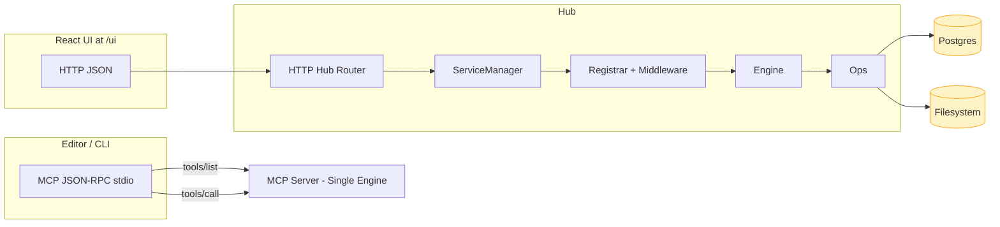
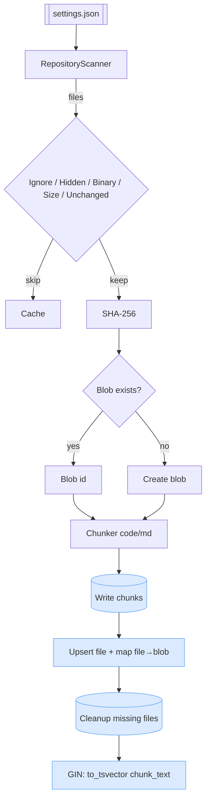
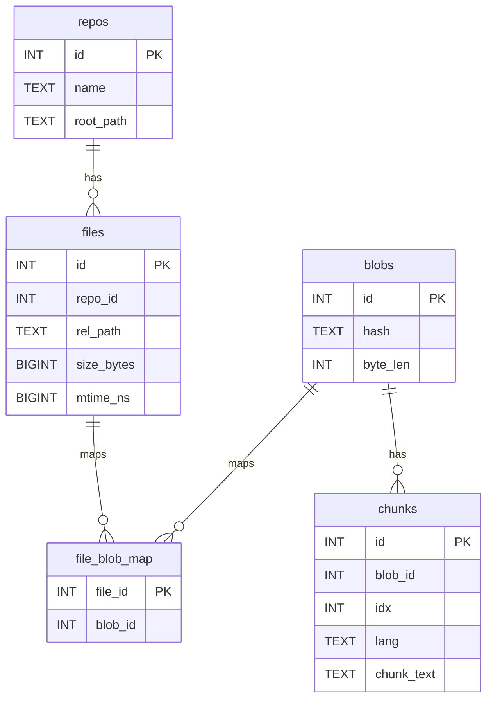
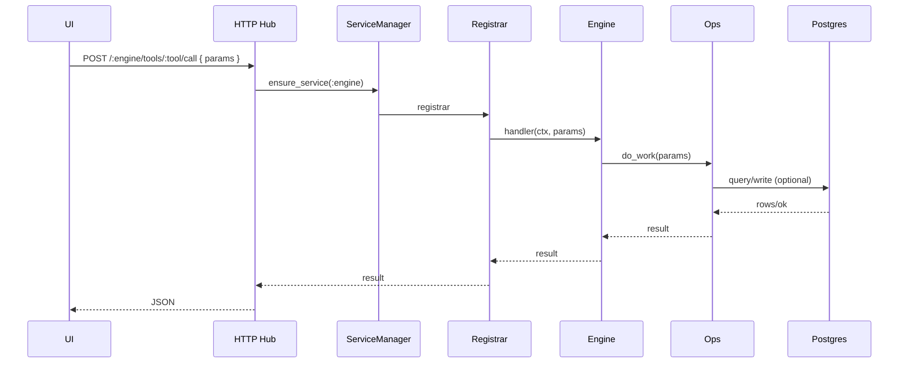
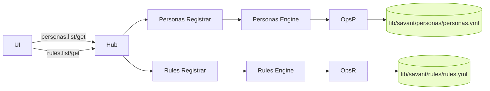
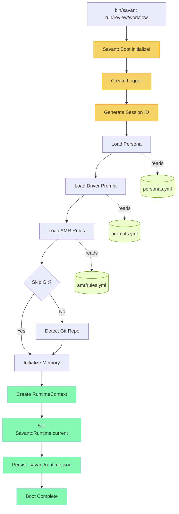
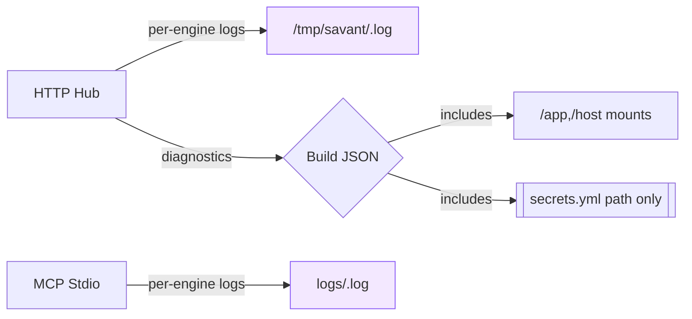

# Savant Architecture Overview

- **Purpose:** Local indexer plus MCP servers enabling private repo search and Jira access through stdio tools that editors can call. Ruby services coordinate storage in Postgres with FTS-enabled chunk search.
- **Indexer Flow:** Configured repos are scanned, hashed, deduped into blobs, chunked, and stored via tables (`repos`, `files`, `blobs`, `file_blob_map`, `chunks`). Chunks receive a GIN index on `to_tsvector('english', chunk_text)` for ranked retrieval.
- **Config Inputs:** `config/settings.json` validated by `Savant::Config.load` drives repo list, file limits, DB connection, and MCP listen options. `.gitignore` plus repo-specific ignores feed the scanner.
- **Runtime Modes:** Scripts run directly with env vars (`DATABASE_URL`, Jira creds) or via Docker/Makefile targets (e.g., `make quickstart`, `make repo-index-all`, `make mcp-context-run`). MCP service selection depends on `MCP_SERVICE` env.
- **Logging & Timing:** `Savant::Logger` handles stdout logs for CLI tools and `logs/<service>.log` for MCP server, flagging slow operations via `SLOW_THRESHOLD_MS`.

### Key Components

- **Boot Runtime (`lib/savant/boot.rb`):** P0 critical path component that initializes the Savant Engine. Orchestrates loading of personas, driver prompts, AMR rules, repo context, and session memory. Provides global `Savant::Runtime.current` access to RuntimeContext. Creates `.savant/runtime.json` state and `logs/engine_boot.log`. Required before any agent, workflow, or multiplexer operations.
- **RuntimeContext (`lib/savant/runtime_context.rb`):** Global state container holding session_id, persona, driver_prompt, amr_rules, repo, memory, logger, and multiplexer. Accessible throughout codebase via `Savant::Runtime.current`.
- **AMR System (`lib/savant/amr/`):** Ahmed Matching Rules define request pattern matching and action routing. Loaded from `rules.yml` during boot. Contains rules for code_review, workflow_execution, agent_run, context_query, and persona_switch.
- **Indexer (`lib/savant/indexer/*`):** Runner orchestrates repo scans, merges ignore files, skips hidden/binary/unchanged files (tracked in `.cache/indexer.json`), dedupes blobs via SHA256, chunks code vs. markdown differently, and maintains file↔blob associations plus cleanup for deleted files.
- **Database Layer (`lib/savant/db.rb`):** Wraps `pg` with helpers to migrate schema, ensure FTS, upsert repos/files/blobs, replace chunks, and drop data for deleted repos.
- **Context MCP Engine:** Uses chunk search via `lib/savant/context/fts.rb`, operations defined in `ops.rb`, tools registered in `tools.rb`, and orchestrated by `engine.rb`.
- **Jira MCP Engine:** REST v3 client in `lib/savant/jira/client.rb`, operations + engine orchestrate ticket queries/actions exposed via `jira/tools.rb`.
- **MCP Server (`lib/savant/mcp_server.rb`):** JSON-RPC 2.0 stdio server loading either Context or Jira registrar per `MCP_SERVICE`, exposing `tools/list` and `tools/call`.

### Data Model

- `repos(id, name, root_path)` records indexed repos with deduped names.
- `files(id, repo_id, rel_path, size_bytes, mtime_ns)` enforces unique file per repo.
- `blobs(id, hash, byte_len)` deduplicated SHA256 content; `file_blob_map(file_id, blob_id)` links files.
- `chunks(id, blob_id, idx, lang, chunk_text)` store searchable slices with overlapping boundaries to preserve context.

### Operational Highlights

- **Boot Runtime CLI:** Use `bin/savant run`, `bin/savant review`, or `bin/savant workflow <name>` to initialize the engine with full boot diagnostics. All commands create `.savant/runtime.json` and `logs/engine_boot.log`.
- Use other CLI entrypoints in `bin/` (`context_repo_indexer`, `db_migrate`, `mcp_server`, etc.) to manage lifecycle.
- Docker Compose spins up Postgres plus optional services; Make targets wrap indexing, DB prep, MCP runs, and tests.
- No secrets in repo; load Jira credentials via env or `secrets.yml` copy.
- Session state persists in `.savant/runtime.json` with session_id, persona, driver_prompt, amr, and repo metadata.

---

## Visuals (Mermaid)

### System Overview

### Indexer Pipeline

### Database ER Diagram

### Tool Call (HTTP via Hub)

### Personas / Rules Data Flow (YAML)

### Boot Runtime Flow

### Logs & Secrets

---

## Notes & Gotchas

- **Boot Runtime:** All Savant commands (`run`, `review`, `workflow`) must go through the boot sequence. The RuntimeContext is globally accessible via `Savant::Runtime.current` after boot completes.
- **AMR Rules:** Loaded once during boot from `lib/savant/amr/rules.yml`. Changes to AMR require reboot.
- **Session State:** Each boot creates a unique session_id and persists state to `.savant/runtime.json`. Historical sessions remain in the file.
- **Git Detection:** Boot auto-detects git repos unless `--skip-git` is used. Repo path resolution handles macOS `/private` symlinks.
- One engine per stdio MCP process; the Hub multiplexes multiple engines via HTTP.
- Indexer cache avoids rehashing unchanged files; bump `mtime_ns` on real edits.
- FTS tuning: adjust `mdMaxChars`, `codeMaxLines`, `overlapLines` for retrieval quality/perf.
- Keep mounts.yml present to control engine order in the UI (context → think → personas → rules → jira).
- Diagnostics exposes only paths and redacted secrets metadata; values are never included.
