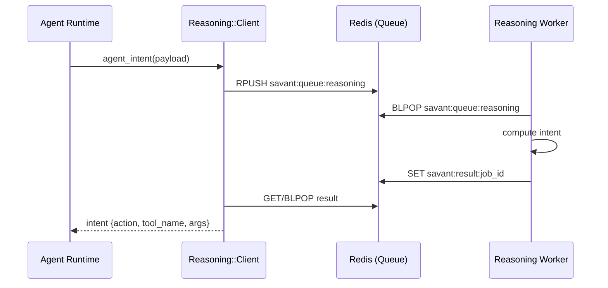
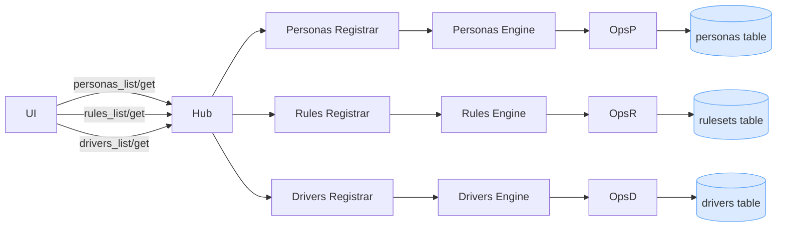
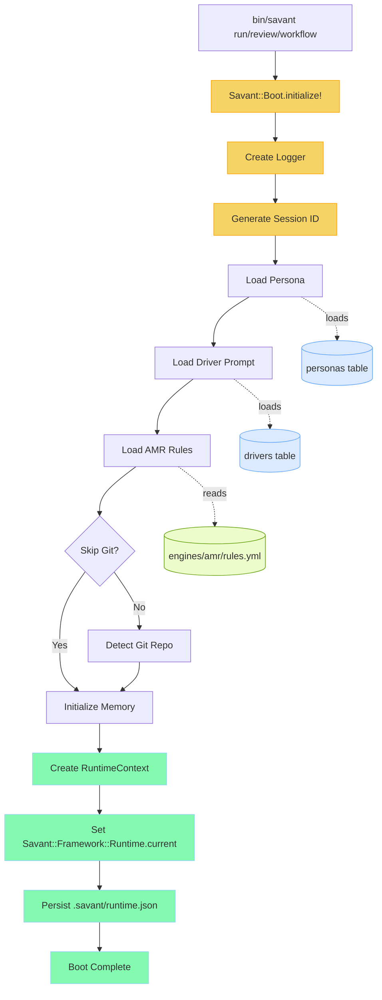

# Savant Architecture Overview

- **Purpose:** Local indexer plus MCP services enabling private repo search, Jira access, and workflow tooling. Ruby services coordinate storage in Postgres with FTS-enabled chunk search and stdio/HTTP transports.
- **Indexer Flow:** Configured repos are scanned, hashed, deduped into blobs, chunked, and stored via tables (`repos`, `files`, `blobs`, `file_blob_map`, `chunks`). Chunks receive a GIN index on `to_tsvector('english', chunk_text)` for ranked retrieval.
- **Config Inputs:** `config/settings.json` validated by `Savant::Framework::Config.load` drives repo list, file limits, DB connection, and MCP listen options. `.gitignore` plus repo-specific ignores feed the scanner.
- **Runtime Modes:** Scripts run directly with env vars (`DATABASE_URL`, Jira creds) or via Docker/Makefile targets (e.g., `make quickstart`, `make repo-index-all`, `make mcp-context-run`). MCP service selection depends on `MCP_SERVICE` env.
- **Logging & Timing:** `Savant::Logging::Logger` handles stdout logs for CLI tools and `logs/<service>.log` for MCP server, flagging slow operations via `SLOW_THRESHOLD_MS`.

### Key Components

- **Boot Runtime (`lib/savant/framework/boot.rb`):** Initializes the Savant Engine. Orchestrates loading of personas and driver prompts from DB-backed engines, AMR rules from YAML, repo context, and session memory. Provides global `Savant::Framework::Runtime.current` access to RuntimeContext, creates `.savant/runtime.json`, and writes `logs/engine_boot.log`.
- **RuntimeContext (`lib/savant/framework/engine/runtime_context.rb`):** Global state container holding session_id, persona, driver_prompt, amr_rules, repo, memory, logger, and multiplexer. Accessible via `Savant::Framework::Runtime.current`.
- **AMR System (`lib/savant/engines/amr/`):** Ahmed Matching Rules define request pattern matching and action routing. Loaded from `rules.yml` during boot. Contains rules for code_review, workflow_execution, agent_run, context_query, and persona_switch.
- **Personas / Rules / Drivers (DB-backed):** CRUD lives in `lib/savant/engines/personas`, `lib/savant/engines/rules`, and `lib/savant/engines/drivers` with persistence in Postgres tables `personas`, `rulesets`, and `drivers`.
- **ServiceManager (`lib/savant/hub/service_manager.rb`):** Transport-agnostic core infrastructure for loading MCP engines and managing tool registries. Used by all transport layers (HTTP and MCP).
- **Transport Layer (`lib/savant/framework/transports/`):** Dual-protocol support with HTTP (`transports/http/rack_app.rb` for Hub + UI) and MCP (`transports/mcp/stdio.rb` + `transports/mcp/websocket.rb` for stdio/ws connections).
- **Indexer (`lib/savant/engines/indexer/*`):** Runner orchestrates repo scans, merges ignore files, skips hidden/binary/unchanged files (tracked in `.cache/indexer.json`), dedupes blobs via SHA256, chunks code vs. markdown differently, and maintains file↔blob associations plus cleanup for deleted files.
- **Database Layer (`lib/savant/framework/db.rb`):** Wraps `pg` with helpers to migrate schema, ensure FTS, upsert repos/files/blobs, replace chunks, and drop data for deleted repos.
- **Reasoning API + Queue Worker (`reasoning/`):** External service the Agent Runtime calls for intent. Using Redis-based transport, a background worker consumes the queue (`savant:queue:reasoning`), computes intent, and writes results back (`savant:result:{job_id}`) for low-latency polling.
- **Context MCP Engine:** Uses chunk search via `lib/savant/engines/context/fts.rb`, operations defined in `ops.rb`, tools registered in `tools.rb`, and orchestrated by `engine.rb`.
- **Git MCP Engine:** Local, read‑only Git intelligence. Provides `repo_status`, `changed_files`, `diff`, `hunks`, `read_file`, and `file_context`. Implementation under `lib/savant/engines/git/{engine,ops,tools,repo_detector,diff_parser,hunk_parser,file_context}.rb`.
- **Jira MCP Engine:** REST v3 client in `lib/savant/engines/jira/client.rb`, operations + engine orchestrate ticket queries/actions exposed via `jira/tools.rb`.
- **MCP Server (`lib/savant/framework/mcp/server.rb`):** Transport-agnostic launcher selecting stdio or websocket via `Savant::Transports::MCP::*` based on `MCP_SERVICE` and config, exposing JSON-RPC 2.0 `tools/list` and `tools/call`.

### Transport Architecture

Savant supports two transport protocols, cleanly separated:

**HTTP Transport** (`lib/savant/framework/transports/http/`)
- `rack_app.rb`: Rack application exposing JSON-RPC endpoints for Hub and UI
- Used by: Hub router/builder (`lib/savant/hub/router.rb`, `lib/savant/hub/builder.rb`) and HTTP runner (`lib/savant/hub/server/http_runner.rb`)
- Module: `Savant::Transports::HTTP::RackApp`

**MCP Transport** (`lib/savant/framework/transports/mcp/`)
- `stdio.rb`: Stdio transport for editor integrations (Claude Desktop, VSCode)
- `websocket.rb`: WebSocket transport for MCP protocol
- Used by: MCP Server (`lib/savant/framework/mcp/server.rb` via `bin/mcp_server`)
- Modules: `Savant::Transports::MCP::Stdio`, `Savant::Transports::MCP::WebSocket`

**Shared Infrastructure**
- `ServiceManager` (`lib/savant/hub/service_manager.rb`): Core engine loading and tool registry management, used by all transports
- Both transport types use the same engine registrars and tool definitions
- Logging varies by transport: HTTP logs to `/tmp/savant/<service>.log`, MCP logs to `logs/<service>.log`

### Data Model

- `repos(id, name, root_path)` records indexed repos with deduped names.
- `files(id, repo_id, rel_path, size_bytes, mtime_ns)` enforces unique file per repo.
- `blobs(id, hash, byte_len)` deduplicated SHA256 content; `file_blob_map(file_id, blob_id)` links files.
- `chunks(id, blob_id, idx, lang, chunk_text)` store searchable slices with overlapping boundaries to preserve context.

### Operational Highlights

- **Boot Runtime CLI:** Use `bin/savant run`, `bin/savant review`, or `bin/savant workflow <name>` to initialize the engine with full boot diagnostics. All commands create `.savant/runtime.json` and `logs/engine_boot.log`.
- Use other CLI entrypoints in `bin/` (`context_repo_indexer`, `db_migrate`, `mcp_server`, etc.) to manage lifecycle.
- Docker Compose spins up Postgres plus optional services; Make targets wrap indexing, DB prep, MCP runs, and tests.
- No secrets in repo; load Jira credentials via env or `secrets.yml` copy.
- Session state persists in `.savant/runtime.json` with session_id, persona, driver_prompt, amr, and repo metadata.

---

## Visuals (Mermaid)

### System Overview
Description: Shows how editor/CLI and UI requests enter Savant, which transport they use, how the Hub and ServiceManager route to an engine/ops layer, and where storage boundaries (Postgres + filesystem) sit.

### Indexer Pipeline
Description: Walks a repo scan from settings.json through ignore filters and hashing, highlights deduplication into blobs, and ends at chunk creation + DB writes that power full‑text search.

### Database ER Diagram
Description: Entity model for repos, files, blobs, and chunks, including the file↔blob mapping used for dedupe and the chunk table that backs FTS.

### Tool Call (HTTP via Hub)
Description: Step‑by‑step HTTP request path for a tool call, from the UI endpoint through Hub routing and engine ops, and then back to the client with results.

### Reasoning Queue Worker (Redis)

Description: Shows the async intent flow when the Agent Runtime uses the Redis queue transport, including enqueue, worker processing, and result polling.

### Personas / Rules / Drivers Data Flow (DB)
Description: Illustrates which RPC calls load personas, rulesets, and driver prompts, which engines/ops handle them, and the Postgres tables that persist each catalog.

### Boot Runtime Flow
Description: Full boot chain from CLI command to runtime context creation, including persona/driver/AMR loading, optional git detection, and persistence to `.savant/runtime.json`.

### Logs & Secrets
Description: Contrasts log destinations for HTTP vs MCP transports and shows the diagnostics payload containing mount paths and redacted secret metadata.

---

## Notes & Gotchas

- **Boot Runtime:** All Savant commands (`run`, `review`, `workflow`) must go through the boot sequence. The RuntimeContext is globally accessible via `Savant::Framework::Runtime.current` after boot completes.
- **AMR Rules:** Loaded once during boot from `lib/savant/engines/amr/rules.yml`. Changes to AMR require reboot.
- **Session State:** Each boot creates a unique session_id and persists state to `.savant/runtime.json`. Historical sessions remain in the file.
- **Git Detection:** Boot auto-detects git repos unless `--skip-git` is used. Repo path resolution handles macOS `/private` symlinks.
- One engine per stdio MCP process; the Hub multiplexes multiple engines via HTTP.
- Indexer cache avoids rehashing unchanged files; bump `mtime_ns` on real edits.
- FTS tuning: adjust `mdMaxChars`, `codeMaxLines`, `overlapLines` for retrieval quality/perf.
- Keep mounts.yml present to control engine order in the UI (context → think → personas → rules → jira).
- Diagnostics exposes only paths and redacted secrets metadata; values are never included.
