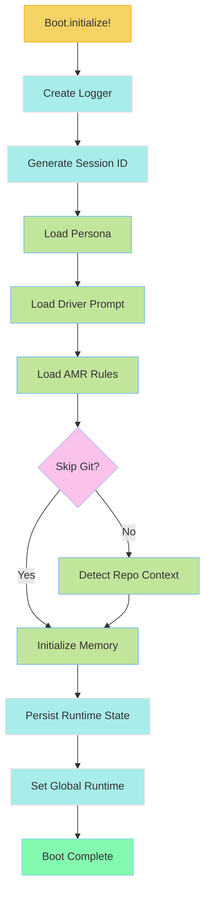
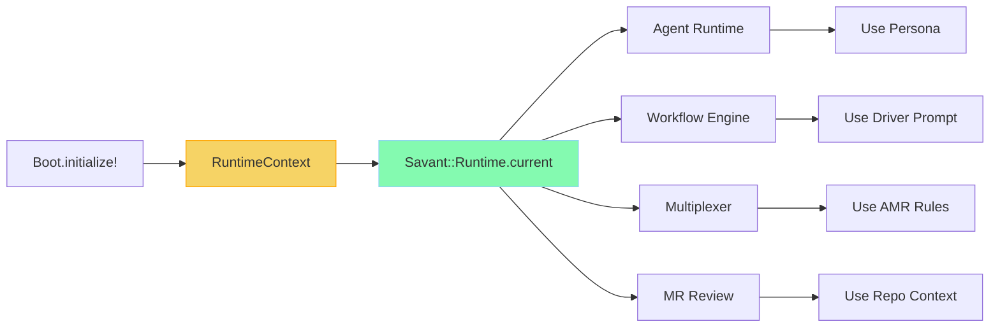
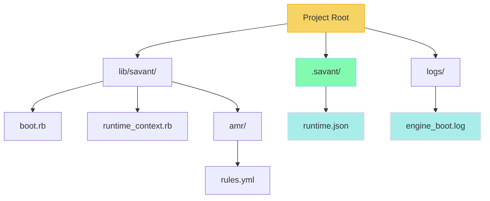

# Boot Runtime Notes

The Boot Runtime is the **P0 critical path** foundation for the Savant Engine MVP. It initializes and prepares all core components required for any agent, workflow, or multiplexer to function. Without this module, the engine cannot run agents, select tools, perform MR review, or initialize workflows.

## Core Purpose

The Boot Runtime provides:
- **Unified initialization** – single entry point for all Savant commands
- **Runtime state container** – globally accessible context via `Savant::Runtime.current`
- **Component loading** – orchestrated loading of personas, driver prompts, AMR rules, repo context, and memory
- **Session management** – unique session IDs and persistent state tracking
- **Observability** – structured logging for all boot events

## Architecture

### RuntimeContext (`lib/savant/runtime_context.rb`)

A Struct-based container holding all runtime state:

```ruby
Savant::RuntimeContext.new(
  session_id: String,       # Unique session identifier
  persona: Hash,            # Loaded persona (name, version, prompt_md)
  driver_prompt: Hash,      # Think driver prompt (version, hash, prompt_md)
  amr_rules: Hash,          # AMR ruleset (version, rules array)
  repo: Hash,               # Git repository context (path, branch, commit)
  memory: Hash,             # Session memory (ephemeral + persistent_path)
  logger: Savant::Logger,   # Boot logger instance
  multiplexer: Object       # Reserved for future multiplexer integration
)
```

**Global Access:**
```ruby
# Access anywhere in the codebase
Savant::Runtime.current.persona
Savant::Runtime.current.session_id
Savant::Runtime.current.driver_prompt[:version]
```

**Serialization:**
```ruby
# Human-readable hash representation
context.to_h
# => {
#   session_id: "session_20251129_001931_2f7b843c",
#   persona: { name: "savant-engineer", version: 4 },
#   driver_prompt: "developer",
#   amr_rules: "5 rules",
#   repo: "/Users/home/code/mcp/savant",
#   memory: "initialized"
# }
```

### Boot Module (`lib/savant/boot.rb`)

Main initializer orchestrating the boot sequence:

```ruby
context = Savant::Boot.initialize!(
  persona_name: 'savant-engineer',  # Default persona
  driver_version: nil,              # nil = latest
  base_path: nil,                   # nil = auto-detect
  skip_git: false                   # Skip repo detection
)
```

#### Boot Sequence (in order)

1. **Logger Creation**
   - Creates `logs/engine_boot.log`
   - Structured JSON logging with timestamps
   - Outputs to both stdout and log file

2. **Session ID Generation**
   - Format: `session_YYYYMMDD_HHMMSS_<8-char-hex>`
   - Example: `session_20251129_001931_2f7b843c`
   - Guaranteed unique per boot

3. **Persona Loading**
   - Uses `Savant::Personas::Ops` to load persona by name
   - Returns: name, version, summary, prompt_md, tags
   - Error: `BootError` if persona not found

4. **Driver Prompt Loading**
   - Uses `Savant::Think::Engine` to load driver prompt
   - Returns: version, sha256 hash, prompt markdown
   - Defaults to latest version from `lib/savant/think/prompts.yml`

5. **AMR Rules Loading**
   - Reads `lib/savant/amr/rules.yml`
   - Validates YAML structure
   - Returns: version, description, rules array
   - Error: `BootError` if file missing or invalid YAML

6. **Repo Context Detection**
   - Searches for `.git` directory from current path upward
   - Extracts: repo root path, current branch, last commit SHA
   - Returns `nil` if not in a git repository or `skip_git: true`

7. **Memory Initialization**
   - Creates `.savant/` directory in project root
   - Initializes ephemeral (in-RAM) memory hash
   - Sets up persistent state path: `.savant/runtime.json`

8. **Runtime Persistence**
   - Writes complete runtime state to `.savant/runtime.json`
   - Includes: session_id, persona, driver_prompt, amr, repo, timestamps

9. **Global Registration**
   - Sets `Savant::Runtime.current = context`
   - Makes runtime accessible throughout the application

### AMR System (`lib/savant/amr/`)

Ahmed Matching Rules define how the engine matches and processes requests.

**File:** `lib/savant/amr/rules.yml`

```yaml
version: 1
description: Core AMR ruleset for Savant Engine MVP

rules:
  - id: code_review
    pattern: "review|mr|pull request|code review"
    action: trigger_review_workflow
    priority: high
    tags: [review, code]

  - id: workflow_execution
    pattern: "workflow|execute|run workflow"
    action: execute_workflow
    priority: high
    tags: [workflow, execution]

  - id: agent_run
    pattern: "agent|run|execute|perform"
    action: run_agent
    priority: medium
    tags: [agent, execution]

  - id: context_query
    pattern: "context|repo|codebase|search"
    action: query_context
    priority: medium
    tags: [context, search]

  - id: persona_switch
    pattern: "persona|switch|use persona"
    action: load_persona
    priority: low
    tags: [persona, config]
```

**Structure:**
- `version` – AMR ruleset version (integer)
- `description` – Human-readable description
- `rules` – Array of rule objects:
  - `id` – Unique rule identifier
  - `pattern` – Regex pattern for matching
  - `action` – Action to trigger
  - `priority` – Rule priority (high/medium/low)
  - `tags` – Categorization tags

## CLI Commands

### `savant run`

Boot the engine and display runtime status.

```bash
./bin/savant run [OPTIONS]

Options:
  --persona=NAME    Persona to load (default: savant-engineer)
  --skip-git        Skip git repository detection

Example:
  ./bin/savant run
  ./bin/savant run --persona=savant-architect
  ./bin/savant run --skip-git
```

**Output:**
```
🚀 Booting Savant Engine...

✓ Boot successful!

📊 Runtime Status:
  Session ID:      session_20251129_001931_2f7b843c
  Persona:         savant-engineer (v4)
  Driver:          developer
  AMR Rules:       5 rules loaded
  Repository:      /Users/home/code/mcp/savant
    Branch:        boot-runtime
    Last Commit:   6ed3be6
  Runtime State:   /Users/home/code/mcp/savant/.savant/runtime.json

Engine ready for agent execution.
```

### `savant review`

Boot the engine for MR review workflows.

```bash
./bin/savant review [OPTIONS]

Options:
  --persona=NAME    Persona to load (default: savant-engineer)

Example:
  ./bin/savant review
```

**Note:** MR review logic is not yet implemented. This command boots the runtime and prepares for future review functionality.

### `savant workflow`

Boot the engine for workflow execution.

```bash
./bin/savant workflow <name> [OPTIONS]

Options:
  --params=JSON     Workflow parameters as JSON (default: {})
  --persona=NAME    Persona to load (default: savant-engineer)

Example:
  ./bin/savant workflow test-flow
  ./bin/savant workflow triage --params='{"ticket":"PROJ-123"}'
```

**Note:** Workflow execution logic is not yet implemented. This command boots the runtime and prepares for future workflow orchestration.

## Persistent State

### `.savant/runtime.json`

Contains complete runtime state persisted after each boot.

```json
{
  "session_id": "session_20251129_001931_2f7b843c",
  "persona": {
    "name": "savant-engineer",
    "version": 4
  },
  "driver_prompt": {
    "version": "developer",
    "hash": "sha256:082323fda94c36e8cc6add9f06451e83c4ba418e1042d64c60968ac5fc1693a7"
  },
  "amr": {
    "version": 1,
    "rule_count": 5
  },
  "repo": {
    "path": "/Users/home/code/mcp/savant",
    "branch": "boot-runtime",
    "last_commit": "6ed3be6"
  },
  "created_at": "2025-11-29T00:19:31Z",
  "updated_at": "2025-11-29T00:19:31Z"
}
```

**Purpose:**
- Audit trail of boot sessions
- State recovery for debugging
- Session correlation across logs
- Historical tracking of runtime configurations

**Location:** Created automatically in `.savant/` directory at project root.

### `logs/engine_boot.log`

Structured JSON logs for all boot events.

```json
{"timestamp":"2025-11-29T00:19:31Z","level":"info","service":"boot","event":"boot_start","session_id":"initializing"}
{"timestamp":"2025-11-29T00:19:31Z","level":"info","service":"boot","event":"loading_persona","name":"savant-engineer"}
{"timestamp":"2025-11-29T00:19:31Z","level":"info","service":"boot","event":"persona_loaded","name":"savant-engineer","version":4}
{"timestamp":"2025-11-29T00:19:31Z","level":"info","service":"boot","event":"loading_driver_prompt","version":"latest"}
{"timestamp":"2025-11-29T00:19:31Z","level":"info","service":"boot","event":"driver_prompt_loaded","version":"developer","hash":"sha256:082323f..."}
{"timestamp":"2025-11-29T00:19:31Z","level":"info","service":"boot","event":"loading_amr_rules"}
{"timestamp":"2025-11-29T00:19:31Z","level":"info","service":"boot","event":"amr_rules_loaded","version":1,"rule_count":5}
{"timestamp":"2025-11-29T00:19:31Z","level":"info","service":"boot","event":"initializing_memory","session_id":"session_20251129_001931_2f7b843c"}
{"timestamp":"2025-11-29T00:19:31Z","level":"info","service":"boot","event":"memory_initialized","path":"/Users/home/code/mcp/savant/.savant/runtime.json"}
{"timestamp":"2025-11-29T00:19:31Z","level":"info","service":"boot","event":"boot_summary","session_id":"session_20251129_001931_2f7b843c","persona_name":"savant-engineer","persona_version":4,"driver_version":"developer","amr_rule_count":5,"repo_path":"/Users/home/code/mcp/savant","repo_branch":"boot-runtime"}
{"timestamp":"2025-11-29T00:19:31Z","level":"info","service":"boot","event":"runtime_persisted","path":"/Users/home/code/mcp/savant/.savant/runtime.json"}
{"timestamp":"2025-11-29T00:19:31Z","level":"info","service":"boot","event":"boot_complete","session_id":"session_20251129_001931_2f7b843c"}
```

**Key Events:**
- `boot_start` – Boot sequence initiated
- `loading_persona` – Persona loading started
- `persona_loaded` – Persona successfully loaded
- `loading_driver_prompt` – Driver prompt loading started
- `driver_prompt_loaded` – Driver prompt successfully loaded
- `loading_amr_rules` – AMR rules loading started
- `amr_rules_loaded` – AMR rules successfully loaded
- `initializing_memory` – Memory system initialization
- `memory_initialized` – Memory system ready
- `boot_summary` – Complete boot summary with all components
- `runtime_persisted` – State persisted to runtime.json
- `boot_complete` – Boot sequence completed successfully

**Error Events:**
- `persona_load_failed` – Persona not found or load error
- `driver_prompt_load_failed` – Driver prompt load error
- `amr_rules_load_failed` – AMR file missing or load error
- `amr_rules_parse_failed` – AMR YAML parse error
- `repo_detection_failed` – Git repo detection error
- `memory_init_failed` – Memory initialization error
- `boot_failed` – Overall boot failure

## Error Handling

### BootError Exception

All boot failures raise `Savant::Boot::BootError` with descriptive messages:

```ruby
begin
  Savant::Boot.initialize!(persona_name: 'nonexistent')
rescue Savant::Boot::BootError => e
  puts "Boot failed: #{e.message}"
  # => "Boot failed: Failed to load persona 'nonexistent': not_found"
end
```

### Common Error Scenarios

**Persona Not Found:**
```
❌ Boot failed: Failed to load persona 'nonexistent-persona': not_found
```

**AMR Rules Missing:**
```
❌ Boot failed: AMR rules file not found at /path/lib/savant/amr/rules.yml.
Please create lib/savant/amr/rules.yml
```

**Invalid AMR YAML:**
```
❌ Boot failed: Failed to parse AMR rules: (<unknown>): did not find expected key...
```

**Driver Prompt Error:**
```
❌ Boot failed: Failed to load driver prompt: PROMPT_NOT_FOUND
```

## Visual Overview

### Boot Sequence Flow


### Runtime Context Access


### File System Structure


## Integration Points

### With Personas Engine
```ruby
# Boot uses Savant::Personas::Ops
ops = Savant::Personas::Ops.new(root: base_path)
persona_data = ops.get(name: 'savant-engineer')
# => { name:, version:, summary:, prompt_md:, tags: }
```

### With Think Engine
```ruby
# Boot uses Savant::Think::Engine
engine = Savant::Think::Engine.new(env: { 'SAVANT_PATH' => base_path })
prompt_data = engine.driver_prompt(version: nil)
# => { version:, hash:, prompt_md: }
```

### With Logger
```ruby
# Boot creates and uses Savant::Logger
logger = Savant::Logger.new(
  io: $stdout,
  file_path: 'logs/engine_boot.log',
  level: ENV['LOG_LEVEL'] || 'info',
  json: true,
  service: 'boot'
)
```

## Dependencies

**Required Existing Components:**
- `Savant::Logger` (`lib/savant/logger.rb`)
- `Savant::Personas::Ops` (`lib/savant/personas/ops.rb`)
- `Savant::Think::Engine` (`lib/savant/think/engine.rb`)

**Required Files:**
- `lib/savant/personas/personas.yml` – Personas catalog
- `lib/savant/think/prompts.yml` – Driver prompt registry
- `lib/savant/think/prompts/*.md` – Driver prompt files
- `lib/savant/amr/rules.yml` – AMR ruleset

**Optional:**
- `.git/` directory – For repository context detection

## Future Extensions (Non-Goals for MVP)

The following are explicitly **out of scope** for the Boot Runtime but will build on this foundation:

- ❌ Agent runtime loop
- ❌ MR review logic implementation
- ❌ Git diff engine integration
- ❌ Workflow execution logic
- ❌ Multiplexer routing implementation
- ❌ Model selection and configuration

These features will be implemented in subsequent PRs and will use the initialized RuntimeContext.

## Testing

### Unit Tests

**RuntimeContext Tests** (`spec/savant/runtime_context_spec.rb`):
- Structure and initialization
- Keyword argument handling
- Nil value support
- `to_h` serialization
- Global accessor (`Savant::Runtime.current`)

**Boot Tests** (`spec/savant/boot_spec.rb`):
- Complete boot sequence
- Individual loader tests
- Session ID uniqueness
- File creation verification
- Error handling (missing files, invalid YAML)
- Git repository detection
- Memory persistence across boots

### Integration Tests

**CLI Tests** (`spec/savant/cli/boot_commands_spec.rb`):
- `savant run` command
- `savant review` command
- `savant workflow` command
- Runtime state persistence
- Log file creation
- Error scenarios

### Running Tests

```bash
# Run all boot tests
bundle exec rspec spec/savant/runtime_context_spec.rb
bundle exec rspec spec/savant/boot_spec.rb
bundle exec rspec spec/savant/cli/boot_commands_spec.rb

# Run specific test
bundle exec rspec spec/savant/boot_spec.rb:10
```

## Usage Examples

### Basic Boot

```ruby
require 'savant/boot'

# Boot with defaults
context = Savant::Boot.initialize!

# Access components
puts context.session_id
# => "session_20251129_001931_2f7b843c"

puts context.persona[:name]
# => "savant-engineer"

puts context.driver_prompt[:version]
# => "developer"

puts context.amr_rules[:rules].size
# => 5
```

### Custom Persona Boot

```ruby
# Boot with different persona
context = Savant::Boot.initialize!(
  persona_name: 'savant-architect'
)

puts context.persona[:name]
# => "savant-architect"
```

### Boot Without Git

```ruby
# Skip git repository detection
context = Savant::Boot.initialize!(skip_git: true)

puts context.repo
# => nil
```

### Access Global Runtime

```ruby
# After boot, access from anywhere
Savant::Boot.initialize!

# In any other file
def some_method
  persona = Savant::Runtime.current.persona
  logger = Savant::Runtime.current.logger

  logger.info(event: 'using_persona', name: persona[:name])
end
```

## References

- **PRD:** `docs/prds/01-boot-time-sq.md`
- **Implementation:** `lib/savant/boot.rb`, `lib/savant/runtime_context.rb`
- **AMR Rules:** `lib/savant/amr/rules.yml`
- **Tests:** `spec/savant/boot_spec.rb`, `spec/savant/runtime_context_spec.rb`
- **CLI:** `bin/savant` (run, review, workflow commands)
