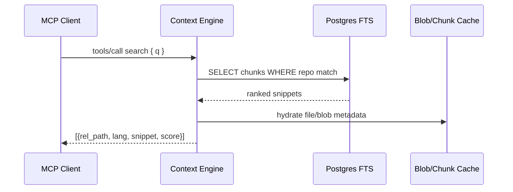

# Context Engine Notes

- **Entry Points:** Set `MCP_SERVICE=context` then run `ruby ./bin/mcp_server` (or `make mcp-context-run`). Tools become available via stdio `tools/list` and `tools/call`.
- **Engine Structure:** `lib/savant/context/engine.rb` orchestrates requests, delegating to `ops.rb` for implementations and `tools.rb` for registrar metadata. `fts.rb` encapsulates ranked chunk search returning `[rel_path, chunk, lang, score]` arrays.
- **Core Tools:**
  - `search`: queries Postgres FTS over `chunks.chunk_text`, leveraging repo context set in DB. Returns scored code/markdown snippets with file path + language.
  - `memory_bank`: surfaces saved context snippets (if configured) for agents.
  - `resources`: enumerates indexed repos/resources available to the agent.
- **Dependencies:** Requires indexed data in Postgres (run `bin/context_repo_indexer index <repo>`). Needs `DATABASE_URL` and optional `LOG_LEVEL` env vars.
- **Performance Considerations:** Search uses overlap-aware chunking; ensure indexer chunk params (`codeMaxLines`, `overlapLines`, `mdMaxChars`) align with query needs. Use `Savant::Logger.with_timing` around expensive ops for observability.
- **Failure Modes:** If config missing keys, `Savant::Config.load` raises `ConfigError`. DB misconfiguration yields `pg` connection errors—validate with `bin/db_smoke` and ensure migrations via `bin/db_migrate` and `bin/db_fts`.

