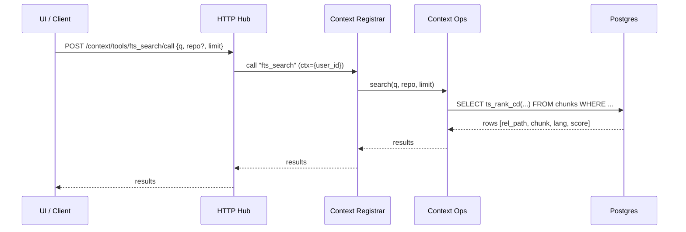
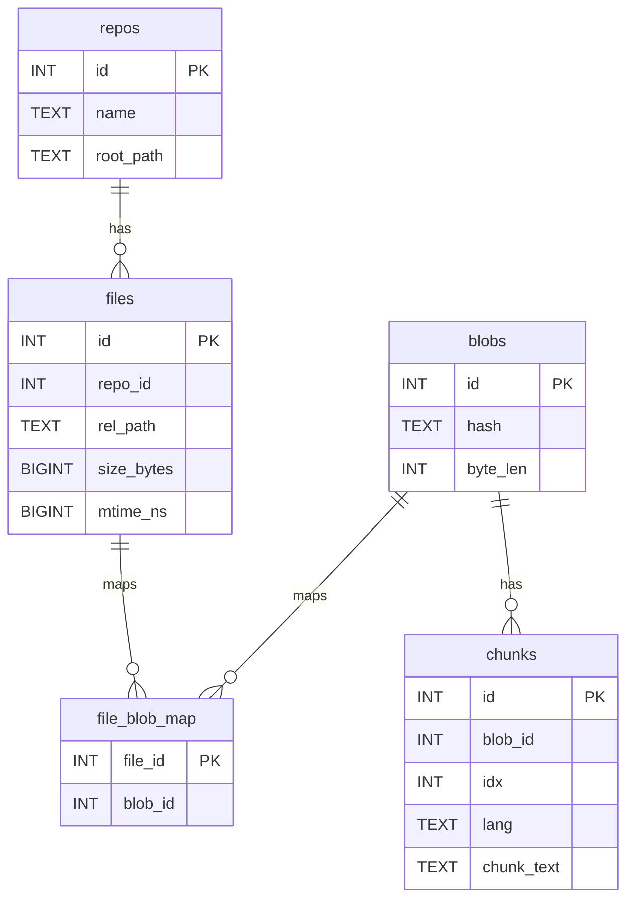

# Context Engine Notes

## Overview
- Entry point: `MCP_SERVICE=context ruby ./bin/mcp_server`
- Files: `lib/savant/engines/context/{engine.rb,ops.rb,tools.rb,fts.rb}` plus `fs/` + `memory_bank/`
- Purpose: fast private code/markdown search over Postgres FTS and helpers for memory resources and repo admin.

## Call Flow

## Data Model (DB)

## Tools (Selected)
- `fts_search` – ranked snippet search (code + markdown)
- `memory/resources/*` – list/read memory_bank markdown stored in DB
- `fs/repo/*` – index/delete/status helpers

## Notes
- Ensure DB is migrated and FTS created (`make migrate && make fts`).
- Index before searching (`make repo-index-all`).
- Logs: `/tmp/savant/context.log` (Hub) or `logs/context.log` (stdio).
