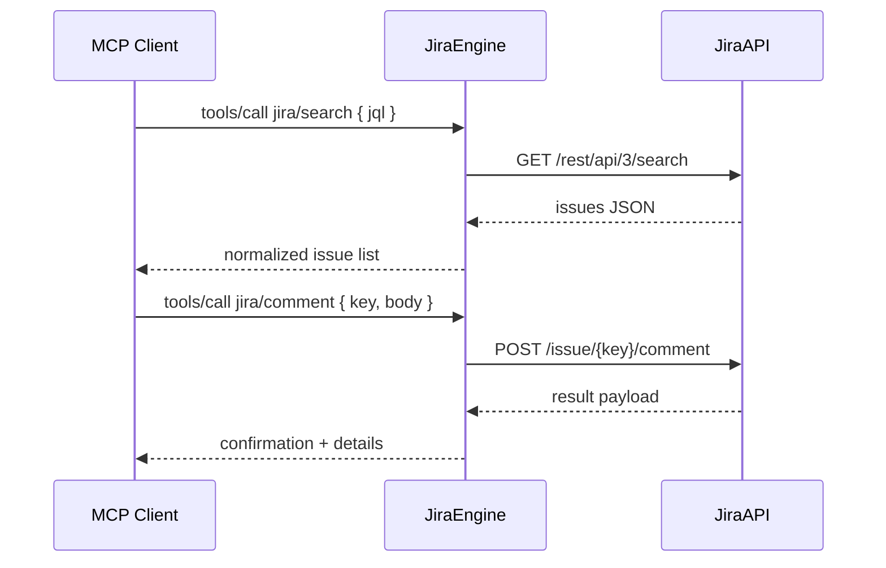

# Jira Engine Notes

- **Activation:** Run `MCP_SERVICE=jira ruby ./bin/mcp_server` (or `make mcp-jira-run`). Jira-specific tools are the only ones advertised to clients.
- **Engine Layout:** `lib/savant/jira/engine.rb` orchestrates tool execution; `ops.rb` defines actions (search issues, create/comment, fetch transitions), `client.rb` wraps Jira REST v3, and `tools.rb` registers schemas.
- **Configuration:** Requires Jira env vars: `JIRA_SITE`, `JIRA_EMAIL`, `JIRA_API_TOKEN` (or equivalent secrets file). Additional options can live in `config/settings.json` under `mcp` service block.
- **Capabilities:**
  - Query issues by JQL, key, or filters.
  - Retrieve metadata/resources for Jira projects.
  - Perform write actions (create, comment, transition) when credentials permit.
- **Error Handling:** Client raises informative errors for HTTP failures; ensure network access and credential scopes. Use `Savant::Logger` outputs (also mirrored to `logs/jira.log`) for debugging.
- **Testing:** Run `make jira-test` or `bundle exec rspec spec/jira` to cover operations; `make jira-self` exercises self-test flows.

