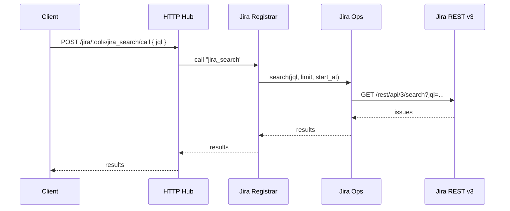

# Jira Engine Notes

## Overview
- Activation: `MCP_SERVICE=jira ruby ./bin/mcp_server`
- Files: `lib/savant/engines/jira/{engine.rb,ops.rb,client.rb,tools.rb}`
- Purpose: Jira REST v3 tools (search, read) with guarded writes (create/comment/transition).

## Call Flow

## Config
- Env or secrets: `JIRA_BASE_URL`, `JIRA_EMAIL`, `JIRA_API_TOKEN` (or basic auth) and optional `JIRA_ALLOW_WRITES=true`.
- Writes are rejected unless explicitly enabled.

## Notes
- Logs at `/tmp/savant/jira.log` (Hub) or `logs/jira.log` (stdio).
- `make jira-test` and `make jira-self` are useful smoke tests.
