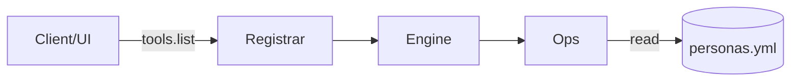

# Memory: Personas Engine

- Purpose: Provide versioned Savant personas as prompts.
- Data file: `lib/savant/engines/personas/personas.yml` (YAML list of entries)
- Schema: `name`, `title`, `version`, `summary`, `tags?`, `prompt_md`, `notes?`
- Typical usage: client fetches a persona then injects `prompt_md` as the system prompt.

## Structure


### Example YAML
```yaml
- name: savant-engineer
  title: Savant Engineer
  version: v1.0.0
  summary: Pragmatic implementer with clean diffs and tests.
  tags: [engineering, ruby, postgres, mcp]
  prompt_md: |
    You are the Savant Engineer...
```

## Usage
- Stdio: `MCP_SERVICE=personas SAVANT_PATH=$(pwd) ruby ./bin/mcp_server`
- List: `tools/list` → `personas.list` and `personas.get`
- Get: `tools/call` name=`personas.get` arguments=`{"name":"savant-engineer"}`

## Notes
- Logs at `/tmp/savant/personas.log` (Hub) or `logs/personas.log` (stdio).
