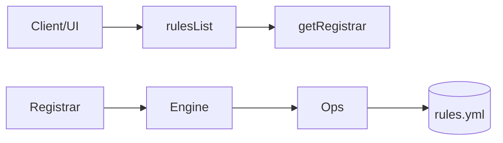

# Rules Engine

Expose versioned rule sets (code review, backend, testing, style, security) as structured YAML + markdown for LLM clients.

## Structure

## Data
- File: `lib/savant/engines/rules/rules.yml`
- Schema: `name`, `title`, `version`, `summary`, `tags?`, `rules_md`, `notes?`

## Tools
- `rules.list` – list rule sets (filter by name/title/tags/summary)
- `rules.get` – fetch `{ name, title, version, summary, tags?, rules_md, notes? }`
- `rules.read` – read a single ruleset YAML by name
- `rules.write` – overwrite a single ruleset YAML by name
- `rules.create` – create a ruleset (name/title/version/summary/rules_md required)
- `rules.update` – update a ruleset (partial fields allowed)
- `rules.delete` – delete a ruleset by name
- `rules.catalog.read` / `rules.catalog.write` – bulk read/overwrite entire catalog

## Usage
- Stdio: `MCP_SERVICE=rules SAVANT_PATH=$(pwd) ruby ./bin/mcp_server`
- Hub: `GET /rules/tools`, `POST /rules/tools/rules.get/call` with `{ params: { name } }`

## UI
- Second layer: Engines → Rules
- Third layer: Browse tab
- Page: list + YAML viewer + “View Rules” dialog (markdown) + copy icons

## Notes
- Logs at `/tmp/savant/rules.log` (Hub) and `logs/rules.log` (stdio).
