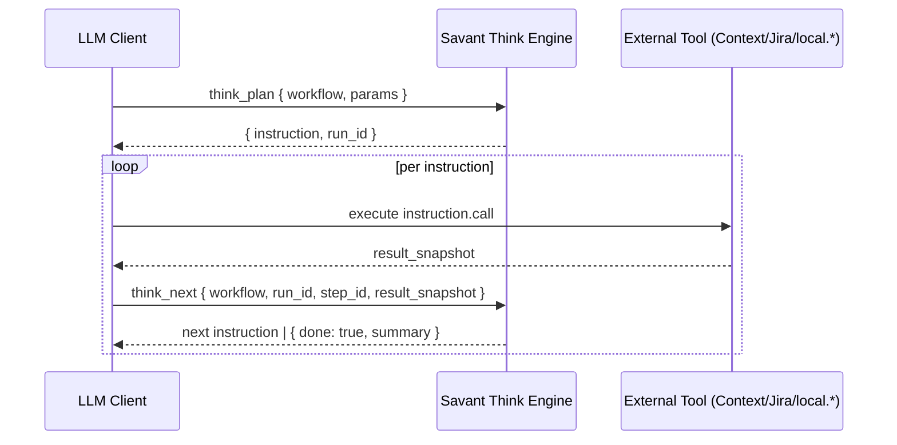
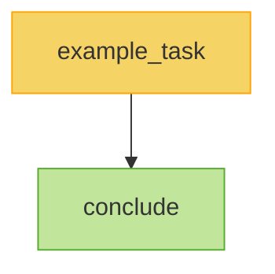

# Think Engine Notes

Deterministic workflow orchestration for LLM clients. Think validates YAML-defined DAGs, returns explicit tool instructions, and keeps the client inside a predictable `plan → execute → next` loop guided by a versioned driver prompt.

## Core Ideas
- **Instruction Loop:** Every run starts with `think_plan`, executes external/local tools, and advances via `think_next` until `done: true`.
- **Driver Prompt:** The Drivers MCP exposes `drivers_get` to fetch the canonical driver prompt (see `lib/savant/engines/drivers/prompts/*.md`). Workflows can insert a step that calls this tool if they want to surface the prompt before executing other steps.
- **Workflow Sources:** YAML files in `lib/savant/engines/think/workflows/` define step DAGs, templates, and captures. No database is required; run state persists under `.savant/state/`.

## Tool Surface
- `think_workflows_list` / `think_workflows_read` – discover workflow metadata or YAML.
- `think_plan` – validates inputs and emits the first instruction.
- `think_next` – records the previous step’s snapshot and returns the next instruction (or completion summary).
- `prompt_say` – utility tool used inside workflows for progress announcements.



Driver prompts are no longer inserted automatically. If you need to prime your run, include a step that calls the Drivers engine `drivers_get` tool and captures the result for downstream steps.

## Creating a Workflow (Example)
Example below shows a minimal triage flow you can adapt.

1. **Write YAML under `lib/savant/engines/think/workflows/`**
   ```yaml
   # lib/savant/engines/think/workflows/triage_ticket.yml
   workflow: triage_ticket
   version: 1.0.0
   steps:
     - id: fetch_ticket
       call: jira.issue.get
       input_template:
         key: "{{params.ticket_key}}"
       capture_as: ticket
     - id: summarize
       deps: [fetch_ticket]
       call: prompt_say
       input_template:
         text: |
           🧠 Ticket Summary
           Key: {{ticket.key}}
           Title: {{ticket.fields.summary}}
   ```
2. **List it** – `ruby ./bin/savant call think_workflows_list --service=think` shows `triage_ticket v1.0.0`.
3. **Plan & loop** – run `think_plan`/`think_next` from your MCP client. Each returned instruction references the YAML step IDs. Captured values (e.g., `ticket`, or `__driver` if a driver step exists) are accessible via Liquid templates in downstream steps.
4. **Show driver content** – if your workflow captures a driver prompt (common when you include a `drivers_get` step that outputs to `__driver`), display `__driver.prompt_md` before executing any dependent steps so the LLM sees the guard rails.

### Template File
- Start from `lib/savant/engines/think/workflows/_template.yml` for consistent metadata and params scaffolding.
- Rename the file, update `workflow`, `version`, `summary`, and flesh out the `steps` list. The template includes placeholder steps; add a driver bootstrap step (calling `drivers_get`) if your workflow requires the driver prompt.



## What “Having a Workflow” Means
- **Contract:** Steps act as contracts between the Think engine and the client. If a step says `call: gitlab.get_merge_request`, the client must call that exact tool and pass the templated payload.
- **State:** Think snapshots each `capture_as` blob into `.savant/state/<workflow>__<run_id>.json`. Re-running with `start_fresh: false` resumes from saved state.
- **Observability:** `Savant::Logger` records every transition (step ID, duration, payload size). When debugging, tail `logs/think.log`.
- **Evolution:** Update YAML to change behavior; no Ruby changes required unless you add new helper tools. The done PRDs show how workflows evolved (e.g., adding an explicit driver bootstrap step when needed) to accommodate new guard rails.

## References
- Workflows: `lib/savant/engines/think/workflows/*.yml`
- Prompts: `lib/savant/engines/think/prompts/`
