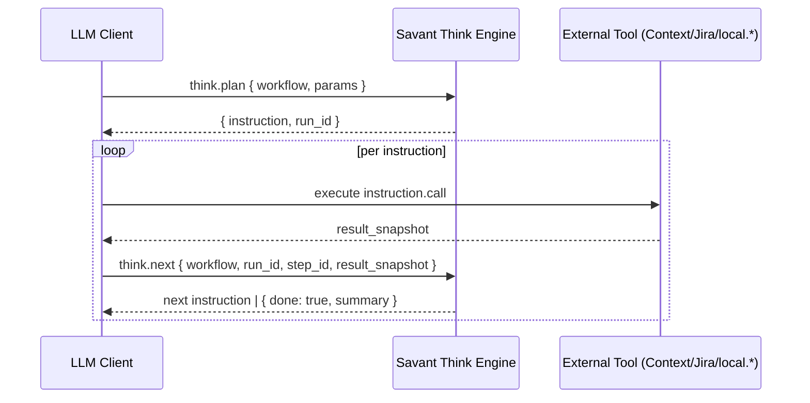
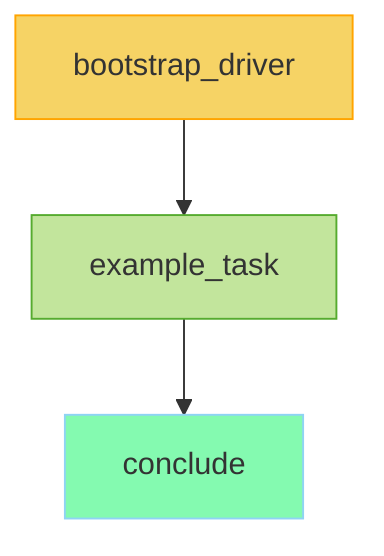

# Think Engine Notes

Deterministic workflow orchestration for LLM clients. Think validates YAML-defined DAGs, returns explicit tool instructions, and keeps the client inside a predictable `plan → execute → next` loop guided by a versioned driver prompt.

## Core Ideas
- **Instruction Loop:** Every run starts with `think.plan`, executes external/local tools, and advances via `think.next` until `done: true`.
- **Driver Prompt:** `think.driver_prompt` surfaces the canonical orchestration rules (see `lib/savant/engines/think/prompts/*.md`). Workflows typically inject this as the first instruction to ensure consistent guard rails.
- **Workflow Sources:** YAML files in `lib/savant/engines/think/workflows/` define step DAGs, templates, and captures. No database is required; run state persists under `.savant/state/`.

## Tool Surface
- `think.workflows.list` / `think.workflows.read` – discover workflow metadata or YAML.
- `think.plan` – validates inputs, seeds driver prompt, and emits the first instruction.
- `think.next` – records the previous step’s snapshot and returns the next instruction (or completion summary).
- `think.driver_prompt` – fetches `{version, hash, prompt_md}` for priming LLM clients.
- `prompt.say` – utility tool used inside workflows for progress announcements.



## Creating a Workflow (Example)
Example below shows a minimal triage flow you can adapt.

1. **Write YAML under `lib/savant/engines/think/workflows/`**
   ```yaml
   # lib/savant/engines/think/workflows/triage_ticket.yml
   workflow: triage_ticket
   version: 1.0.0
   steps:
     - id: bootstrap_driver
       call: think.driver_prompt
       input_template:
         version: stable
       capture_as: __driver
     - id: fetch_ticket
       deps: [bootstrap_driver]
       call: jira.issue.get
       input_template:
         key: "{{params.ticket_key}}"
       capture_as: ticket
     - id: summarize
       deps: [fetch_ticket]
       call: prompt.say
       input_template:
         text: |
           🧠 Ticket Summary
           Key: {{ticket.key}}
           Title: {{ticket.fields.summary}}
   ```
2. **List it** – `ruby ./bin/savant call think.workflows.list --service=think` shows `triage_ticket v1.0.0`.
3. **Plan & loop** – run `think.plan`/`think.next` from your MCP client. Each returned instruction references the YAML step IDs. Captured values (e.g., `ticket`, `__driver`) are accessible via Liquid templates in downstream steps.
4. **Follow driver prompt** – clients MUST display `__driver.prompt_md` before executing subsequent steps, matching the `think-code-review-fix` PRD requirement.

### Template File
- Start from `lib/savant/engines/think/workflows/_template.yml` for consistent metadata, params, and driver bootstrap.
- Rename the file, update `workflow`, `version`, `summary`, and flesh out the `steps` list. The template already includes a driver prompt step and a placeholder `prompt.say` step.



## What “Having a Workflow” Means
- **Contract:** Steps act as contracts between the Think engine and the client. If a step says `call: gitlab.get_merge_request`, the client must call that exact tool and pass the templated payload.
- **State:** Think snapshots each `capture_as` blob into `.savant/state/<workflow>__<run_id>.json`. Re-running with `start_fresh: false` resumes from saved state.
- **Observability:** `Savant::Logger` records every transition (step ID, duration, payload size). When debugging, tail `logs/think.log`.
- **Evolution:** Update YAML to change behavior; no Ruby changes required unless you add new helper tools. The done PRDs show how workflows evolved (e.g., forcing the driver prompt bootstrap) to accommodate new guard rails.

## References
- Workflows: `lib/savant/engines/think/workflows/*.yml`
- Prompts: `lib/savant/engines/think/prompts/`
