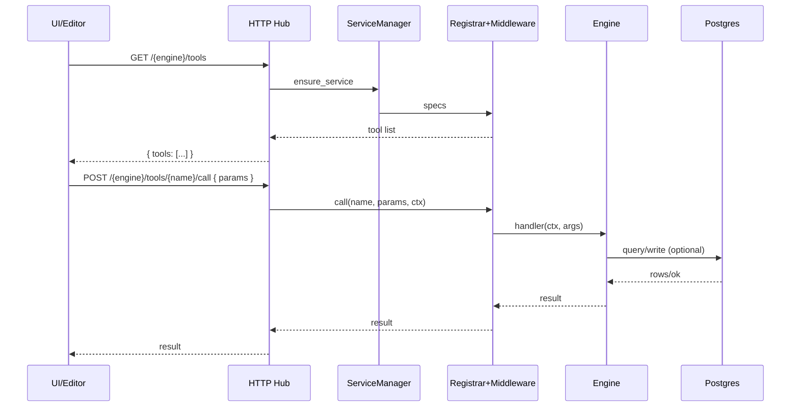

# Agent Framework Notes

- **Goal:** Provide AI agents with actionable reference for working inside Savant’s workflows (indexer + MCP + Jira) when operating through Codex CLI or similar environments.

## Developer Flow

- Follow PRD→Branch→Plan→TDD→Implement→Commit→Push sequence when automating larger changes. Default branch naming: `feature/<prd-slug>` with push to `origin` unless overridden.
- Write an “Agent Implementation Plan” directly into PRDs when automating multi-step work; keep steps concrete and test-focused.
- After implementation, run `bundle exec rubocop -A` and `bundle exec rspec` (or service-specific test targets such as `make mcp-test`, `make jira-test`). Failures halt the flow unless explicitly allowed.

## Environment & Tooling

- **Config:** Primary settings live at `config/settings.json` (see `config/settings.example.json` and `config/schema.json`) and must include `indexer`, `database`, and `mcp` blocks.
- **Make Targets:** `make quickstart` boots the Docker stack and runs migrations/FTS (no indexing); `make dev` starts services only; `make repo-index-all` and `make repo-status` manage indexing; `make migrate` and `make fts` handle DB setup; `make mcp-context-run`/`make mcp-jira-run` launch servers.
- **CLI Scripts:** Located in `bin/` (e.g., `bin/context_repo_indexer`, `bin/db_migrate`, `bin/mcp_server`, `bin/config_validate`). Set `DATABASE_URL` before DB-backed commands.

## Operational Guidance

### Visual Overview

- Keep `memory_bank` entries concise and factual so downstream agents can quickly ingest architecture, engine behaviors, and workflows.
- Reference `Savant::Logger.with_timing` when instrumenting long-running tasks to keep logs consistent.
- Ensure Postgres migrations and FTS setup have run before indexing or serving context queries to avoid runtime errors.
- No secrets committed in repo; fetch Jira credentials via env or `secrets.yml` copy.
