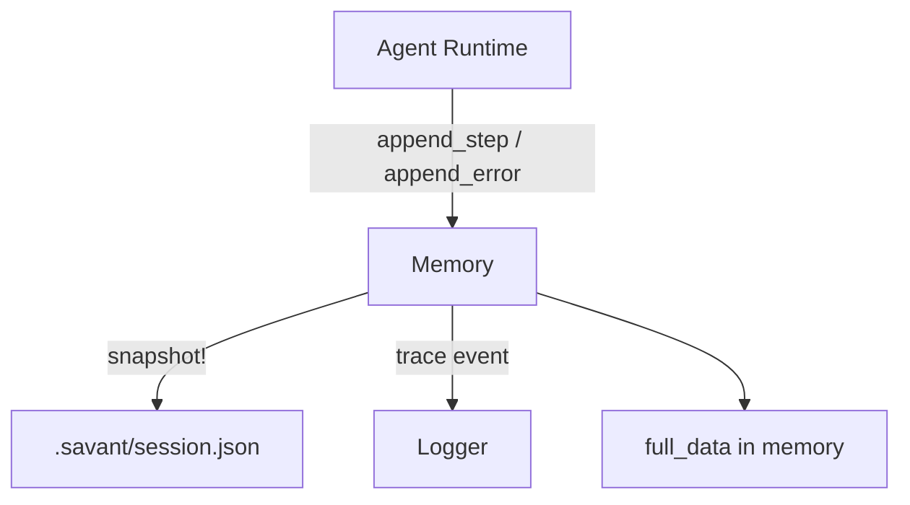
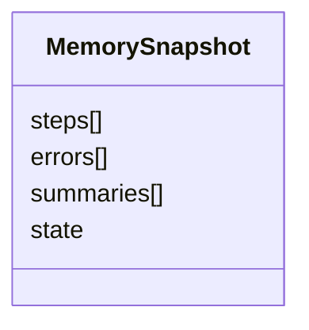
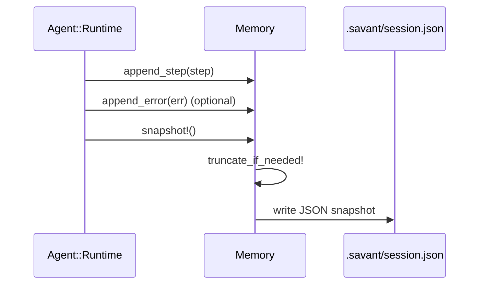

# Savant Memory System

The memory system captures per-step agent activity, persists it to disk, and enforces a size budget so long runs stay manageable. It is optimized for step-by-step traceability rather than long-term recall.

- Location: `lib/savant/agent/memory.rb`
- Persistent file: `.savant/session.json`
- In-memory full history: `full_data` (never truncated)

## Responsibilities

- Append steps, errors, and summaries from the runtime loop.
- Persist a snapshot after each step.
- Keep snapshots under a fixed size budget by trimming older steps.
- Emit lightweight telemetry on snapshot success/failure.

#### Architecture

Description: The runtime writes steps into the memory container, which snapshots a trimmed view to disk while keeping a full in-memory history.



## Data Model

The persisted snapshot is a single JSON object with four top-level keys.

```json
{
  "steps": [
    { "step": 1, "action": {"action":"tool"}, "output": {"ok":true} }
  ],
  "errors": [
    { "message": "timeout", "step": 3 }
  ],
  "summaries": [
    "step 1-3: searched codebase"
  ],
  "state": {
    "current_goal": "Find where Framework is defined"
  }
}
```

Description: The snapshot payload is a compact, step-indexed log that favors recent steps and summarization.



## Lifecycle (Per Step)

Description: Each loop appends new data, trims if needed, and persists the snapshot.



## Truncation Policy

- Budget is enforced as JSON length: ~16k chars (~4k tokens).
- If over budget and more than 5 steps exist, older steps are summarized.
- The snapshot keeps the last 5 steps and inserts a summary stub:
  - `{"index":"summary","note":"Summarized N earlier steps"}`
- `full_data` retains the complete, untrimmed history in memory.

## Persistence and Errors

- `.savant/` is created if missing.
- Snapshot failures are logged as warnings but do not crash the runtime.
- Snapshot success logs a trace event with step counts.

## Runtime Integration

- The runtime appends tool output and reasoning results to `steps`.
- Errors from tool calls or the Reasoning API are appended to `errors`.
- The snapshot is written after each step to support replay/debugging.

## Testing

- Memory behavior is exercised indirectly via runtime smoke tests.
- Truncation can be validated by forcing large step payloads and confirming snapshot size.
