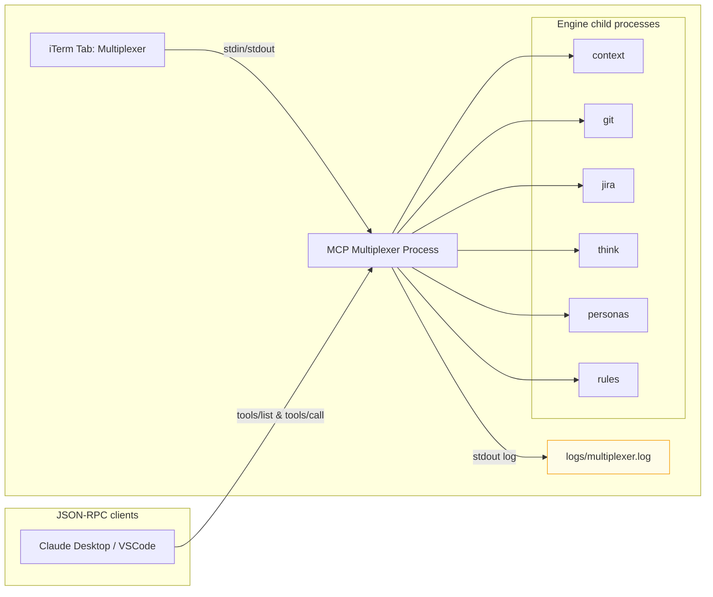

# MCP Multiplexer iTerm Guide

Use this note to keep iTerm workflows aligned with the Savant multiplexer. It collects the visual architecture, pane layout tips, and quick CLI examples so editors stay in sync while the multiplexer serves every engine.

## Visual Architecture

## Recommended iTerm Pane Layout

- **Left pane**: action shell for running `savant` helpers (`savant engines`, `savant tools`, `savant call`).
- **Right pane**: tail logs `tail -F logs/multiplexer.log` or watch repo indexing output.
- **Split view**: keep a small pane for `bundle exec ruby ./bin/mcp_server` so you can see multiplexer stdout and restart with Cmd+R if needed.
- **Tabs**: reserve a second tab for editing `config/settings.json` or running indexer commands (`make repo-status`).
- **Profiles**: create an iTerm profile that sets `SAVANT_PATH=$PWD` automatically, so every new window points to the repo root.

Keep the 4/8 panel balance in mind—use a wider log pane to read multiplexer events while keeping commands in the smaller control pane.

## Multiplexer Checklist

| Task | Command | Notes |
| --- | --- | --- |
| Start multiplexer | ``SAVANT_PATH=$(pwd) bundle exec ruby ./bin/mcp_server`` | Boots the unified MCP surface; child processes launch per config. Logs land in `logs/multiplexer.log`. |
| List engines | ``./bin/savant engines`` | Shows status, PID, tool count, uptime per child process. Useful before calling tools. |
| List tools | ``./bin/savant tools`` | Reveals full namespace (`context.fts/search`, `git.diff`, `jira.issue.get`, etc.). Use `--json` for automation. |
| Call a tool | ``./bin/savant call context.fts.search --input='{"q":"memory"}'`` | Sends request through multiplexer to the correct engine. Pipes straight to JSON. |
| Call a git tool | ``./bin/savant call git.repo_status --input='{}'`` | Returns `{is_repo, path, branch, head, tracked_files, languages}` for the CWD repository. |
| Stream logs | ``tail -F logs/multiplexer.log`` | Watch child restarts, tool routing, crash alerts. Keep this running in the log pane. |

## Example Sessions

1. **Boot + Inspect**
   - Start multiplexer in one pane.
   - In the left pane, run `./bin/savant engines` to confirm all engines are online.
   - Tail the log in another pane to ensure no restarts occur.
2. **Call Context Tools**
 - Use `./bin/savant call context.fts.search --input='{"q":"indexer"}'` from the control pane.
  - Watch multiplexer log show `context.fts.search` routed and answered; copy response from stdout.
3. **Call Git Tools**
  - Run `./bin/savant call git.changed_files --input='{}'` to inspect working tree changes.
  - Run `./bin/savant call git.diff --input='{"paths":["lib/savant/framework/mcp/dispatcher.rb"]}'` for structured hunks/lines.
4. **Isolate a Single Engine**
   - Set `MCP_SERVICE=jira` and run `bundle exec ruby ./bin/mcp_server` in a temporary pane if you need to test Jira-only tooling.
   - After verifying, revert to the multiplexer command and check `./bin/savant tools` shows the merged namespace again.

## Tips

- Set `SAVANT_MULTIPLEXER_DISABLED=1` to boot a single engine for debugging, then re-enable for normal workflows.
- Use iTerm trigger on `logs/multiplexer.log` to highlight `restart` entries so you notice when a child dies.
- Combine `savant tools --json | jq '.[] | select(.name|startswith("jira"))'` when scripting tool discovery.

Add this note to the memory bank so future sessions immediately match the visual layout and commands used when working with the multiplexer from iTerm.
