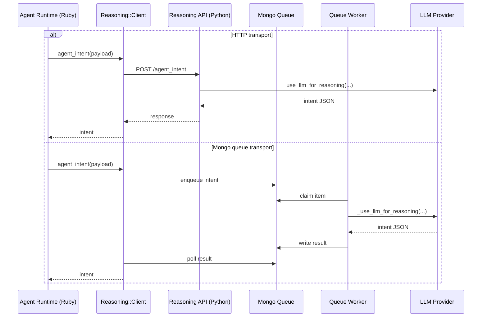
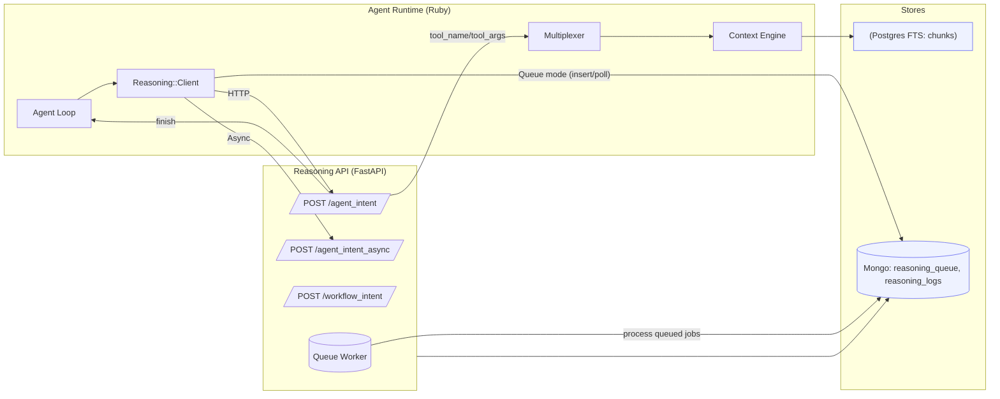
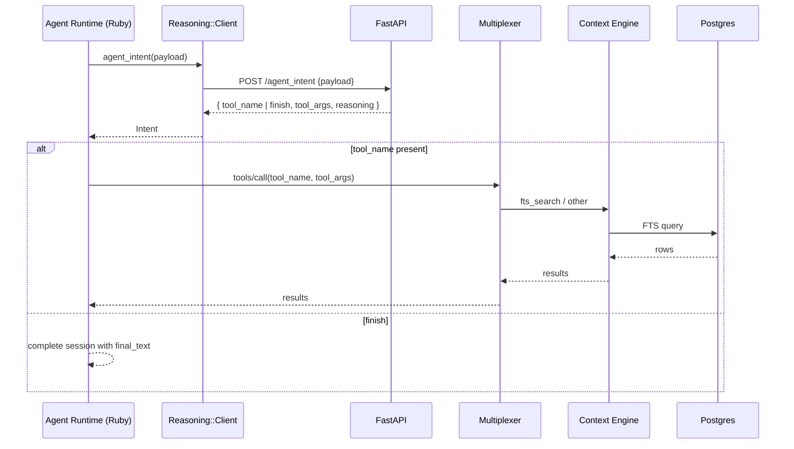
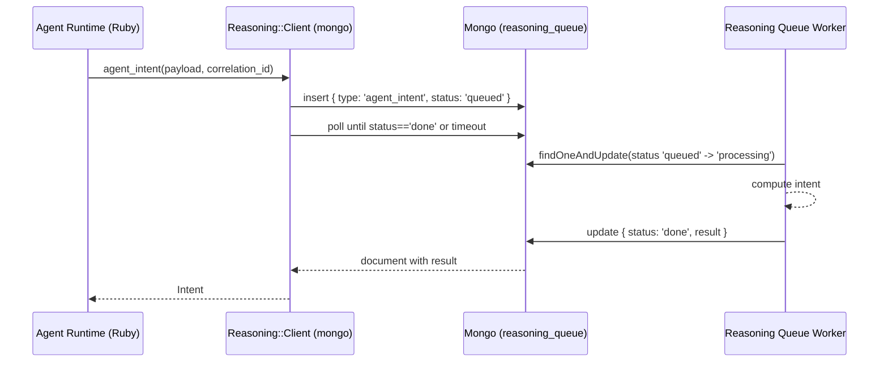
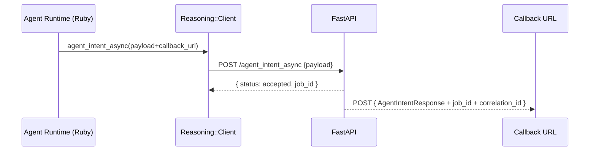
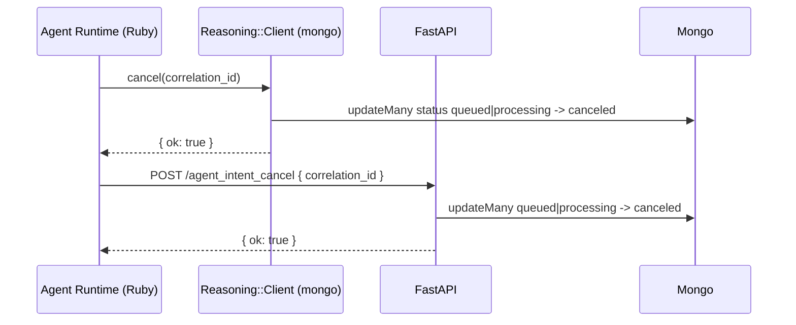

# Reasoning API

Status: MVP Complete
Version: v1
Owners: Runtime + Reasoning

## Purpose
- External service that decides the agent’s next action (tool call vs finish) given session state, persona, rules, history, and goal.
- Provides synchronous HTTP endpoints and a Mongo-backed queue mode for resilient, low-latency intent computation.
- Emits structured telemetry for diagnostics and usage analytics.

## Stack
- API: Python FastAPI + Uvicorn (`reasoning/api.py`)
- Models: Pydantic request/response schemas
- LLM helpers: LangChain/requests with simple provider selection (optional)
- Queue/Logs: MongoDB (optional) for `reasoning_queue` and `reasoning_logs`
- Client SDK: Ruby `Savant::Reasoning::Client` (HTTP or Mongo transport)

## Components
- Reasoning API (FastAPI): Implements `/agent_intent`, `/agent_intent_async`, `/agent_intent_cancel`, `/workflow_intent`, `/healthz`.
- Ruby Client: `lib/savant/reasoning/client.rb` with retry, timeout, tool validation, and Mongo queue fallback.
- Agent Runtime: uses the client to request intents inside the autonomous loop.
- Context Engine + DB: invoked when the next action is a search/tool call.
- Observability: Mongo `reasoning_logs` collection; optional local file/stdout logs.

## Endpoints
- POST `/agent_intent` → decide next action
  - Request (Pydantic `AgentIntentRequest`):
    - `session_id` string
    - `persona` object; `driver` object; `rules` object; `instructions` string
    - `llm` object (provider/model/api_key)
    - `repo_context` object; `memory_state` object; `history` array
    - `goal_text` string; `forced_tool` string; `max_steps` int
    - `agent_state` object (e.g., stuck flags)
    - `callback_url` string (ignored in sync call); `correlation_id` string
  - Response (`AgentIntentResponse`):
    - `status` ok|error; `duration_ms` int; `intent_id` string
    - `tool_name` string; `tool_args` object; `reasoning` string
    - `finish` boolean; `final_text` string; `trace` array

- POST `/agent_intent_async` → accept and compute in background; POSTs result to `callback_url`
  - Request: same as sync, requires `callback_url`
  - Response: `{ status: "accepted", job_id }`
  - Callback payload: `AgentIntentResponse` plus `{ job_id, correlation_id }`

- POST `/agent_intent_cancel` → best-effort cancel queued/processing jobs (queue mode)
  - Request: `{ correlation_id }`
  - Response: `{ ok: true|false, error? }`

- POST `/workflow_intent` → minimal workflow node transition helper
  - Request (`WorkflowIntentRequest`): `{ run_id, workflow_name, current_node, outputs?, params?, memory_state? }`
  - Response (`WorkflowIntentResponse`): `{ status, duration_ms, intent_id, next_node?, action_type?, tool_name?, tool_args?, reasoning?, finish, trace }`

- GET `/healthz` (alias `/health`) → `{ status: "ok" }`

Headers
- `Accept-Version: v1` (default)
- `Authorization: Bearer <token>` when fronted by an auth proxy

## Schema Reference

- Reference `config/reasoning_api_schema.json` for request/response shapes.
- Minimal example request:
  ```json
  {"session_id":"s1","persona":{},"goal_text":"search project for TODOs"}
  ```
- Minimal example response:
  ```json
  {"status":"ok","intent_id":"agent-1","tool_name":"context.fts_search","tool_args":{"query":"search project for TODOs"},"finish":false}
  ```

## Transport Modes
- HTTP (default): Ruby client POSTs to `/agent_intent` with retry/backoff.
- Mongo queue (default in client when `REASONING_TRANSPORT=mongo`):
  - Client inserts `{ type: 'agent_intent', correlation_id, status: 'queued', payload }` into `reasoning_queue` then polls until `status: 'done'` or timeout.
  - API runs a background worker thread processing queue items, computing results, and writing `{ status: 'done', result }` back.
  - Cancel: set `status: 'canceled'` on queued/processing docs by `correlation_id`.

## LLM Invocation (Who / Where / When)

- **Who calls the LLM:** The Reasoning API service (Python) or its queue worker, not the Ruby runtime.
- **Where in code:** `reasoning/api.py` in `_use_llm_for_reasoning`, invoked by `_compute_intent_sync`.
- **When it happens:** Each intent decision unless a forced tool is provided or the heuristic fallback short‑circuits.
  - HTTP mode: `POST /agent_intent` and `POST /workflow_intent` execute `_compute_intent_sync` inside the API process.
  - Mongo queue mode: the queue worker runs `_process_one_queue_item` → `_compute_intent_sync`.

Description: HTTP mode calls the LLM from the API process; queue mode calls the LLM from the worker process. Both share the same reasoning function.



## Configuration
- Make targets
  - `make reasoning-setup` → Python venv + dependencies
  - `make reasoning-api` → run Uvicorn with code reload
  - `make reasoning-api-stdout` or `make reasoning-api-file log=logs/reasoning.log`
- Environment (API)
  - `UVICORN_HOST`/`UVICORN_PORT` (default `127.0.0.1:9000`)
  - `MONGO_URI` or `MONGO_HOST` (optional for queue/logs)
  - `REASONING_QUEUE_WORKER=0` to disable background worker
  - `REASONING_QUEUE_WORKERS` number of worker threads (default 4)
  - `REASONING_QUEUE_POLL_MS` poll interval in ms (default 50)
  - `REASONING_LOG_FILE` to mirror JSON logs to a file; `REASONING_LOG_STDOUT=1` mirrors to stdout
- Environment (Ruby client)
  - `REASONING_API_URL` (default `http://127.0.0.1:9000`)
  - `REASONING_API_TOKEN` (optional)
  - `REASONING_API_TIMEOUT_MS` (default 5000), `REASONING_API_RETRIES` (default 2), `REASONING_API_VERSION` (default `v1`)
  - `REASONING_TRANSPORT` (`mongo` or `http`; default `mongo`)
  - `MONGO_URI` / `MONGO_HOST` (for queue mode)

## Behavior & Fallbacks
- LLM-first decision: attempts provider/model per `llm` field; otherwise uses heuristics (search vs finish) and existing history to avoid repeated searches.
- Tool validation: Ruby client checks returned `tool_name` exists in Multiplexer tools; invalid tool raises `intent_validation_error`.
- Retries: client retries on HTTP 5xx and timeouts up to `REASONING_API_RETRIES`.
- Async callbacks: on `/agent_intent_async`, service POSTs the result payload to `callback_url` with `{ job_id, correlation_id }`.
- Telemetry: `reasoning_logs` collection stores JSON events; HTTP mode also mirrors logs to stdout/file if configured.

## Architecture (Mermaid)


Rendered images:
- Architecture: `memory_bank/assets/reasoning_api/architecture.svg` (PNG also available)
- Sync intent: `memory_bank/assets/reasoning_api/sync_intent.svg`
- Queue mode: `memory_bank/assets/reasoning_api/queue_mode.svg`
- Async callback: `memory_bank/assets/reasoning_api/async_callback.svg`
- Cancel (queue): `memory_bank/assets/reasoning_api/cancel_queue.svg`

Regenerate assets: `bash scripts/render_mermaid.sh`

## Sequence: Sync Intent (HTTP)


See rendered: `memory_bank/assets/reasoning_api/sync_intent.svg`

## Sequence: Queue Mode (Mongo)


See rendered: `memory_bank/assets/reasoning_api/queue_mode.svg`

## Sequence: Async Callback (HTTP)


See rendered: `memory_bank/assets/reasoning_api/async_callback.svg`

## Sequence: Cancel (Queue Mode)


See rendered: `memory_bank/assets/reasoning_api/cancel_queue.svg`

## Operational Notes
- Run HTTP+worker locally: `make reasoning-setup && make reasoning-api` (serves at `http://127.0.0.1:9000`).
- Run worker-only (no HTTP): `make reasoning-worker` (processes Mongo queue)
- Diagnostics: Hub surfaces calls/usage via `reasoning_diagnostics` and Mongo stats in Context FS diagnostics.
- Security: front with an auth proxy if exposing externally; set `REASONING_API_TOKEN` and validate in a gateway if needed.
- Performance: queue mode avoids HTTP overhead and tolerates transient API restarts; sync HTTP is simplest to integrate.
- Failure Modes: client timeouts raise `timeout`; HTTP ≥500 retried; 4xx surface server error messages.
- Troubleshooting:
  - Timeouts: increase `REASONING_API_TIMEOUT_MS` or inspect API logs.
  - Invalid tools: client validates tool names against Multiplexer; ensure the tool exists.
  - Health: `curl http://127.0.0.1:9000/healthz` should return `{ "status": "ok" }`.

Queue status output (worker)
- The worker prints a concise status line when counts change, and at least once per minute.
- Tuning:
  - `REASONING_QUEUE_STATUS_MS` (default 60000) — minimum interval between prints
  - `REASONING_QUEUE_STATUS_POLL_MS` (default 1000) — how frequently to check for changes

## Examples
HTTP curl
```bash
curl -sX POST http://127.0.0.1:9000/agent_intent \
  -H 'Accept-Version: v1' -H 'Content-Type: application/json' \
  -d '{
    "session_id":"s1",
    "persona": {"name":"savant-engineer"},
    "goal_text":"Find auth logic",
    "history": []
  }'
```

Ruby (client)
```ruby
client = Savant::Reasoning::Client.new # transport defaults to mongo
intent = client.agent_intent(session_id: 's1', persona: {}, goal_text: 'List Makefile targets')
if intent.finish
  puts intent.final_text
else
  # route to multiplexer
  puts [intent.tool_name, intent.tool_args]
end
```

## Interactions with Memory Bank
- The service favors `context.fts_search` for information-seeking goals, which integrates with the Context Engine.
- Context Engine can search indexed repo chunks (Postgres FTS) and memory_bank markdown (filesystem scan or DB-backed list/read).
- History-aware rule avoids repeating searches when prior steps already returned search results.
