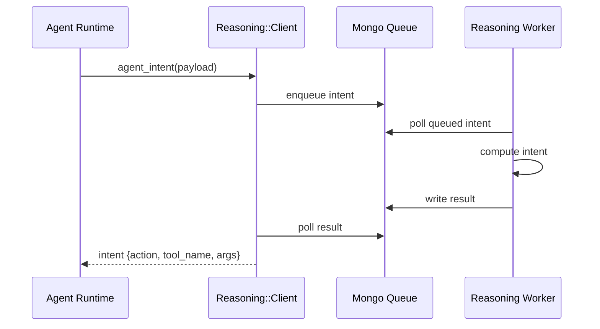
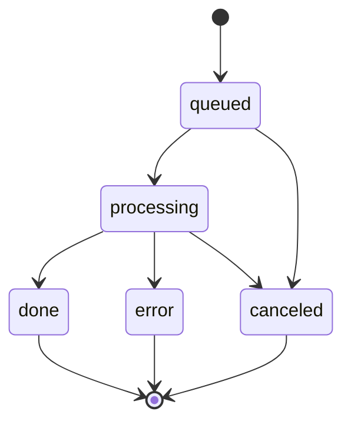
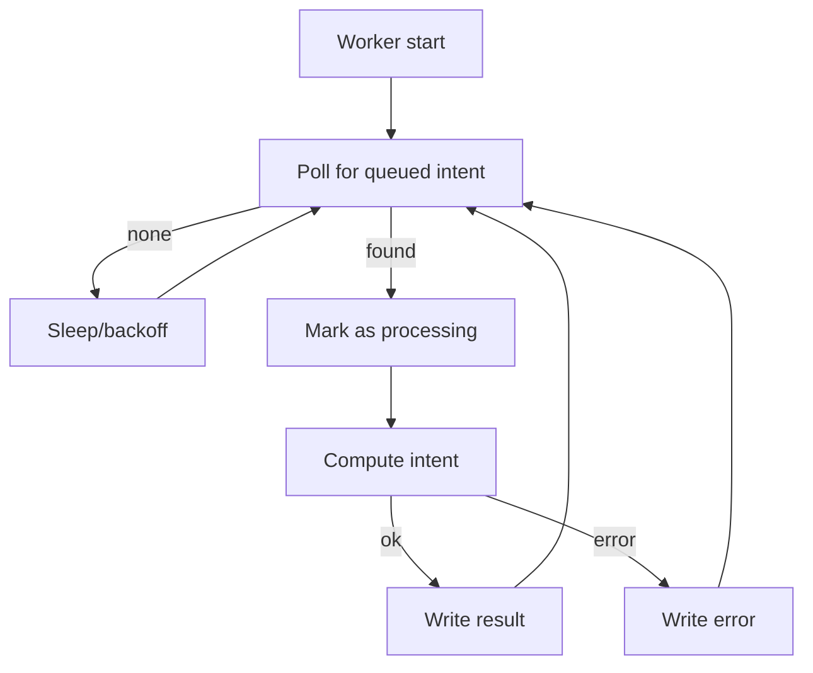

# Reasoning Queue Worker (Mongo Transport)

The Reasoning Queue Worker consumes queued intent requests from Mongo, computes decisions, and writes results back for the Agent Runtime to poll. It exists to decouple agent execution from reasoning compute and to support cancellation/queue control.

- Location: `reasoning/`
- Queue transport: `REASONING_TRANSPORT=mongo`
- Queue DB: `reasoning_queue` (Mongo)
- Client: `lib/savant/reasoning/client.rb`

## Responsibilities

- Poll queued intent requests from Mongo.
- Execute the reasoning model / workflow to produce `{action, tool_name, args, finish?, reasoning}`.
- Write results back to the queue for client polling.
- Honor cancellation signals and timeouts when configured.

## Architecture

Description: The Agent Runtime enqueues intent requests via the Reasoning client, the worker processes them, and the client polls the result to resume the loop.



## Queue Data Model

Each queue entry contains the request payload and a result slot. Fields vary by version, but the pattern is stable.

```json
{
  "_id": "...",
  "status": "queued|processing|done|error|canceled",
  "payload": {
    "session_id": "session_...",
    "step": 3,
    "goal": "Find where Framework is defined",
    "context": {"persona": "savant-engineer"}
  },
  "result": {
    "action": "tool",
    "tool_name": "savant-context.fts_search",
    "args": {"query": "Framework", "limit": 10},
    "reasoning": "Search for Framework definitions"
  },
  "error": null,
  "created_at": "...",
  "updated_at": "..."
}
```

Description: Status transitions move from queued to processing to done (or error/canceled) as the worker progresses.



## Lifecycle (Worker Loop)

Description: The worker continuously polls, locks one item, processes it, and writes the result.



## Configuration

- `REASONING_TRANSPORT=mongo` enables queue usage.
- `REASONING_QUEUE_WORKER=1` enables the worker in the Reasoning service.
- `MONGO_URI` or `MONGO_HOST` selects the Mongo instance.
- `REASONING_API_TIMEOUT_MS` and `REASONING_API_RETRIES` affect client polling behavior.

## Failure Modes

- Queue item stuck in `processing`: investigate worker logs and restart.
- `error` result: the runtime records the error and exits the step.
- Mongo unavailable: client falls back to error and runtime stops the loop.

## Operational Notes

- The queue transport is preferred when cancellation and multi-run coordination are needed.
- Use HTTP transport (`REASONING_TRANSPORT=http`) for simple local runs.
- Worker should be supervised in dev/prod to avoid orphaned processing states.
