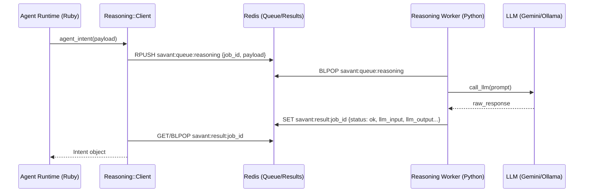
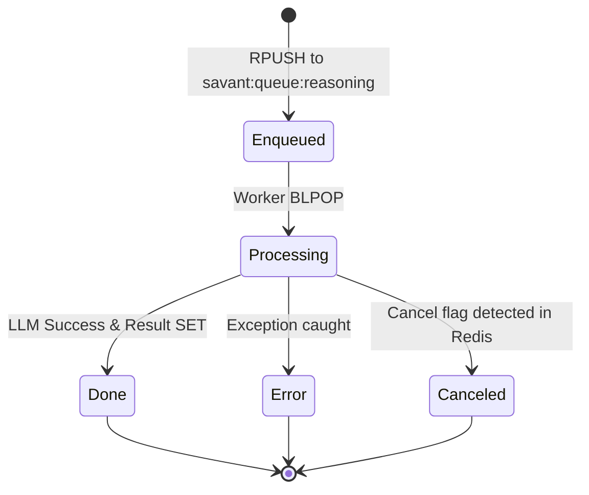

# Reasoning Queue Worker (Redis Architecture)

The Reasoning Queue Worker is a high-performance Python service that handles LLM reasoning tasks. It uses **Redis** as a low-latency message broker to decouple agent execution from reasoning compute, supporting parallel execution, cancellation, and detailed diagnostic tracing.

- **Location**: `reasoning/`
- **Queue Transport**: Redis (`BRPOP`/`BLPOP` flow)
- **Primary Keys**:
  - Queue: `savant:queue:reasoning`
  - Results: `savant:result:{job_id}`
  - Metadata: `savant:job:meta:{job_id}`
  - Cancellation: `savant:jobs:cancel:requested` (Set)
- **Client**: `lib/savant/reasoning/client.rb`

## Responsibilities

- **High-Speed Polling**: Uses Redis `BLPOP` for sub-millisecond job pickup.
- **Agent Reasoning**: Executes persona-based reasoning to decide between taking an action (tool call) or finishing with a result.
- **Parallel Execution**: Supports multiple concurrent jobs (orchestrated by the Ruby engine using threads).
- **Traced Output**: Captures the raw `llm_input` (prompt) and `llm_output` (response) for every step.
- **Job Lifecycle**: Manages status transitions from `queued` to `processing` to `completed/failed/canceled`.

## Architecture

The Agent Runtime (Ruby) enqueues jobs into Redis. One or more Python workers consume these jobs, interact with the configured LLM (Gemini or Ollama), and write back the structured result.



## Data Model

### Job Result (`savant:result:{job_id}`)

The worker produces a detailed JSON snapshot of the reasoning step:

```json
{
  "status": "ok",
  "intent_id": "agent-123456789",
  "tool_name": "context.fts_search",
  "tool_args": {"query": "how to deploy"},
  "reasoning": "Need to find deployment docs to answer the user inquiry.",
  "finish": false,
  "final_text": null,
  "llm_input": "Full formatted prompt seen by the LLM...",
  "llm_output": "Raw response received from the LLM...",
  "worker_id": "hostname:pid"
}
```

## Process Flow



## Configuration

- **`REDIS_URL`**: Connection string for the Redis instance.
- **`REASONING_RESULT_TTL`**: Time-to-live for job results in Redis (Default: 300s).
- **`OLLAMA_BASE_URL`**: URL for local Ollama instance if using the local provider.
- **`GOOGLE_API_KEY`**: Required for Gemini-based reasoning.
- **`COUNCIL_ROLE_TIMEOUT_MS`**: Client-side timeout for waiting on Redis results.

## Tracing and Debugging

The new architecture prioritizes visibility:

1. **LLM Input/Output**: Every job stores the exact prompt (`llm_input`) and raw response (`llm_output`).
2. **Hub Diagnostics**: The Hub UI fetches these keys directly from Redis to show a side-by-side comparison of what the agent "thought" vs what was parsed.
3. **Worker Registry**: Live workers are tracked in `savant:workers:registry` with heartbeats for monitoring cluster health.

## Failure Modes

- **Timeout**: If no result appears in Redis within `timeout_ms`, the client raises a Ruby `StandardError`.
- **Worker Crash**: If a worker dies while processing, the job ID remains in `savant:jobs:running` but the result never appears; the system handles this via client-side timeouts.
- **LLM Error**: The worker catches API failures and writes an `error` status to `savant:result:{job_id}`.
