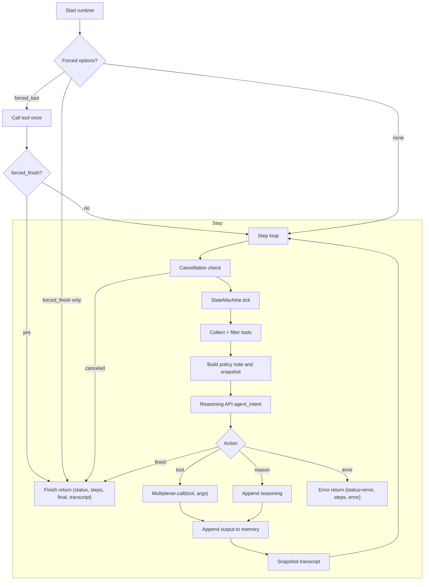
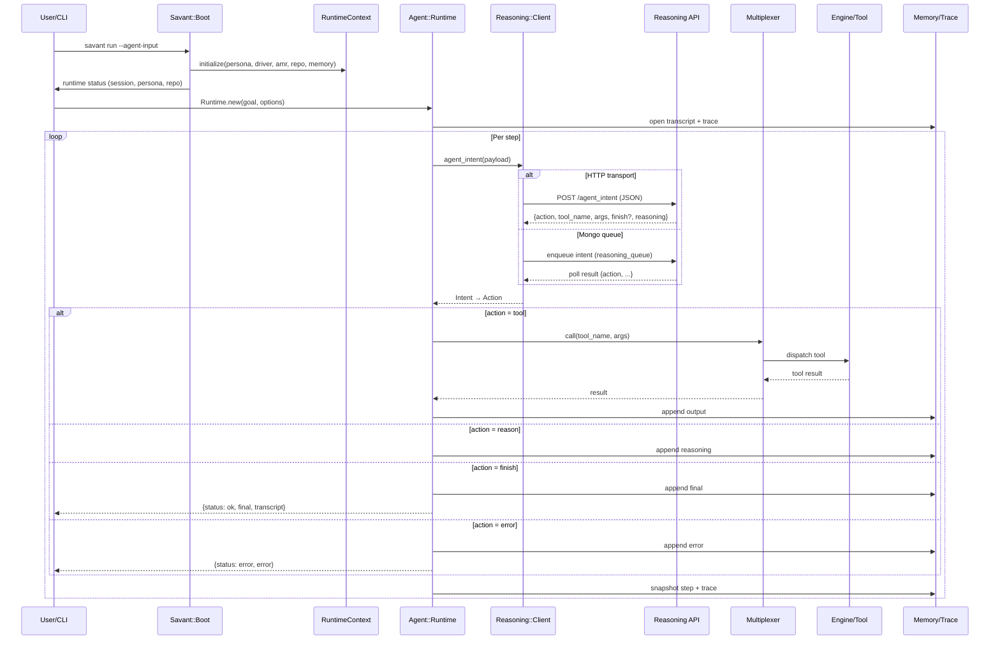
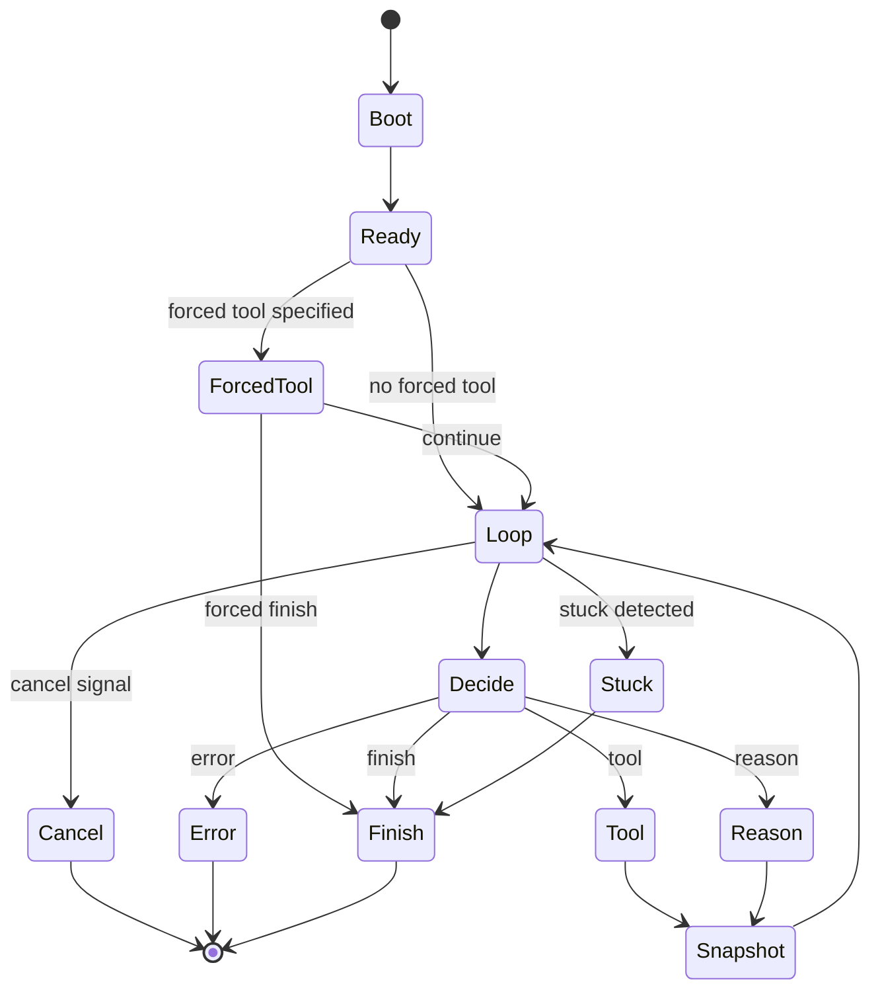

# Savant Agent Runtime (Reasoning API Only)

The Agent Runtime is the orchestrator that runs an autonomous reasoning loop for a given goal. It decides what to do next (call a tool, add reasoning, or finish) by delegating decisions to the external Reasoning API. It then executes MCP tools via the Multiplexer, persists transcripts, and emits structured telemetry.

- Location: `lib/savant/agent/runtime.rb`
- Decision engine: Reasoning API only (no SLM/LLM fallback inside the runtime)
- Transports supported by Reasoning Client: HTTP or Mongo queue (see env below)

## Responsibilities

- Build step context from persona, driver, AMR rules, repo metadata, and memory state.
- Call Reasoning API `/agent_intent` each step to obtain the next action.
- Execute MCP tools via the Multiplexer when requested by the intent.
- Persist a structured transcript and per-step snapshots to disk.
- Enforce tool-use policy (disable/allow by environment, instructions, and state machine).
- Handle forced steps (forced tool or forced finish), workflow auto-detect, cancellation, and dry-run.
- Emit detailed telemetry to `EventRecorder` and `logs/agent_trace.log`.

## Main Collaborators (Key Files)

- Runtime context: `lib/savant/framework/engine/runtime_context.rb`
- Reasoning client: `lib/savant/reasoning/client.rb`
- Multiplexer (tools): `lib/savant/multiplexer.rb`
- Memory store: `lib/savant/agent/memory.rb`
- Prompt builder: `lib/savant/agent/prompt_builder.rb` (for snapshots/telemetry)
- State machine: `lib/savant/agent/state_machine.rb`
- Logging/telemetry: `lib/savant/logging/logger.rb`, `lib/savant/logging/event_recorder.rb`

## High-Level Flow (Per Run)

1. Initialize context (persona, driver, AMR rules, repo, memory) via Boot.
2. Optionally detect workflow intent and force a one-shot workflow tool call.
3. Enter the step loop:
   - Tick state machine; check for cancellation or stuck state.
   - Collect and filter available tools from the Multiplexer.
   - Build a policy/system note and a snapshot prompt (telemetry only).
   - Decide via Reasoning API `/agent_intent` → one action: tool | reason | finish | error.
   - If tool: call `Multiplexer.call`, record output; else record reasoning/finish/error.
   - Append to transcript and persist a snapshot.
4. Exit on finish, error, or after `max_steps`.

## Flow Chart (Runtime Loop)



## Request Sequence: Submitting an Agent Run

When a user submits an agent run (e.g., `savant run --agent-input="..."`), the following sequence occurs.



## Tool Policy and Safety

- Disable-all: `AGENT_DISABLE_TOOLS=1` or instruction cues → no tool calls (convert to reasoning or finish).
- Disable Context tools: `AGENT_DISABLE_CONTEXT_TOOLS=1` or instruction cues.
- Disable search-only: `AGENT_DISABLE_SEARCH_TOOLS=1` to block `context.fts_search` and `context.memory_search`.
- Think tools are disabled by default; set `AGENT_ALLOW_THINK_TOOLS=1` to enable.
- The runtime also enforces state-machine allowlists when present.

## Cancellation and Dry-Run

- Cancellation: the runtime checks a run-scoped key; if signaled, it appends a finish step with `final="Canceled by user"` and exits.
- Dry-run: skips external calls and immediately returns `{status: ok, final: "ok"}` while still exercising force options.

## Workflow Auto-Detect (AMR Shortcut)

- If the goal contains a known workflow name (or common review intents), the runtime can force a one-shot `workflow.workflow_run` and finish.
- Disable with `AGENT_DISABLE_WORKFLOW_AUTODETECT=1`.

## Telemetry and Artifacts

- Event stream: `Savant::Logging::EventRecorder.global` collects events like `prompt_snapshot`, `tool_call_started/ completed`, `reasoning_step`.
- File trace: `logs/agent_trace.log` contains NDJSON of step-by-step events.
- Memory snapshot: `.savant/session.json` per run with all steps, actions, results, and final.

## Reasoning API Configuration

- HTTP:
  - `REASONING_API_URL` (e.g., `http://127.0.0.1:9000`)
  - `REASONING_API_TOKEN` (optional)
  - `REASONING_API_TIMEOUT_MS` (default 5000), `REASONING_API_RETRIES` (default 2)
- Mongo Queue:
  - `REASONING_TRANSPORT=mongo`
  - `MONGO_URI` (or `MONGO_HOST`), DB auto-selects by env (`savant_development`/`savant_test`)

## Error Handling

- If the Reasoning API is unreachable or returns invalid data, the runtime emits a structured error, records it, and exits.
- Tool invocation errors are captured and recorded with the step’s output.

## Quick Start

- Prepare DB and index repos per the main docs.
- Start the Reasoning API (HTTP or queue worker).
- Run: `savant run --agent-input="Summarize the design of the indexer."`
- Inspect: `logs/agent_trace.log` and the transcript JSON for the step-by-step record.

## State Diagram




## Legacy SLM-first Design (Historical)

The content below is preserved from the former `memory_bank/agent_runtime.md` and reflects the SLM-first design and deprecated flags. It is retained for historical context.

### Agent Runtime (Legacy)

Note: This document contains legacy details about an SLM-first strategy. As of v0.1.x, the Agent Runtime uses the Reasoning API for decisions (no local SLM fallback). See the Current Design section above for the current design. The examples below are historical and may reference deprecated flags like `--slm`.

**Status**: MVP Complete
**Version**: 1.0
**Dependencies**: Boot Runtime, Multiplexer, LLM Provider (Ollama/Anthropic/OpenAI)

#### Overview

The Agent Runtime is Savant's autonomous reasoning loop system. It orchestrates tool execution with memory persistence and comprehensive telemetry. Decisions are made by an external Reasoning API.

#### Architecture

```
┌─────────────────────────────────────────────────────────────────┐
│                        AGENT RUNTIME                            │
├─────────────────────────────────────────────────────────────────┤
│                                                                 │
│  ┌──────────────┐      ┌──────────────┐      ┌──────────────┐ │
│  │   Memory     │◄────►│   Prompt     │◄────►│   Output     │ │
│  │   System     │      │   Builder    │      │   Parser     │ │
│  └──────────────┘      └──────────────┘      └──────────────┘ │
│         ▲                      │                      ▲         │
│         │                      ▼                      │         │
│         │              ┌──────────────┐              │         │
│         │              │  LLM Adapter │              │         │
│         │              └──────────────┘              │         │
│         │                      │                      │         │
│         │          ┌───────────┼───────────┐         │         │
│         │          ▼           ▼           ▼         │         │
│         │     ┌────────┐  ┌────────┐  ┌────────┐   │         │
│         │     │ Ollama │  │Anthropic│ │ OpenAI │   │         │
│         │     └────────┘  └────────┘  └────────┘   │         │
│         │                                            │         │
│         └────────────────────────────────────────────┘         │
│                                                                 │
│                      ┌──────────────┐                          │
│                      │ Multiplexer  │                          │
│                      └──────────────┘                          │
│                             │                                   │
│              ┌──────────────┼──────────────┐                  │
│              ▼              ▼              ▼                  │
│         ┌────────┐     ┌────────┐     ┌────────┐            │
│         │Context │     │ Think  │     │  Jira  │            │
│         │ Engine │     │ Engine │     │ Engine │            │
│         └────────┘     └────────┘     └────────┘            │
│                                                                 │
└─────────────────────────────────────────────────────────────────┘
```

#### Reasoning Loop

```
START
  │
  ├─► [1] Build Prompt ─────────┐
  │    • Persona + Driver        │
  │    • AMR Rules               │
  │    • Repo Context            │
  │    • Memory Summaries        │
  │    • Last Tool Output        │
  │    • Schema Instructions     │
  │    • Token Budget: <8k SLM   │
  │                               │
  ├─► [2] Call LLM ◄─────────────┘
  │    • SLM-first (phi3.5)
  │    • Temp: 0.0-0.2
  │    • Max tokens: 2048
  │
  ├─► [3] Parse Output
  │    • Extract JSON
  │    • Validate schema: {action, tool_name, args, final, reasoning}
  │    • Auto-correct if malformed
  │    • Validate tool_name against multiplexer
  │
  ├─► [4] Execute Action ────────┐
  │                               │
  ├─► action=tool? ───────► Route via Multiplexer
  │                          • Call engine tool
  │                          • Handle timeouts/errors
  │                          • Retry once on failure
  │                          • Capture output
  │                               │
  ├─► action=finish? ──────► Return final result
  │                               │
  ├─► action=error? ───────► Log & retry (max 2)
  │                               │
  ├─► [5] Update Memory ◄─────────┘
  │    • Append step to ephemeral
  │    • Persist to .savant/session.json
  │    • Summarize if >4k tokens
  │    • Emit telemetry event
  │
  ├─► [6] Check Limits
  │    • step < max_steps (25)?
  │    • retry_count < retry_limit (2)?
  │
  └─► YES? ─► Loop to [1]
      NO?  ─► END
```

#### Token Budget Management

The Prompt Builder enforces strict token limits to keep context windows manageable:

```
┌─────────────────────────────────────────────────────────────┐
│                    PROMPT ASSEMBLY                          │
│                                                             │
│  Priority  │ Section           │ Max Tokens │ Trimming     │
│ ──────────────────────────────────────────────────────────  │
│     1      │ System Schema     │    500     │ NEVER        │
│     2      │ Persona           │    800     │ NEVER        │
│     3      │ Driver Prompt     │   1200     │ NEVER        │
│     4      │ AMR Rule Names    │    200     │ NEVER        │
│     5      │ Last Tool Output  │   1500     │ If needed    │
│     6      │ Memory Summaries  │   2000     │ LRU oldest   │
│     7      │ Repo Context      │   1500     │ LRU oldest   │
│     8      │ Extras            │    300     │ First to go  │
│                                                             │
│  SLM Budget:  8,000 tokens  (default)                       │
│  LLM Budget: 32,000 tokens  (for escalation)                │
└─────────────────────────────────────────────────────────────┘
```

**Trimming Strategy (LRU)**:
1. Remove extras (timestamps, metadata)
2. Truncate repo context (keep most recent files)
3. Summarize older memory steps (keep last 3-5 full)
4. Never trim: persona, driver, schema, AMR rules

#### Memory System

```
┌──────────────────────────────────────────────────────────────┐
│                      MEMORY LAYERS                           │
├──────────────────────────────────────────────────────────────┤
│                                                              │
│  EPHEMERAL (Runtime.current.memory[:ephemeral])             │
│  ┌────────────────────────────────────────────────────────┐ │
│  │  {                                                      │ │
│  │    steps: [                                             │ │
│  │      { step: 1, action: {...}, output: {...} },        │ │
│  │      { step: 2, action: {...}, output: {...} }         │ │
│  │    ],                                                   │ │
│  │    errors: [...],                                       │ │
│  │    summaries: ["step 1-3: searched codebase"],         │ │
│  │    state: { current_goal: "...", context: {...} }      │ │
│  │  }                                                      │ │
│  └────────────────────────────────────────────────────────┘ │
│                          │                                   │
│                          ▼                                   │
│  PERSISTENT (.savant/session.json)                          │
│  ┌────────────────────────────────────────────────────────┐ │
│  │  Snapshot written after each step                      │ │
│  │  • Full state up to ~4k tokens                         │ │
│  │  • Older steps → SLM summaries                         │ │
│  │  • Tool outputs attached per step                      │ │
│  │  • Supports session replay/debugging                   │ │
│  └────────────────────────────────────────────────────────┘ │
│                                                              │
└──────────────────────────────────────────────────────────────┘
```

#### LLM Adapter Layer

Pluggable provider architecture with env-based configuration:

```
┌─────────────────────────────────────────────────────────────┐
│                      LLM::Adapter                           │
│                                                             │
│  ENV['LLM_PROVIDER']  →  delegates to backend              │
├─────────────────────────────────────────────────────────────┤
│                                                             │
│  Ollama (default)                                           │
│  ├─ Host: ENV['OLLAMA_HOST'] || http://127.0.0.1:11434     │
│  ├─ SLM:  ENV['SLM_MODEL']   || phi3.5:latest              │
│  ├─ LLM:  ENV['LLM_MODEL']   || llama3:latest              │
│  └─ API:  POST /api/generate                               │
│                                                             │
│  Anthropic (stub)                                           │
│  ├─ API Key: ENV['ANTHROPIC_API_KEY']                      │
│  └─ Models: claude-3-5-sonnet, claude-3-opus              │
│                                                             │
│  OpenAI (stub)                                              │
│  ├─ API Key: ENV['OPENAI_API_KEY']                         │
│  └─ Models: gpt-4, gpt-3.5-turbo                           │
│                                                             │
└─────────────────────────────────────────────────────────────┘
```

#### Output Schema

All LLM responses must conform to this JSON schema:

```json
{
  "action": "tool|finish|error",
  "tool_name": "context.fts_search",
  "args": {
    "query": "authentication logic",
    "limit": 10
  },
  "final": "Summary of findings...",
  "reasoning": "I need to search for auth logic to understand the flow"
}
```

**Parser Auto-Correction**:
- Extracts JSON from markdown code blocks
- Coerces `args` to Hash if string
- Validates `tool_name` against multiplexer routes
- Converts malformed JSON via SLM retry (once)

#### Telemetry & Logging

```
┌─────────────────────────────────────────────────────────────┐
│                    OBSERVABILITY STACK                      │
├─────────────────────────────────────────────────────────────┤
│                                                             │
│  logs/agent_runtime.log  (Runtime Logs)                     │
│  ┌────────────────────────────────────────────────────────┐ │
│  │ [INFO] Step 1: build_prompt → 1.2ms                    │ │
│  │ [INFO] Step 1: llm_call(phi3.5) → 450ms                │ │
│  │ [INFO] Step 1: parse_output → 2.1ms                    │ │
│  │ [INFO] Step 1: tool_call(context.fts_search) → 89ms    │ │
│  │ [INFO] Step 1: update_memory → 3.4ms                   │ │
│  │ [INFO] Step 2: ...                                      │ │
│  │ [INFO] Session complete: 8 steps, 2 tools, 1 finish    │ │
│  └────────────────────────────────────────────────────────┘ │
│                                                             │
│  logs/agent_trace.log  (Telemetry Events)                   │
│  ┌────────────────────────────────────────────────────────┐ │
│  │ {"type":"reasoning_step","step":1,"ts":"2025-11-30",  │ │
│  │  "model":"phi3.5:latest","prompt_tokens":1234,         │ │
│  │  "output_tokens":89,"duration_ms":450,"action":"tool", │ │
│  │  "tool_name":"context.fts_search",                     │ │
│  │  "metadata":{"decision_summary":"Search for auth"}}    │ │
│  └────────────────────────────────────────────────────────┘ │
│                                                             │
│  .savant/session.json  (Memory Snapshot)                    │
│  ┌────────────────────────────────────────────────────────┐ │
│  │ Persistent session state with full step history        │ │
│  │ • Supports replay/debugging                            │ │
│  │ • Updated after each step                              │ │
│  └────────────────────────────────────────────────────────┘ │
│                                                             │
└─────────────────────────────────────────────────────────────┘
```

#### CLI Integration

Extended `bin/savant run` with agent execution:

```bash
# Basic execution
./bin/savant run --agent-input="Summarize recent changes"

# File input
./bin/savant run --agent-file=/path/to/goal.txt

# Model overrides
./bin/savant run --agent-input="..." --slm=phi3.5 --llm=llama3:latest

# Limits & dry-run
./bin/savant run --agent-input="..." --max-steps=10 --dry-run

# Force specific tool (testing)
./bin/savant run --agent-input="..." \
  --force-tool=context.fts_search \
  --force-args='{"query":"auth","limit":5}' \
  --force-finish

# Quiet mode (no console JSON)
./bin/savant run --agent-input="..." --quiet
```

#### Frontend Diagnostics

Real-time agent monitoring UI at `/diagnostics/agents`:

```
┌──────────────────────────────────────────────────────────────┐
│                     AGENT DIAGNOSTICS UI                     │
├──────────────────────────────────────────────────────────────┤
│                                                              │
│  Controls:                                                   │
│  [Timeline View] [Grouped View] [Live:ON] [Refresh]         │
│                                                              │
│  Filters:                                                    │
│  ☑ reasoning_step  ☑ llm_call  ☐ prompt_snapshot           │
│  ☑ tool_call_started  ☑ tool_call_completed                │
│                                                              │
│  ┌────────────────────────────────────────────────────────┐ │
│  │ Step #1  tool  context.fts_search                      │ │
│  │   events=4  model=phi3.5  tokens=1234/89               │ │
│  ├────────────────────────────────────────────────────────┤ │
│  │ Step #2  tool  think_prompts_list                      │ │
│  │   events=3  model=phi3.5  tokens=1456/102              │ │
│  ├────────────────────────────────────────────────────────┤ │
│  │ Step #3  finish                                         │ │
│  │   events=1  model=phi3.5  tokens=1567/234              │ │
│  └────────────────────────────────────────────────────────┘ │
│                                                              │
│  Details Panel:                                              │
│  ┌────────────────────────────────────────────────────────┐ │
│  │ Step: 1                                                 │ │
│  │ Action: tool                                            │ │
│  │ Tool: context.fts_search                               │ │
│  │ Args: {"query":"auth","limit":10}                      │ │
│  │ Output: [23 results]                                    │ │
│  │ Reasoning: "Need to find authentication logic..."      │ │
│  │ Duration: 450ms                                         │ │
│  │ Tokens: 1234 → 89                                      │ │
│  └────────────────────────────────────────────────────────┘ │
│                                                              │
│  [Download Trace] [Download Session]                        │
│                                                              │
└──────────────────────────────────────────────────────────────┘
```

**Features**:
- **Timeline View**: Chronological event stream
- **Grouped View**: Events grouped by reasoning step
- **Live Streaming**: Real-time updates via SSE
- **Filters**: Toggle event types
- **Export**: Download trace logs + session JSON

#### Configuration

Add to `config/settings.json`:

```json
{
  "agent": {
    "maxSteps": 25,
    "retryLimit": 2,
    "prompt": {
      "slmBudgetTokens": 8000,
      "llmBudgetTokens": 32000
    }
  },
  "llm": {
    "provider": "ollama",
    "slmModel": "phi3.5:latest",
    "llmModel": "llama3:latest",
    "ollamaHost": "http://127.0.0.1:11434"
  }
}
```

**ENV Overrides** (take precedence):
- `LLM_PROVIDER` → `ollama|anthropic|openai`
- `SLM_MODEL` → Small model name
- `LLM_MODEL` → Large model name
- `OLLAMA_HOST` → Ollama API endpoint
- `ANTHROPIC_API_KEY` → Anthropic API key
- `OPENAI_API_KEY` → OpenAI API key

#### File Structure

```
lib/savant/
├── agent/
│   ├── runtime.rb          # Core reasoning loop
│   ├── prompt_builder.rb   # Token budget + prompt assembly
│   ├── output_parser.rb    # JSON extraction + validation
│   └── memory.rb           # Ephemeral + persistent state
├── llm/
│   ├── adapter.rb          # Provider delegation
│   ├── ollama.rb           # Ollama implementation
│   ├── anthropic.rb        # Anthropic stub
│   └── openai.rb           # OpenAI stub
└── engines/context/fs/
    └── repo_indexer.rb     # Repo context builder

spec/savant/
├── agent/
│   ├── runtime_smoke_spec.rb
│   ├── prompt_builder_spec.rb
│   └── output_parser_spec.rb
└── engines/context/fs/
    └── repo_indexer_spec.rb

frontend/src/pages/diagnostics/
├── Agent.tsx               # Agent diagnostics UI
└── Overview.tsx            # Updated with LLM status

logs/
├── agent_runtime.log       # Runtime logs
└── agent_trace.log         # Telemetry events

.savant/
└── session.json            # Persistent memory snapshot
```

#### Error Handling & Retries

```
Error Detected
  │
  ├─► Transient Error? (timeout, network)
  │    YES → Retry (max 2 attempts, exponential backoff)
  │    NO  → Log + continue
  │
  ├─► Malformed JSON?
  │    → Ask SLM to output valid JSON-only (once)
  │    → If still fails → action=error
  │
  ├─► Tool Not Found?
  │    → action=error with reason
  │    → LLM sees error in next prompt
  │    → Can self-correct tool name
  │
  ├─► Tool Execution Failed?
  │    → Capture error output
  │    → Append to memory
  │    → Continue loop (LLM sees failure)
  │
  └─► Max Steps Reached?
       → Force finish with summary
       → Log truncation warning
```

#### Model Switching Strategy

```
┌─────────────────────────────────────────────────────────────┐
│                  MODEL SELECTION LOGIC                      │
├─────────────────────────────────────────────────────────────┤
│                                                             │
│  DEFAULT: SLM (phi3.5:latest)                               │
│  ├─ Fast decisions (200-500ms)                             │
│  ├─ Tool routing                                            │
│  ├─ Simple analysis                                         │
│  └─ Token budget: 8k                                        │
│                                                             │
│  ESCALATE TO LLM when:                                      │
│  ├─ Driver prompt flags "complex"                           │
│  ├─ Large diff analysis (>500 lines)                        │
│  ├─ MR review requested                                     │
│  ├─ Multi-file refactoring                                  │
│  ├─ SLM retry failed (malformed output)                     │
│  └─ Token budget: 32k                                       │
│                                                             │
│  COST OPTIMIZATION:                                         │
│  • 90%+ of steps use SLM                                    │
│  • LLM only for heavyweight operations                      │
│  • Ollama = $0 (local inference)                            │
│  • Anthropic/OpenAI = pay-per-token                         │
│                                                             │
└─────────────────────────────────────────────────────────────┘
```

#### Quick Start

**1. Install Ollama + pull models:**
```bash
# Install from https://ollama.ai
ollama pull phi3.5:latest
ollama pull llama3:latest
```

**2. Run agent:**
```bash
./bin/savant run --skip-git \
  --agent-input="Summarize the codebase structure" \
  --slm=phi3.5:latest \
  --llm=llama3:latest
```

**3. View logs:**
```bash
tail -f logs/agent_runtime.log
tail -f logs/agent_trace.log
cat .savant/session.json | jq
```

**4. Access diagnostics UI:**
```
http://localhost:9999/diagnostics/agents
```

#### Testing

```bash
# Unit tests
bundle exec rspec spec/savant/agent/output_parser_spec.rb
bundle exec rspec spec/savant/agent/prompt_builder_spec.rb

# Integration smoke test
bundle exec rspec spec/savant/agent/runtime_smoke_spec.rb

# Full suite
bundle exec rspec spec/savant/agent/
```

#### Acceptance Criteria (MVP)

- [x] SLM-only loop completes successfully
- [x] Escalates to LLM on flagged tasks
- [x] Tools route via multiplexer
- [x] Failures captured and retried
- [x] `.savant/session.json` maintained under budget
- [x] `logs/agent_trace.log` has one event per step
- [x] `logs/agent_runtime.log` captures timings and final summary
- [x] Frontend diagnostics UI with live streaming
- [x] CLI flags for model/step overrides
- [x] Configuration schema validation

#### Future Enhancements

- [ ] Anthropic adapter implementation
- [ ] OpenAI adapter implementation
- [ ] Streaming LLM responses
- [ ] Parallel tool execution
- [ ] Session resumption from `.savant/session.json`
- [ ] Token estimator tuning (more accurate)
- [ ] Memory summarization triggers (adaptive)
- [ ] Multi-turn conversation support
- [ ] Tool call caching
- [ ] Cost tracking per session
