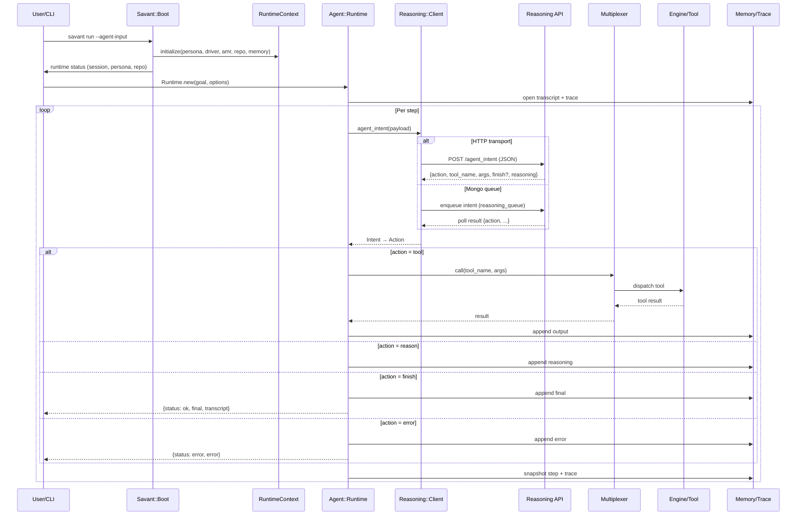
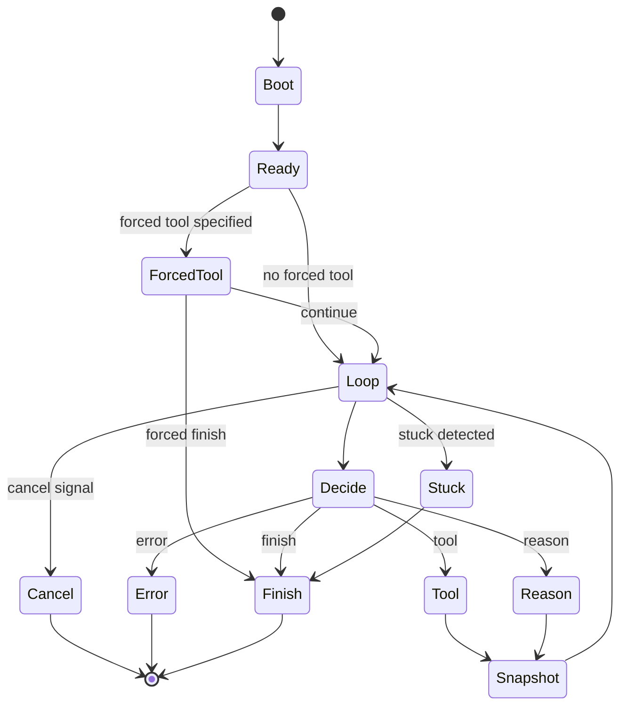

# Savant Agent Runtime (Reasoning API Only)

The Agent Runtime is the orchestrator that runs an autonomous reasoning loop for a given goal. It decides what to do next (call a tool, add reasoning, or finish) by delegating decisions to the external Reasoning API. It then executes MCP tools via the Multiplexer, persists transcripts, and emits structured telemetry.

- Location: `lib/savant/agent/runtime.rb`
- Decision engine: Reasoning API only (no SLM/LLM fallback inside the runtime)
- Transports supported by Reasoning Client: HTTP or Mongo queue (see env below)

## Responsibilities

- Build step context from persona, driver, AMR rules, repo metadata, and memory state.
- Call Reasoning API `/agent_intent` each step to obtain the next action.
- Execute MCP tools via the Multiplexer when requested by the intent.
- Persist a structured transcript and per-step snapshots to disk.
- Enforce tool-use policy (disable/allow by environment, instructions, and state machine).
- Handle forced steps (forced tool or forced finish), workflow auto-detect, cancellation, and dry-run.
- Emit detailed telemetry to `EventRecorder` and `logs/agent_trace.log`.

## Main Collaborators (Key Files)

- Runtime context: `lib/savant/framework/engine/runtime_context.rb`
- Reasoning client: `lib/savant/reasoning/client.rb`
- Multiplexer (tools): `lib/savant/multiplexer.rb`
- Memory store: `lib/savant/agent/memory.rb`
- Prompt builder: `lib/savant/agent/prompt_builder.rb` (for snapshots/telemetry)
- State machine: `lib/savant/agent/state_machine.rb`
- Logging/telemetry: `lib/savant/logging/logger.rb`, `lib/savant/logging/event_recorder.rb`

## High-Level Flow (Per Run)

1. Initialize context (persona, driver, AMR rules, repo, memory) via Boot.
2. Optionally detect workflow intent and force a one-shot workflow tool call.
3. Enter the step loop:
   - Tick state machine; check for cancellation or stuck state.
   - Collect and filter available tools from the Multiplexer.
   - Build a policy/system note and a snapshot prompt (telemetry only).
   - Decide via Reasoning API `/agent_intent` → one action: tool | reason | finish | error.
   - If tool: call `Multiplexer.call`, record output; else record reasoning/finish/error.
   - Append to transcript and persist a snapshot.
4. Exit on finish, error, or after `max_steps`.

## Flow Chart (Runtime Loop)

```mermaid
graph TD
  A[Start runtime] --> B{Forced options?}
  B -->|forced_tool| C[Call tool once]
  C --> C2{forced_finish?}
  C2 -->|yes| Z[Finish and return]
  C2 -->|no| D
  B -->|forced_finish only| Z
  B -->|none| D[Step loop]

  subgraph Step
    D --> E[Cancellation check]
    E -->|canceled| Z
    E --> F[StateMachine.tick]
    F --> G[Collect + filter tools]
    G --> H[Build policy note and snapshot]
    H --> I[Reasoning API agent_intent]
    I --> J{Action}
    J -->|tool| K["Multiplexer.call(tool, args)"]
    K --> M[Append output to memory]
    J -->|reason| L[Append reasoning]
    J -->|finish| Z
    J -->|error| ZE[Record error and exit]
    L --> M
    M --> N[Snapshot transcript]
    N --> D
  end

  Z[Finish return {status, steps, final, transcript}]
  ZE[Error return {status=error, steps, error}]
```

## Request Sequence: Submitting an Agent Run

When a user submits an agent run (e.g., `savant run --agent-input="..."`), the following sequence occurs.



## Tool Policy and Safety

- Disable-all: `AGENT_DISABLE_TOOLS=1` or instruction cues → no tool calls (convert to reasoning or finish).
- Disable Context tools: `AGENT_DISABLE_CONTEXT_TOOLS=1` or instruction cues.
- Disable search-only: `AGENT_DISABLE_SEARCH_TOOLS=1` to block `context.fts_search` and `context.memory_search`.
- Think tools are disabled by default; set `AGENT_ALLOW_THINK_TOOLS=1` to enable.
- The runtime also enforces state-machine allowlists when present.

## Cancellation and Dry-Run

- Cancellation: the runtime checks a run-scoped key; if signaled, it appends a finish step with `final="Canceled by user"` and exits.
- Dry-run: skips external calls and immediately returns `{status: ok, final: "ok"}` while still exercising force options.

## Workflow Auto-Detect (AMR Shortcut)

- If the goal contains a known workflow name (or common review intents), the runtime can force a one-shot `workflow.workflow_run` and finish.
- Disable with `AGENT_DISABLE_WORKFLOW_AUTODETECT=1`.

## Telemetry and Artifacts

- Event stream: `Savant::Logging::EventRecorder.global` collects events like `prompt_snapshot`, `tool_call_started/ completed`, `reasoning_step`.
- File trace: `logs/agent_trace.log` contains NDJSON of step-by-step events.
- Memory snapshot: `.savant/session.json` per run with all steps, actions, results, and final.

## Reasoning API Configuration

- HTTP:
  - `REASONING_API_URL` (e.g., `http://127.0.0.1:9000`)
  - `REASONING_API_TOKEN` (optional)
  - `REASONING_API_TIMEOUT_MS` (default 5000), `REASONING_API_RETRIES` (default 2)
- Mongo Queue:
  - `REASONING_TRANSPORT=mongo`
  - `MONGO_URI` (or `MONGO_HOST`), DB auto-selects by env (`savant_development`/`savant_test`)

## Error Handling

- If the Reasoning API is unreachable or returns invalid data, the runtime emits a structured error, records it, and exits.
- Tool invocation errors are captured and recorded with the step’s output.

## Quick Start

- Prepare DB and index repos per the main docs.
- Start the Reasoning API (HTTP or queue worker).
- Run: `savant run --agent-input="Summarize the design of the indexer."`
- Inspect: `logs/agent_trace.log` and the transcript JSON for the step-by-step record.

## State Diagram


